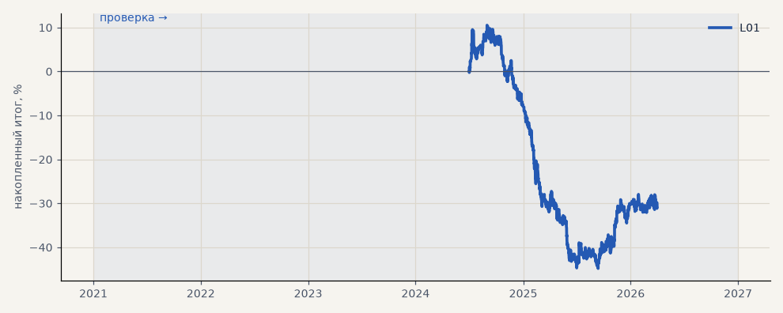

# L01. CatBoost LKOH без ленты (2024–2026, 3 seed)

**Семейство:** модель CatBoost · **база:** — · **гипотеза:** — · **вердикт:** база (в минусе после комиссии)

**Что проверяли.** CatBoost Лукойла — 85 признаков, включая 4 по объёму, та же разметка на 3 класса; квартальный walk-forward 2024Q3–2026Q1 без тренд-фильтра; 3 seed. Период короче, чем у серебра, — лента сделок есть только с 2024 года.

**Зачем.** База для проверки признаков ленты обезличенных сделок.

**Итог простыми словами.** После комиссии в минусе на всех seed.

Подробности: [results/model_changelog.md](../../results/model_changelog.md)

Проверка — сделки, открытые с 1 января 2021 года; выбор — до 2021. В скобках — база на тех же инструментах.

| срез | период | сделок | итог % | выигрышей | ожидание на сделку | PF | без 2 лучших | просадка | t | лет в плюсе |
|---|---|---|---|---|---|---|---|---|---|---|
| все инструменты | проверка | 1383 | -30.0 | 38% | -0.022% | 0.90 | -33.0 | -55.3 | -1.46 | 1/3 |
| LKOH | проверка | 1383 | -30.0 | 38% | -0.022% | 0.90 | -33.0 | -55.3 | -1.46 | 1/3 |

Журнал сделок: `trades.csv.gz` (инструмент, прогон, сторона, вход, выход, цены, результат после издержек, причина выхода).
