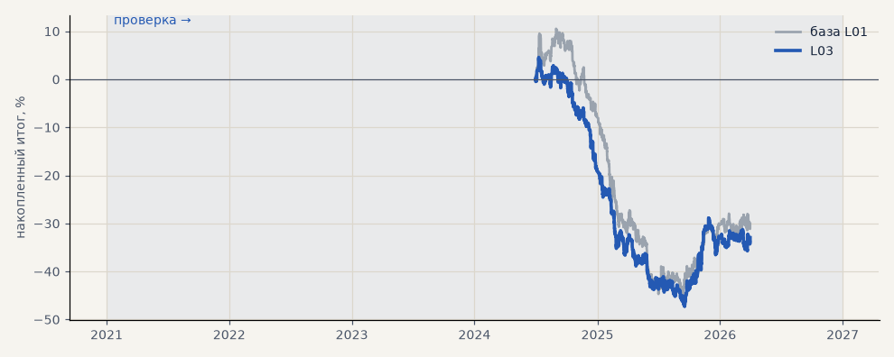

# L03. Лента + история с 2016 года

**Семейство:** модель CatBoost · **база:** L01 · **гипотеза:** — · **вердикт:** не помогло

**Что поменяли:** обучение на всей истории, признаки ленты там, где она есть

Подробности: [results/model_changelog.md](../../results/model_changelog.md)

Проверка — сделки, открытые с 1 января 2021 года; выбор — до 2021. В скобках — база на тех же инструментах.

| срез | период | сделок | итог % | выигрышей | ожидание на сделку | PF | без 2 лучших | просадка | t | лет в плюсе |
|---|---|---|---|---|---|---|---|---|---|---|
| все инструменты | проверка | 1242 (1383) | -32.9 (-30.0) | 38% (38%) | -0.027% (-0.022%) | 0.87 (0.90) | -35.4 (-33.0) | -51.8 (-55.3) | -1.85 (-1.46) | 1/3 (1/3) |
| LKOH | проверка | 1242 (1383) | -32.9 (-30.0) | 38% (38%) | -0.027% (-0.022%) | 0.87 (0.90) | -35.4 (-33.0) | -51.8 (-55.3) | -1.85 (-1.46) | 1/3 (1/3) |

Журнал сделок: `trades.csv.gz` (инструмент, прогон, сторона, вход, выход, цены, результат после издержек, причина выхода).
