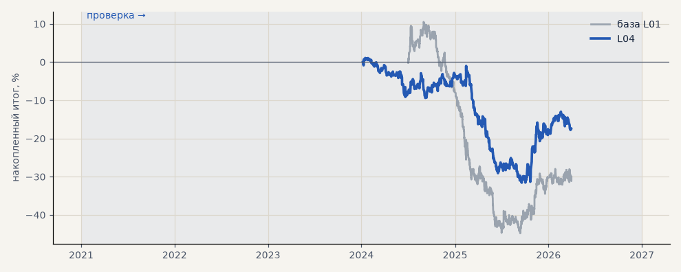

# L04. Правило ленты без модели (z_6 ≥ 1.5)

**Семейство:** модель CatBoost · **база:** L01 · **гипотеза:** — · **вердикт:** не помогло (−17% на 9 кварталах)

**Что проверяли.** Без модели — лонг, если z-оценка нетто-дельты крупных сделок за 6 часов не ниже 1.5; шорт, если не выше −1.5.

**Зачем.** Этот признак дал +8.6% на 258 сделках во втором полугодии 2025 года.

**Итог простыми словами.** На 9 кварталах −17% — прежний результат был удачным полугодием.

Подробности: [results/model_changelog.md](../../results/model_changelog.md)

Проверка — сделки, открытые с 1 января 2021 года; выбор — до 2021. В скобках — база на тех же инструментах.

| срез | период | сделок | итог % | выигрышей | ожидание на сделку | PF | без 2 лучших | просадка | t | лет в плюсе |
|---|---|---|---|---|---|---|---|---|---|---|
| все инструменты | проверка | 830 (1383) | -17.4 (-30.0) | 40% (38%) | -0.021% (-0.022%) | 0.90 (0.90) | -24.4 (-33.0) | -32.6 (-55.3) | -1.07 (-1.46) | 1/3 (1/3) |
| LKOH | проверка | 830 (1383) | -17.4 (-30.0) | 40% (38%) | -0.021% (-0.022%) | 0.90 (0.90) | -24.4 (-33.0) | -32.6 (-55.3) | -1.07 (-1.46) | 1/3 (1/3) |

Журнал сделок: `trades.csv.gz` (инструмент, прогон, сторона, вход, выход, цены, результат после издержек, причина выхода).
