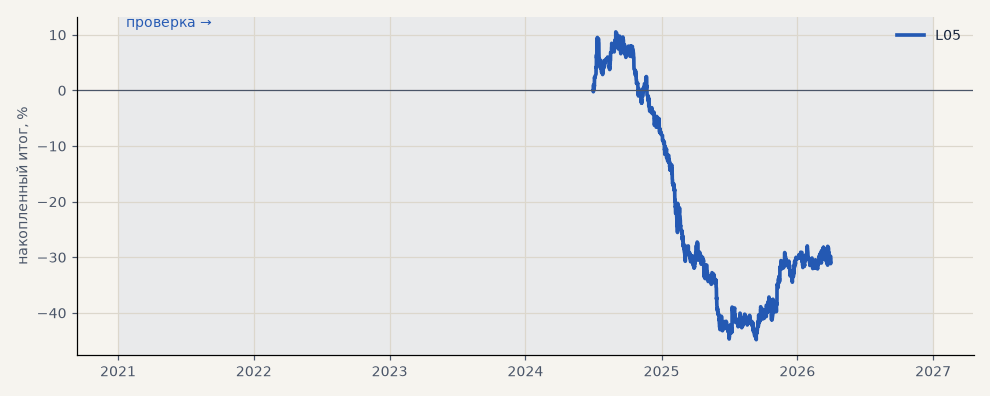

# L05. CatBoost LKOH (прогон для размера позиции, 3 seed)

**Семейство:** модель CatBoost · **база:** — · **гипотеза:** — · **вердикт:** база

**Что поменяли:** база для L06

Подробности: [results/volatility_and_tokdit.md](../../results/volatility_and_tokdit.md)

Проверка — сделки, открытые с 1 января 2021 года; выбор — до 2021. В скобках — база на тех же инструментах.

| срез | период | сделок | итог % | выигрышей | ожидание на сделку | PF | без 2 лучших | просадка | t | лет в плюсе |
|---|---|---|---|---|---|---|---|---|---|---|
| все инструменты | проверка | 1383 | -30.0 | 38% | -0.022% | 0.90 | -33.0 | -55.3 | -1.46 | 1/3 |
| LKOH | проверка | 1383 | -30.0 | 38% | -0.022% | 0.90 | -33.0 | -55.3 | -1.46 | 1/3 |

Журнал сделок: `trades.csv.gz` (инструмент, прогон, сторона, вход, выход, цены, результат после издержек, причина выхода).
