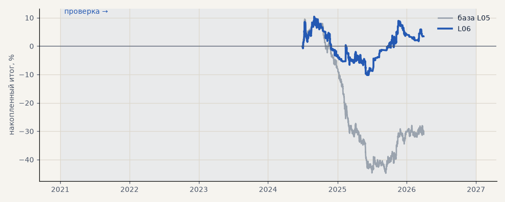

# L06. LKOH — торговать только при ATR ≥ медианы

**Семейство:** модель CatBoost · **база:** L05 · **гипотеза:** — · **вердикт:** слабый плюс

Подробности: [results/volatility_and_tokdit.md](../../results/volatility_and_tokdit.md)

Проверка — сделки, открытые с 1 января 2021 года; выбор — до 2021. В скобках — база на тех же инструментах.

| срез | период | сделок | итог % | выигрышей | ожидание на сделку | PF | без 2 лучших | просадка | t | лет в плюсе |
|---|---|---|---|---|---|---|---|---|---|---|
| все инструменты | проверка | 586 (1383) | +3.5 (-30.0) | 42% (38%) | +0.006% (-0.022%) | 1.02 (0.90) | -0.2 (-33.0) | -20.6 (-55.3) | 0.20 (-1.46) | 1/3 (1/3) |
| LKOH | проверка | 586 (1383) | +3.5 (-30.0) | 42% (38%) | +0.006% (-0.022%) | 1.02 (0.90) | -0.2 (-33.0) | -20.6 (-55.3) | 0.20 (-1.46) | 1/3 (1/3) |

Журнал сделок: `trades.csv.gz` (инструмент, прогон, сторона, вход, выход, цены, результат после издержек, причина выхода).
