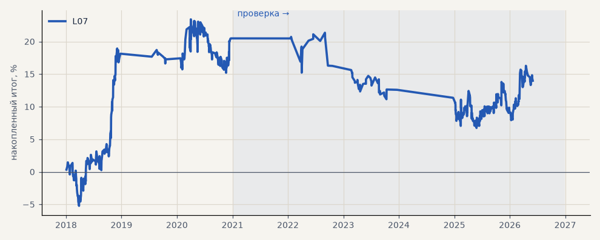

# L07. LKOH годовой walk-forward с гейтом C

**Семейство:** модель CatBoost · **база:** — · **гипотеза:** — · **вердикт:** база

**Что проверяли.** Годовой walk-forward Лукойла 2018–2026 с гейтом C, один прогон.

**Зачем.** Длинная история для модели Лукойла.

**Итог простыми словами.** В 2021 и 2024 модель вырождается в 1–7 деревьев и почти не торгует; в целом около нуля.

Подробности: [results/model_changelog.md](../../results/model_changelog.md)

Проверка — сделки, открытые с 1 января 2021 года; выбор — до 2021. В скобках — база на тех же инструментах.

| срез | период | сделок | итог % | выигрышей | ожидание на сделку | PF | без 2 лучших | просадка | t | лет в плюсе |
|---|---|---|---|---|---|---|---|---|---|---|
| все инструменты | проверка | 377 | -6.5 | 40% | -0.017% | 0.92 | -14.1 | -14.6 | -0.48 | 1/5 |
| все инструменты | выбор | 302 | +20.5 | 46% | +0.068% | 1.25 | +13.1 | -8.2 | 1.38 | 2/3 |
| LKOH | проверка | 377 | -6.5 | 40% | -0.017% | 0.92 | -14.1 | -14.6 | -0.48 | 1/5 |
| LKOH | выбор | 302 | +20.5 | 46% | +0.068% | 1.25 | +13.1 | -8.2 | 1.38 | 2/3 |

Журнал сделок: `trades.csv.gz` (инструмент, прогон, сторона, вход, выход, цены, результат после издержек, причина выхода).
