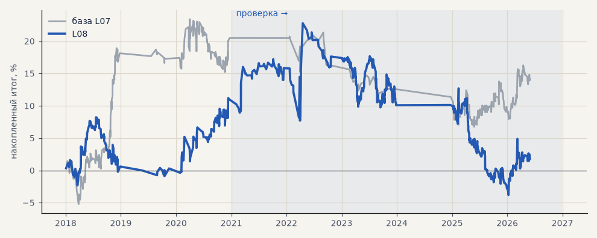

# L08. LKOH — обучение только внутри гейта

**Семейство:** модель CatBoost · **база:** L07 · **гипотеза:** — · **вердикт:** кандидат, не подтверждён

Подробности: [results/model_changelog.md](../../results/model_changelog.md)

Проверка — сделки, открытые с 1 января 2021 года; выбор — до 2021. В скобках — база на тех же инструментах.

| срез | период | сделок | итог % | выигрышей | ожидание на сделку | PF | без 2 лучших | просадка | t | лет в плюсе |
|---|---|---|---|---|---|---|---|---|---|---|
| все инструменты | проверка | 538 (377) | -9.2 (-6.5) | 40% (40%) | -0.017% (-0.017%) | 0.93 (0.92) | -22.5 (-14.1) | -26.6 (-14.6) | -0.48 (-0.48) | 4/6 (1/5) |
| все инструменты | выбор | 208 (302) | +11.0 (+20.5) | 41% (46%) | +0.053% (+0.068%) | 1.20 (1.25) | +5.4 (+13.1) | -9.1 (-8.2) | 0.99 (1.38) | 2/3 (2/3) |
| LKOH | проверка | 538 (377) | -9.2 (-6.5) | 40% (40%) | -0.017% (-0.017%) | 0.93 (0.92) | -22.5 (-14.1) | -26.6 (-14.6) | -0.48 (-0.48) | 4/6 (1/5) |
| LKOH | выбор | 208 (302) | +11.0 (+20.5) | 41% (46%) | +0.053% (+0.068%) | 1.20 (1.25) | +5.4 (+13.1) | -9.1 (-8.2) | 0.99 (1.38) | 2/3 (2/3) |

Журнал сделок: `trades.csv.gz` (инструмент, прогон, сторона, вход, выход, цены, результат после издержек, причина выхода).
