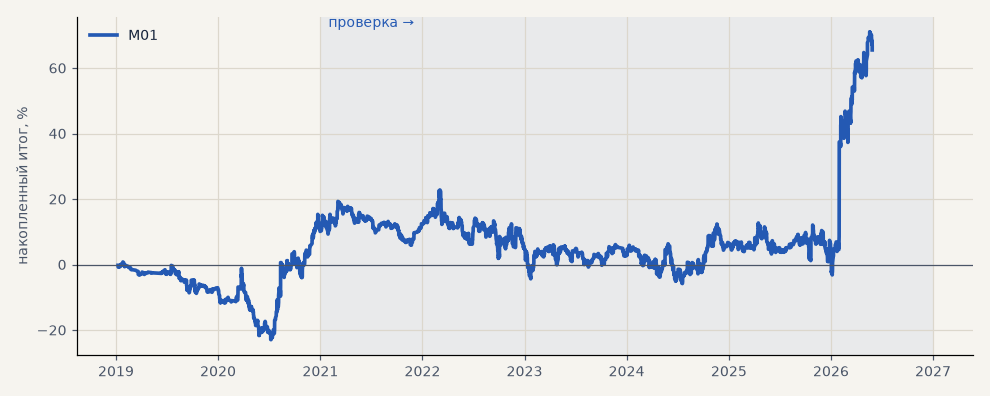

# M01. CatBoost серебра, базовая (3 seed)

**Семейство:** модель CatBoost · **база:** — · **гипотеза:** H20 · **вердикт:** база (преимущество ≈ комиссии)

**Что проверяли.** Модель CatBoost (градиентный бустинг деревьев решений) по 81 признаку часовых баров серебра. Разметка на 3 класса — «рост», если цена прошла +1.5 ATR раньше −0.75 ATR в следующие 10 часов, «падение» — наоборот, иначе «ничего». Каждый год модель учится на данных до 1 января (часть последних данных — для ранней остановки) и торгует весь год. Сделка открывается, если ожидаемая выгода по вероятности класса с учётом комиссии положительна и направление совпадает с тренд-гейтом; стоп 2 ATR, трейлинг 1.5 ATR после +1 ATR, выход через 10 часов. Три прогона с разными seed, метрики усреднены.

**Зачем.** Базовая постановка проекта — прогноз ближайшего движения.

**Итог простыми словами.** Средняя сделка после комиссии едва выше нуля — преимущество модели равно комиссии.

Подробности: [results/model_changelog.md](../../results/model_changelog.md)

Проверка — сделки, открытые с 1 января 2021 года; выбор — до 2021. В скобках — база на тех же инструментах.

| срез | период | сделок | итог % | выигрышей | ожидание на сделку | PF | без 2 лучших | просадка | t | лет в плюсе |
|---|---|---|---|---|---|---|---|---|---|---|
| все инструменты | проверка | 1488 | +55.4 | 46% | +0.037% | 1.10 | +39.6 | -28.6 | 1.16 | 3/6 |
| все инструменты | выбор | 405 | +10.1 | 46% | +0.025% | 1.07 | +3.3 | -23.7 | 0.46 | 1/2 |
| серебро | проверка | 1488 | +55.4 | 46% | +0.037% | 1.10 | +39.6 | -28.6 | 1.16 | 3/6 |
| серебро | выбор | 405 | +10.1 | 46% | +0.025% | 1.07 | +3.3 | -23.7 | 0.46 | 1/2 |

Журнал сделок: `trades.csv.gz` (инструмент, прогон, сторона, вход, выход, цены, результат после издержек, причина выхода).
