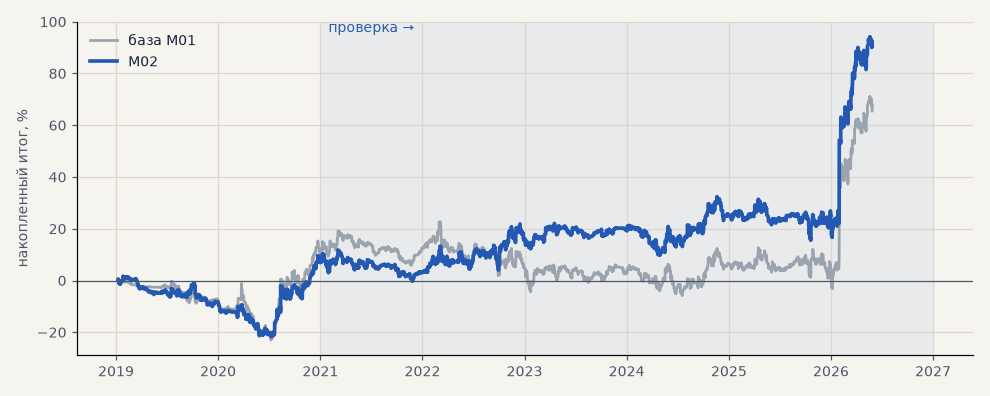

# M02. Обучение только внутри тренд-гейта

**Семейство:** модель CatBoost · **база:** M01 · **гипотеза:** — · **вердикт:** на проверке 2021–26 лучше базы (t 1.8 против 1.2), но базы разных прогонов (M01 и M09) расходятся так же — перепроверить

**Что проверяли.** Та же модель, но обучающая выборка — только часы, где гейт C разрешает вход; остальные часы (около двух третей) из обучения убраны. Торговля та же. Четыре прогона с разными seed.

**Зачем.** Модель тратила силы на нейтральные часы, где сделок всё равно не бывает.

**Итог простыми словами.** На проверке 2021–2026 лучше базы, но разница сравнима с разбросом между базовыми прогонами — перепроверяем (гипотеза H31).

Подробности: [results/model_changelog.md](../../results/model_changelog.md)

Проверка — сделки, открытые с 1 января 2021 года; выбор — до 2021. В скобках — база на тех же инструментах.

| срез | период | сделок | итог % | выигрышей | ожидание на сделку | PF | без 2 лучших | просадка | t | лет в плюсе |
|---|---|---|---|---|---|---|---|---|---|---|
| все инструменты | проверка | 1375 (1488) | +83.9 (+55.4) | 47% (46%) | +0.061% (+0.037%) | 1.17 (1.10) | +72.0 (+39.6) | -16.9 (-28.6) | 1.76 (1.16) | 4/6 (3/6) |
| все инструменты | выбор | 492 (405) | +6.9 (+10.1) | 46% (46%) | +0.014% (+0.025%) | 1.05 (1.07) | +1.8 (+3.3) | -23.4 (-23.7) | 0.33 (0.46) | 1/2 (1/2) |
| серебро | проверка | 1375 (1488) | +83.9 (+55.4) | 47% (46%) | +0.061% (+0.037%) | 1.17 (1.10) | +72.0 (+39.6) | -16.9 (-28.6) | 1.76 (1.16) | 4/6 (3/6) |
| серебро | выбор | 492 (405) | +6.9 (+10.1) | 46% (46%) | +0.014% (+0.025%) | 1.05 (1.07) | +1.8 (+3.3) | -23.4 (-23.7) | 0.33 (0.46) | 1/2 (1/2) |

Журнал сделок: `trades.csv.gz` (инструмент, прогон, сторона, вход, выход, цены, результат после издержек, причина выхода).
