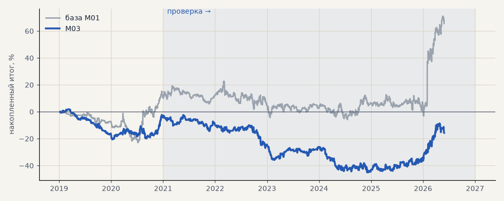

# M03. Разметка по направлению (h4 / 0.3 ATR)

**Семейство:** модель CatBoost · **база:** M01 · **гипотеза:** — · **вердикт:** не помогло

**Что проверяли.** Вместо трёх классов по барьерам — класс по знаку хода за 4 часа, если ход больше 0.3 ATR, иначе «ничего». Остальное как в базе. Один прогон.

**Зачем.** Барьеры могли учить модель волатильности, а не направлению.

**Итог простыми словами.** Хуже базы — модель всё равно опирается на волатильность, прибыльна в 3 годах из 8.

Подробности: [results/model_improvements.md](../../results/model_improvements.md)

Проверка — сделки, открытые с 1 января 2021 года; выбор — до 2021. В скобках — база на тех же инструментах.

| срез | период | сделок | итог % | выигрышей | ожидание на сделку | PF | без 2 лучших | просадка | t | лет в плюсе |
|---|---|---|---|---|---|---|---|---|---|---|
| все инструменты | проверка | 1300 (1488) | -12.2 (+55.4) | 47% (46%) | -0.009% (+0.037%) | 0.97 (1.10) | -20.9 (+39.6) | -42.6 (-28.6) | -0.44 (1.16) | 2/6 (3/6) |
| все инструменты | выбор | 479 (405) | -3.4 (+10.1) | 45% (46%) | -0.007% (+0.025%) | 0.97 (1.07) | -9.4 (+3.3) | -22.5 (-23.7) | -0.24 (0.46) | 1/2 (1/2) |
| серебро | проверка | 1300 (1488) | -12.2 (+55.4) | 47% (46%) | -0.009% (+0.037%) | 0.97 (1.10) | -20.9 (+39.6) | -42.6 (-28.6) | -0.44 (1.16) | 2/6 (3/6) |
| серебро | выбор | 479 (405) | -3.4 (+10.1) | 45% (46%) | -0.007% (+0.025%) | 0.97 (1.07) | -9.4 (+3.3) | -22.5 (-23.7) | -0.24 (0.46) | 1/2 (1/2) |

Журнал сделок: `trades.csv.gz` (инструмент, прогон, сторона, вход, выход, цены, результат после издержек, причина выхода).
