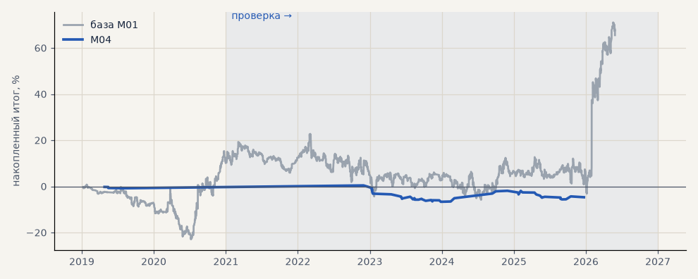

# M04. Регрессия величины хода вместо классов

**Семейство:** модель CatBoost · **база:** M01 · **гипотеза:** — · **вердикт:** не помогло

**Что проверяли.** Регрессия — модель предсказывает величину хода через 4 часа в ATR; сделка, если прогноз больше 0.3 ATR в одну из сторон.

**Зачем.** Спросить модель напрямую «куда и на сколько».

**Итог простыми словами.** Ранняя остановка оставляет 1–4 дерева, прогноз почти никогда не выходит за порог — сигнала нет, сделок единицы.

Подробности: [results/model_changelog.md](../../results/model_changelog.md)

Проверка — сделки, открытые с 1 января 2021 года; выбор — до 2021. В скобках — база на тех же инструментах.

| срез | период | сделок | итог % | выигрышей | ожидание на сделку | PF | без 2 лучших | просадка | t | лет в плюсе |
|---|---|---|---|---|---|---|---|---|---|---|
| все инструменты | проверка | 52 (1488) | -3.9 (+55.4) | 35% (46%) | -0.075% (+0.037%) | 0.76 (1.10) | -7.4 (+39.6) | -7.1 (-28.6) | -0.77 (1.16) | 2/4 (3/6) |
| все инструменты | выбор | 4 (405) | -0.8 (+10.1) | 0% (46%) | -0.204% (+0.025%) | 0.00 (1.07) | -0.7 (+3.3) | -0.8 (-23.7) | -2.45 (0.46) | 0/1 (1/2) |
| серебро | проверка | 52 (1488) | -3.9 (+55.4) | 35% (46%) | -0.075% (+0.037%) | 0.76 (1.10) | -7.4 (+39.6) | -7.1 (-28.6) | -0.77 (1.16) | 2/4 (3/6) |
| серебро | выбор | 4 (405) | -0.8 (+10.1) | 0% (46%) | -0.204% (+0.025%) | 0.00 (1.07) | -0.7 (+3.3) | -0.8 (-23.7) | -2.45 (0.46) | 0/1 (1/2) |

Журнал сделок: `trades.csv.gz` (инструмент, прогон, сторона, вход, выход, цены, результат после издержек, причина выхода).
