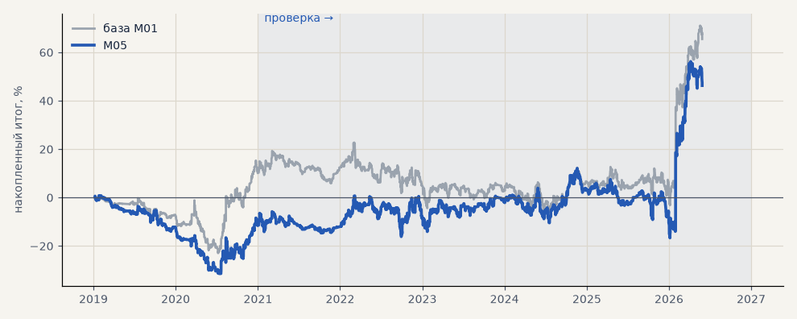

# M05. Сильнее регуляризованная модель

**Семейство:** модель CatBoost · **база:** M01 · **гипотеза:** — · **вердикт:** стабильнее, но хуже

**Что поменяли:** lr 0.02, глубина 4, l2 10, до 3000 деревьев

Подробности: [results/model_changelog.md](../../results/model_changelog.md)

Проверка — сделки, открытые с 1 января 2021 года; выбор — до 2021. В скобках — база на тех же инструментах.

| срез | период | сделок | итог % | выигрышей | ожидание на сделку | PF | без 2 лучших | просадка | t | лет в плюсе |
|---|---|---|---|---|---|---|---|---|---|---|
| все инструменты | проверка | 1411 (1488) | +57.9 (+55.4) | 46% (46%) | +0.041% (+0.037%) | 1.11 (1.10) | +42.1 (+39.6) | -28.7 (-28.6) | 1.25 (1.16) | 4/6 (3/6) |
| все инструменты | выбор | 445 (405) | -11.6 (+10.1) | 42% (46%) | -0.026% (+0.025%) | 0.92 (1.07) | -18.4 (+3.3) | -32.2 (-23.7) | -0.56 (0.46) | 1/2 (1/2) |
| серебро | проверка | 1411 (1488) | +57.9 (+55.4) | 46% (46%) | +0.041% (+0.037%) | 1.11 (1.10) | +42.1 (+39.6) | -28.7 (-28.6) | 1.25 (1.16) | 4/6 (3/6) |
| серебро | выбор | 445 (405) | -11.6 (+10.1) | 42% (46%) | -0.026% (+0.025%) | 0.92 (1.07) | -18.4 (+3.3) | -32.2 (-23.7) | -0.56 (0.46) | 1/2 (1/2) |

Журнал сделок: `trades.csv.gz` (инструмент, прогон, сторона, вход, выход, цены, результат после издержек, причина выхода).
