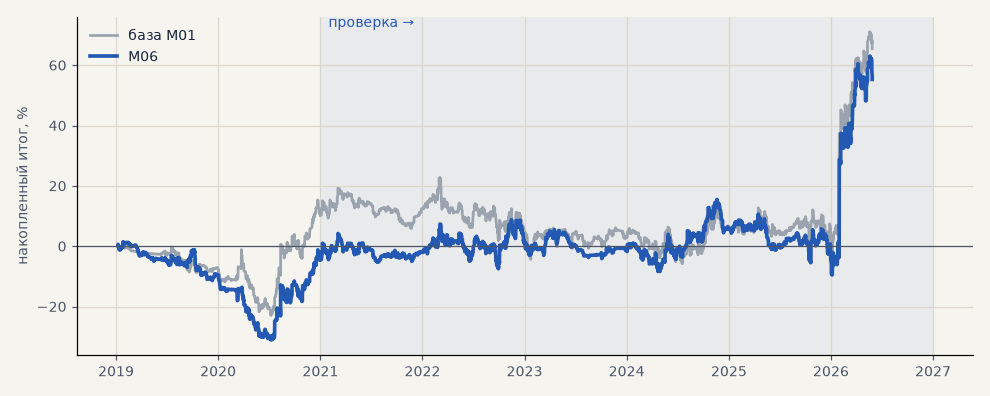

# M06. Ансамбль 3 моделей с разными seed

**Семейство:** модель CatBoost · **база:** M01 · **гипотеза:** — · **вердикт:** не помогло

**Что поменяли:** вероятности трёх моделей усредняются

Подробности: [results/model_changelog.md](../../results/model_changelog.md)

Проверка — сделки, открытые с 1 января 2021 года; выбор — до 2021. В скобках — база на тех же инструментах.

| срез | период | сделок | итог % | выигрышей | ожидание на сделку | PF | без 2 лучших | просадка | t | лет в плюсе |
|---|---|---|---|---|---|---|---|---|---|---|
| все инструменты | проверка | 1346 (1488) | +60.0 (+55.4) | 46% (46%) | +0.045% (+0.037%) | 1.12 (1.10) | +44.2 (+39.6) | -25.1 (-28.6) | 1.28 (1.16) | 4/6 (3/6) |
| все инструменты | выбор | 470 (405) | -4.7 (+10.1) | 45% (46%) | -0.010% (+0.025%) | 0.97 (1.07) | -11.5 (+3.3) | -32.4 (-23.7) | -0.23 (0.46) | 1/2 (1/2) |
| серебро | проверка | 1346 (1488) | +60.0 (+55.4) | 46% (46%) | +0.045% (+0.037%) | 1.12 (1.10) | +44.2 (+39.6) | -25.1 (-28.6) | 1.28 (1.16) | 4/6 (3/6) |
| серебро | выбор | 470 (405) | -4.7 (+10.1) | 45% (46%) | -0.010% (+0.025%) | 0.97 (1.07) | -11.5 (+3.3) | -32.4 (-23.7) | -0.23 (0.46) | 1/2 (1/2) |

Журнал сделок: `trades.csv.gz` (инструмент, прогон, сторона, вход, выход, цены, результат после издержек, причина выхода).
