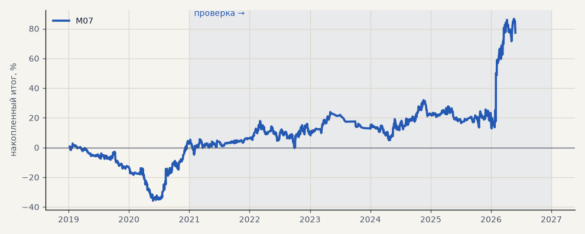

# M07. CatBoost (прогон для мета-модели, seed 42)

**Семейство:** модель CatBoost · **база:** — · **гипотеза:** — · **вердикт:** база

**Что поменяли:** тот же прогон без мета-фильтра — база для M08

Подробности: [results/model_changelog.md](../../results/model_changelog.md)

Проверка — сделки, открытые с 1 января 2021 года; выбор — до 2021. В скобках — база на тех же инструментах.

| срез | период | сделок | итог % | выигрышей | ожидание на сделку | PF | без 2 лучших | просадка | t | лет в плюсе |
|---|---|---|---|---|---|---|---|---|---|---|
| все инструменты | проверка | 1232 | +74.8 | 46% | +0.061% | 1.16 | +42.7 | -19.0 | 1.57 | 5/6 |
| все инструменты | выбор | 537 | +2.5 | 45% | +0.005% | 1.02 | -12.5 | -38.5 | 0.12 | 1/2 |
| серебро | проверка | 1232 | +74.8 | 46% | +0.061% | 1.16 | +42.7 | -19.0 | 1.57 | 5/6 |
| серебро | выбор | 537 | +2.5 | 45% | +0.005% | 1.02 | -12.5 | -38.5 | 0.12 | 1/2 |

Журнал сделок: `trades.csv.gz` (инструмент, прогон, сторона, вход, выход, цены, результат после издержек, причина выхода).
