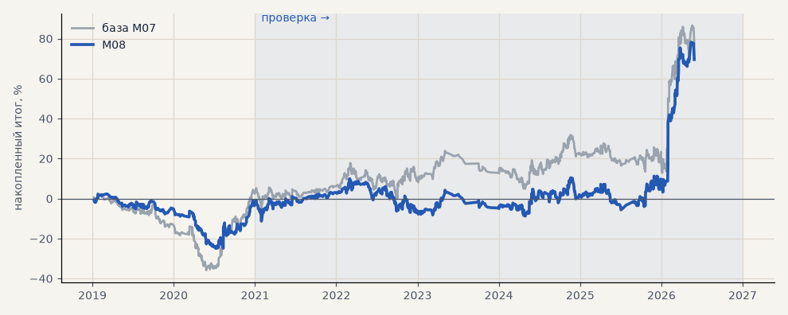

# M08. Мета-модель с контекстом, порог 0.50

**Семейство:** модель CatBoost · **база:** M07 · **гипотеза:** — · **вердикт:** не помогло (AUC ≈ 0.5)

**Что проверяли.** Вторая модель (мета-модель) решает, брать ли сделку основной модели. Её признаки — ход и свеча относительно стороны сделки, класс входа (продолжение, плоско, откат, «нож»), результаты последних 10 и 30 сделок, режим рынка. Сделка — если вероятность успеха не ниже 0.50.

**Зачем.** Отсеять плохие сделки основной модели по контексту, которого у неё нет.

**Итог простыми словами.** AUC мета-модели 0.47–0.53 во всех годах — она не отличает удачные сделки от неудачных; итог как у базы.

Подробности: [results/model_changelog.md](../../results/model_changelog.md)

Проверка — сделки, открытые с 1 января 2021 года; выбор — до 2021. В скобках — база на тех же инструментах.

| срез | период | сделок | итог % | выигрышей | ожидание на сделку | PF | без 2 лучших | просадка | t | лет в плюсе |
|---|---|---|---|---|---|---|---|---|---|---|
| все инструменты | проверка | 995 (1232) | +73.1 (+74.8) | 47% (46%) | +0.073% (+0.061%) | 1.21 (1.16) | +45.2 (+42.7) | -18.6 (-19.0) | 1.80 (1.57) | 5/6 (5/6) |
| все инструменты | выбор | 365 (537) | -3.6 (+2.5) | 46% (45%) | -0.010% (+0.005%) | 0.96 (1.02) | -16.6 (-12.5) | -27.2 (-38.5) | -0.21 (0.12) | 1/2 (1/2) |
| серебро | проверка | 995 (1232) | +73.1 (+74.8) | 47% (46%) | +0.073% (+0.061%) | 1.21 (1.16) | +45.2 (+42.7) | -18.6 (-19.0) | 1.80 (1.57) | 5/6 (5/6) |
| серебро | выбор | 365 (537) | -3.6 (+2.5) | 46% (45%) | -0.010% (+0.005%) | 0.96 (1.02) | -16.6 (-12.5) | -27.2 (-38.5) | -0.21 (0.12) | 1/2 (1/2) |

Журнал сделок: `trades.csv.gz` (инструмент, прогон, сторона, вход, выход, цены, результат после издержек, причина выхода).
