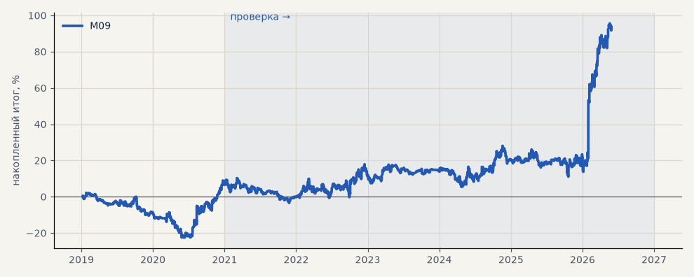

# M09. CatBoost (прогон для размера позиции, 3 seed)

**Семейство:** модель CatBoost · **база:** — · **гипотеза:** — · **вердикт:** база

**Что проверяли.** Прогон с обученной моделью волатильности (3 seed); здесь — сделки основной модели с размером позиции 1.

**Зачем.** База для M10–M12 — те же сделки, меняется только размер позиции.

**Итог простыми словами.** База.

Подробности: [results/volatility_and_tokdit.md](../../results/volatility_and_tokdit.md)

Проверка — сделки, открытые с 1 января 2021 года; выбор — до 2021. В скобках — база на тех же инструментах.

| срез | период | сделок | итог % | выигрышей | ожидание на сделку | PF | без 2 лучших | просадка | t | лет в плюсе |
|---|---|---|---|---|---|---|---|---|---|---|
| все инструменты | проверка | 1364 | +85.7 | 46% | +0.063% | 1.18 | +70.0 | -17.0 | 1.80 | 4/6 |
| все инструменты | выбор | 494 | +6.5 | 46% | +0.013% | 1.05 | -0.3 | -24.8 | 0.32 | 1/2 |
| серебро | проверка | 1364 | +85.7 | 46% | +0.063% | 1.18 | +70.0 | -17.0 | 1.80 | 4/6 |
| серебро | выбор | 494 | +6.5 | 46% | +0.013% | 1.05 | -0.3 | -24.8 | 0.32 | 1/2 |

Журнал сделок: `trades.csv.gz` (инструмент, прогон, сторона, вход, выход, цены, результат после издержек, причина выхода).
