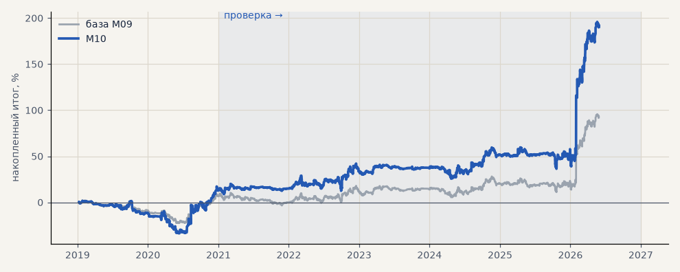

# M10. Размер позиции пропорционален ATR

**Семейство:** модель CatBoost · **база:** M09 · **гипотеза:** — · **вердикт:** слабый плюс (итог в % выше и за счёт большего среднего размера — сравнивать по t и PF)

**Что проверяли.** Размер позиции = ATR сигнального часа / медиана ATR обучающего периода (не больше 2). Комиссия масштабируется размером. Сделки те же, что в M09.

**Зачем.** Преимущество в процентах растёт с волатильностью, а комиссия — нет; значит, в активном рынке стоит торговать больше.

**Итог простыми словами.** t и профит-фактор лучше базы на всех seed — единственное устойчивое улучшение модели. Итог в процентах выше и за счёт большего среднего размера позиции.

Подробности: [results/volatility_and_tokdit.md](../../results/volatility_and_tokdit.md)

Проверка — сделки, открытые с 1 января 2021 года; выбор — до 2021. В скобках — база на тех же инструментах.

| срез | период | сделок | итог % | выигрышей | ожидание на сделку | PF | без 2 лучших | просадка | t | лет в плюсе |
|---|---|---|---|---|---|---|---|---|---|---|
| все инструменты | проверка | 1364 (1364) | +177.4 (+85.7) | 46% (46%) | +0.130% (+0.063%) | 1.30 (1.18) | +145.9 (+70.0) | -23.2 (-17.0) | 2.22 (1.80) | 5/6 (4/6) |
| все инструменты | выбор | 494 (494) | +12.9 (+6.5) | 46% (46%) | +0.026% (+0.013%) | 1.06 (1.05) | -0.8 (-0.3) | -35.2 (-24.8) | 0.35 (0.32) | 1/2 (1/2) |
| серебро | проверка | 1364 (1364) | +177.4 (+85.7) | 46% (46%) | +0.130% (+0.063%) | 1.30 (1.18) | +145.9 (+70.0) | -23.2 (-17.0) | 2.22 (1.80) | 5/6 (4/6) |
| серебро | выбор | 494 (494) | +12.9 (+6.5) | 46% (46%) | +0.026% (+0.013%) | 1.06 (1.05) | -0.8 (-0.3) | -35.2 (-24.8) | 0.35 (0.32) | 1/2 (1/2) |

Журнал сделок: `trades.csv.gz` (инструмент, прогон, сторона, вход, выход, цены, результат после издержек, причина выхода).
