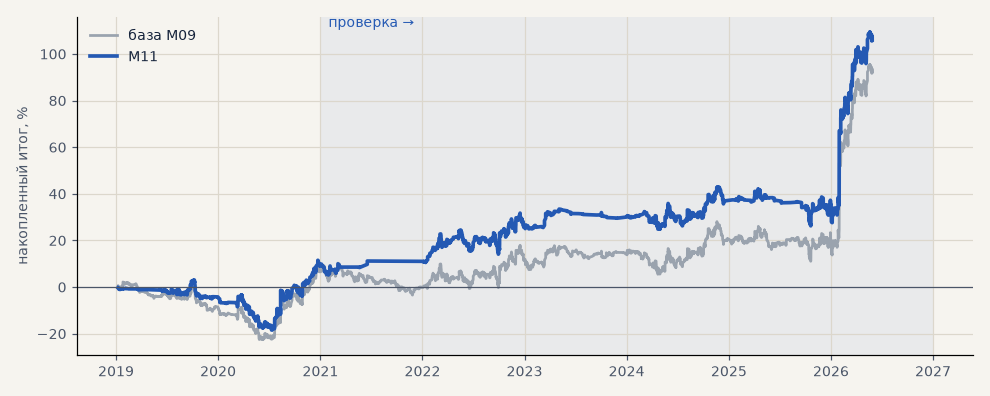

# M11. Торговать только при ATR ≥ медианы

**Семейство:** модель CatBoost · **база:** M09 · **гипотеза:** — · **вердикт:** слабый плюс

**Что проверяли.** Торговать только если ATR сигнального часа не ниже медианы обучающего периода; размер 1.

**Зачем.** Тот же эффект, но без увеличения позиции.

**Итог простыми словами.** Сделок меньше, ожидание на сделку выше вдвое; t выше базы.

Подробности: [results/volatility_and_tokdit.md](../../results/volatility_and_tokdit.md)

Проверка — сделки, открытые с 1 января 2021 года; выбор — до 2021. В скобках — база на тех же инструментах.

| срез | период | сделок | итог % | выигрышей | ожидание на сделку | PF | без 2 лучших | просадка | t | лет в плюсе |
|---|---|---|---|---|---|---|---|---|---|---|
| все инструменты | проверка | 808 (1364) | +97.1 (+85.7) | 47% (46%) | +0.120% (+0.063%) | 1.29 (1.18) | +81.3 (+70.0) | -16.7 (-17.0) | 2.19 (1.80) | 5/6 (4/6) |
| все инструменты | выбор | 350 (494) | +9.1 (+6.5) | 47% (46%) | +0.026% (+0.013%) | 1.08 (1.05) | +2.2 (-0.3) | -21.5 (-24.8) | 0.45 (0.32) | 1/2 (1/2) |
| серебро | проверка | 808 (1364) | +97.1 (+85.7) | 47% (46%) | +0.120% (+0.063%) | 1.29 (1.18) | +81.3 (+70.0) | -16.7 (-17.0) | 2.19 (1.80) | 5/6 (4/6) |
| серебро | выбор | 350 (494) | +9.1 (+6.5) | 47% (46%) | +0.026% (+0.013%) | 1.08 (1.05) | +2.2 (-0.3) | -21.5 (-24.8) | 0.45 (0.32) | 1/2 (1/2) |

Журнал сделок: `trades.csv.gz` (инструмент, прогон, сторона, вход, выход, цены, результат после издержек, причина выхода).
