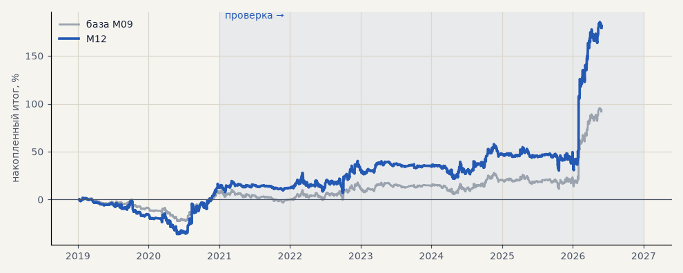

# M12. Размер по прогнозу волатильности моделью

**Семейство:** модель CatBoost · **база:** M09 · **гипотеза:** — · **вердикт:** хуже наивного ATR (итог в % завышен размером позиции)

**Что проверяли.** Размер позиции по прогнозу волатильности отдельной моделью CatBoost (средний размах на 10 часов вперёд) вместо текущего ATR.

**Зачем.** Прогноз волатильности точнее текущего ATR.

**Итог простыми словами.** Прогноз действительно точнее (корреляция с фактом 0.76 против 0.40), но для размера хуже наивного ATR — модель ловит час суток, а преимущество связано с уровнем волатильности периода.

Подробности: [results/volatility_and_tokdit.md](../../results/volatility_and_tokdit.md)

Проверка — сделки, открытые с 1 января 2021 года; выбор — до 2021. В скобках — база на тех же инструментах.

| срез | период | сделок | итог % | выигрышей | ожидание на сделку | PF | без 2 лучших | просадка | t | лет в плюсе |
|---|---|---|---|---|---|---|---|---|---|---|
| все инструменты | проверка | 1364 (1364) | +167.1 (+85.7) | 46% (46%) | +0.122% (+0.063%) | 1.25 (1.18) | +135.5 (+70.0) | -27.6 (-17.0) | 2.03 (1.80) | 4/6 (4/6) |
| все инструменты | выбор | 494 (494) | +12.2 (+6.5) | 46% (46%) | +0.025% (+0.013%) | 1.05 (1.05) | -1.4 (-0.3) | -38.0 (-24.8) | 0.33 (0.32) | 1/2 (1/2) |
| серебро | проверка | 1364 (1364) | +167.1 (+85.7) | 46% (46%) | +0.122% (+0.063%) | 1.25 (1.18) | +135.5 (+70.0) | -27.6 (-17.0) | 2.03 (1.80) | 4/6 (4/6) |
| серебро | выбор | 494 (494) | +12.2 (+6.5) | 46% (46%) | +0.025% (+0.013%) | 1.05 (1.05) | -1.4 (-0.3) | -38.0 (-24.8) | 0.33 (0.32) | 1/2 (1/2) |

Журнал сделок: `trades.csv.gz` (инструмент, прогон, сторона, вход, выход, цены, результат после издержек, причина выхода).
