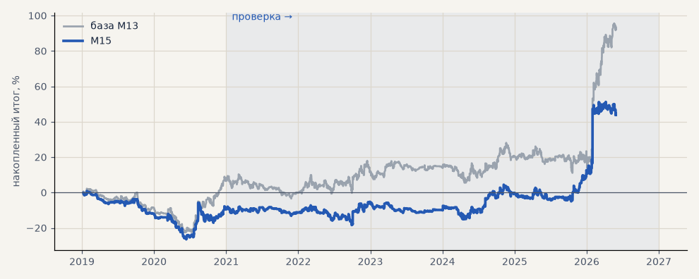

# M15. Сброс тренда по EMA5 часовых свечей

**Семейство:** модель CatBoost · **база:** M13 · **гипотеза:** — · **вердикт:** не помогло

Подробности: [results/trend_filter_ema.md](../../results/trend_filter_ema.md)

Проверка — сделки, открытые с 1 января 2021 года; выбор — до 2021. В скобках — база на тех же инструментах.

| срез | период | сделок | итог % | выигрышей | ожидание на сделку | PF | без 2 лучших | просадка | t | лет в плюсе |
|---|---|---|---|---|---|---|---|---|---|---|
| все инструменты | проверка | 757 (1364) | +53.4 (+85.7) | 46% (46%) | +0.071% (+0.063%) | 1.19 (1.18) | +37.6 (+70.0) | -11.2 (-17.0) | 1.34 (1.80) | 4/6 (4/6) |
| все инструменты | выбор | 304 (494) | -9.6 (+6.5) | 42% (46%) | -0.031% (+0.013%) | 0.91 (1.05) | -16.4 (-0.3) | -27.3 (-24.8) | -0.51 (0.32) | 1/2 (1/2) |
| серебро | проверка | 757 (1364) | +53.4 (+85.7) | 46% (46%) | +0.071% (+0.063%) | 1.19 (1.18) | +37.6 (+70.0) | -11.2 (-17.0) | 1.34 (1.80) | 4/6 (4/6) |
| серебро | выбор | 304 (494) | -9.6 (+6.5) | 42% (46%) | -0.031% (+0.013%) | 0.91 (1.05) | -16.4 (-0.3) | -27.3 (-24.8) | -0.51 (0.32) | 1/2 (1/2) |

Журнал сделок: `trades.csv.gz` (инструмент, прогон, сторона, вход, выход, цены, результат после издержек, причина выхода).
