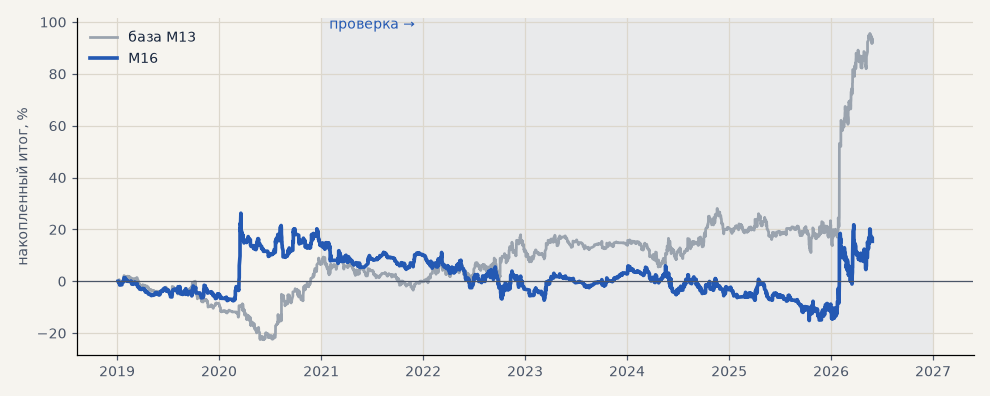

# M16. Тренд-фильтр «плато» из нового подбора

**Семейство:** модель CatBoost · **база:** M13 · **гипотеза:** — · **вердикт:** хуже как гейт входа

**Что проверяли.** Гейт входа — набор параметров тренд-фильтра «плато» из нового подбора (подтверждение 6 часов, гистерезис, шок-слой, сброс по EMA13), лучший по следованию тренду.

**Зачем.** Лучшая разметка тренда должна давать лучшие входы.

**Итог простыми словами.** Как метка тренда он лучше, как фильтр входа — модель уходит в ноль. Подбирать фильтр нужно под применение.

Подробности: [results/trend_filter_ema.md](../../results/trend_filter_ema.md)

Проверка — сделки, открытые с 1 января 2021 года; выбор — до 2021. В скобках — база на тех же инструментах.

| срез | период | сделок | итог % | выигрышей | ожидание на сделку | PF | без 2 лучших | просадка | t | лет в плюсе |
|---|---|---|---|---|---|---|---|---|---|---|
| все инструменты | проверка | 1087 (1364) | +1.7 (+85.7) | 46% (46%) | +0.002% (+0.063%) | 1.00 (1.18) | -14.1 (+70.0) | -30.0 (-17.0) | 0.04 (1.80) | 2/6 (4/6) |
| все инструменты | выбор | 386 (494) | +13.7 (+6.5) | 47% (46%) | +0.036% (+0.013%) | 1.10 (1.05) | +6.4 (-0.3) | -17.0 (-24.8) | 0.58 (0.32) | 1/2 (1/2) |
| серебро | проверка | 1087 (1364) | +1.7 (+85.7) | 46% (46%) | +0.002% (+0.063%) | 1.00 (1.18) | -14.1 (+70.0) | -30.0 (-17.0) | 0.04 (1.80) | 2/6 (4/6) |
| серебро | выбор | 386 (494) | +13.7 (+6.5) | 47% (46%) | +0.036% (+0.013%) | 1.10 (1.05) | +6.4 (-0.3) | -17.0 (-24.8) | 0.58 (0.32) | 1/2 (1/2) |

Журнал сделок: `trades.csv.gz` (инструмент, прогон, сторона, вход, выход, цены, результат после издержек, причина выхода).
