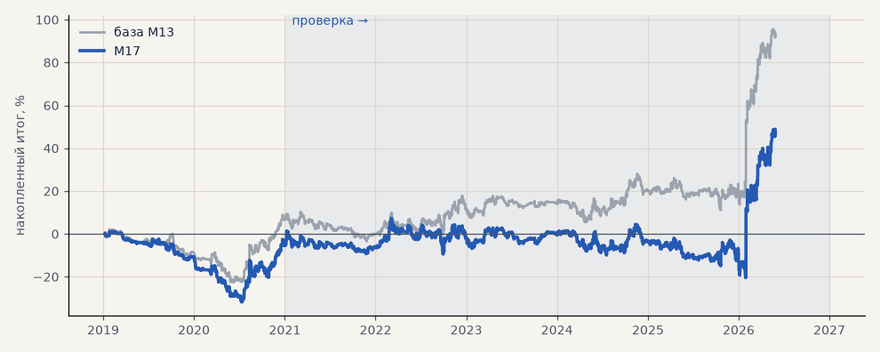

# M17. Признаки «слабой зоны» по EMA5

**Семейство:** модель CatBoost · **база:** M13 · **гипотеза:** — · **вердикт:** не помогло

**Что поменяли:** расстояние до EMA5 и сторона закрытия как признаки модели

Подробности: [results/trend_filter_ema.md](../../results/trend_filter_ema.md)

Проверка — сделки, открытые с 1 января 2021 года; выбор — до 2021. В скобках — база на тех же инструментах.

| срез | период | сделок | итог % | выигрышей | ожидание на сделку | PF | без 2 лучших | просадка | t | лет в плюсе |
|---|---|---|---|---|---|---|---|---|---|---|
| все инструменты | проверка | 1361 (1364) | +52.5 (+85.7) | 45% (46%) | +0.039% (+0.063%) | 1.10 (1.18) | +36.7 (+70.0) | -27.6 (-17.0) | 1.11 (1.80) | 3/6 (4/6) |
| все инструменты | выбор | 424 (494) | -5.5 (+6.5) | 44% (46%) | -0.013% (+0.013%) | 0.96 (1.05) | -12.3 (-0.3) | -32.9 (-24.8) | -0.27 (0.32) | 1/2 (1/2) |
| серебро | проверка | 1361 (1364) | +52.5 (+85.7) | 45% (46%) | +0.039% (+0.063%) | 1.10 (1.18) | +36.7 (+70.0) | -27.6 (-17.0) | 1.11 (1.80) | 3/6 (4/6) |
| серебро | выбор | 424 (494) | -5.5 (+6.5) | 44% (46%) | -0.013% (+0.013%) | 0.96 (1.05) | -12.3 (-0.3) | -32.9 (-24.8) | -0.27 (0.32) | 1/2 (1/2) |

Журнал сделок: `trades.csv.gz` (инструмент, прогон, сторона, вход, выход, цены, результат после издержек, причина выхода).
