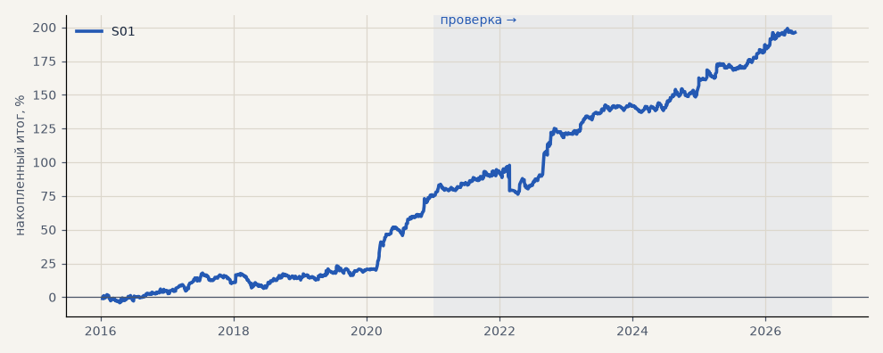

# S01. Импульс, базовая версия

**Семейство:** стратегия без ML (импульс) · **база:** — · **гипотеза:** H24 · **вердикт:** база

**Что поменяли:** ход за 6 ч ≥ 3 ATR по тренд-гейту C; стоп и трейлинг 6 ATR (активация +3), выход ≤ 240 ч; комиссия 0.04%, стоп исполняется по уровню

Подробности: [results/impulse_instruments.md](../../results/impulse_instruments.md)

Проверка — сделки, открытые с 1 января 2021 года; выбор — до 2021. В скобках — база на тех же инструментах.

| срез | период | сделок | итог % | выигрышей | ожидание на сделку | PF | без 2 лучших | просадка | t | лет в плюсе |
|---|---|---|---|---|---|---|---|---|---|---|
| все инструменты | проверка | 1914 | +86.1 | 47% | +0.360% | 1.27 | +76.7 | -12.2 | 3.13 | 5/6 |
| все инструменты | выбор | 1199 | +26.2 | 45% | +0.175% | 1.16 | +21.3 | -13.8 | 1.88 | 2/5 |
| портфель 4 | проверка | 890 | +121.1 | 49% | +0.544% | 1.48 | +102.6 | -21.5 | 3.35 | 6/6 |
| портфель 4 | выбор | 667 | +75.2 | 47% | +0.451% | 1.43 | +65.5 | -11.4 | 3.29 | 5/5 |
| серебро | проверка | 243 | +150.2 | 49% | +0.618% | 1.55 | +112.8 | -25.4 | 2.40 | 5/6 |
| серебро | выбор | 218 | +101.9 | 44% | +0.468% | 1.57 | +63.4 | -32.0 | 2.04 | 4/5 |
| золото | проверка | 263 | +61.3 | 47% | +0.233% | 1.41 | +34.3 | -24.5 | 1.83 | 4/6 |
| золото | выбор | 243 | -16.2 | 43% | -0.066% | 0.90 | -31.4 | -42.5 | -0.60 | 2/5 |
| LKOH | проверка | 213 | +86.3 | 51% | +0.405% | 1.37 | +61.5 | -30.5 | 1.72 | 5/6 |
| LKOH | выбор | 132 | +71.2 | 52% | +0.539% | 1.50 | +43.4 | -29.3 | 1.75 | 2/5 |
| GAZP | проверка | 216 | +142.3 | 52% | +0.659% | 1.48 | +68.5 | -79.8 | 1.31 | 5/6 |
| GAZP | выбор | 155 | +88.2 | 48% | +0.569% | 1.58 | +60.2 | -18.2 | 2.02 | 4/5 |
| SBER | проверка | 218 | +105.5 | 45% | +0.484% | 1.53 | +76.9 | -35.9 | 2.04 | 4/6 |
| SBER | выбор | 162 | +39.3 | 48% | +0.243% | 1.18 | +13.8 | -43.3 | 0.82 | 4/5 |
| MOEX | проверка | 227 | +24.2 | 46% | +0.107% | 1.09 | -1.3 | -32.0 | 0.50 | 3/6 |
| MOEX | выбор | 154 | +11.3 | 45% | +0.073% | 1.05 | -10.9 | -57.4 | 0.26 | 1/5 |
| MTSS | проверка | 192 | +55.1 | 44% | +0.287% | 1.25 | +15.1 | -21.8 | 1.03 | 4/6 |
| MTSS | выбор | 135 | -86.6 | 38% | -0.641% | 0.59 | -101.3 | -93.2 | -2.51 | 2/5 |
| ETH | проверка | 342 | +63.9 | 44% | +0.187% | 1.07 | +5.2 | -100.7 | 0.44 | 4/6 |

Журнал сделок: `trades.csv.gz` (инструмент, прогон, сторона, вход, выход, цены, результат после издержек, причина выхода).
