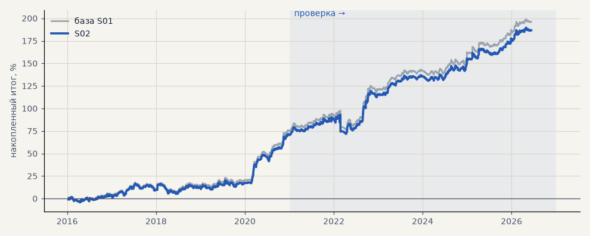

# S02. Стоп исполняется по цене открытия при гэпе

**Семейство:** стратегия без ML (импульс) · **база:** S01 · **гипотеза:** — · **вердикт:** учтено (поправка −9 п.п.)

**Что поменяли:** если минута открылась уже за стопом (ночь, выходные), выход по её цене открытия, а не по уровню стопа

Подробности: [results/audit.md](../../results/audit.md)

Проверка — сделки, открытые с 1 января 2021 года; выбор — до 2021. В скобках — база на тех же инструментах.

| срез | период | сделок | итог % | выигрышей | ожидание на сделку | PF | без 2 лучших | просадка | t | лет в плюсе |
|---|---|---|---|---|---|---|---|---|---|---|
| все инструменты | проверка | 890 (890) | +115.9 (+121.1) | 49% (49%) | +0.521% (+0.544%) | 1.46 (1.48) | +98.2 (+102.6) | -21.5 (-21.5) | 3.23 (3.35) | 6/6 (6/6) |
| все инструменты | выбор | 667 (667) | +70.8 (+75.2) | 47% (47%) | +0.425% (+0.451%) | 1.40 (1.43) | +61.2 (+65.5) | -11.6 (-11.4) | 3.08 (3.29) | 5/5 (5/5) |
| серебро | проверка | 243 (243) | +149.0 (+150.2) | 49% (49%) | +0.613% (+0.618%) | 1.54 (1.55) | +111.6 (+112.8) | -25.4 (-25.4) | 2.38 (2.40) | 5/6 (5/6) |
| серебро | выбор | 218 (218) | +101.5 (+101.9) | 44% (44%) | +0.466% (+0.468%) | 1.56 (1.57) | +63.0 (+63.4) | -32.3 (-32.0) | 2.03 (2.04) | 4/5 (4/5) |
| LKOH | проверка | 213 (213) | +79.6 (+86.3) | 51% (51%) | +0.374% (+0.405%) | 1.34 (1.37) | +55.2 (+61.5) | -31.4 (-30.5) | 1.59 (1.72) | 5/6 (5/6) |
| LKOH | выбор | 132 (132) | +65.6 (+71.2) | 52% (52%) | +0.497% (+0.539%) | 1.44 (1.50) | +37.8 (+43.4) | -29.5 (-29.3) | 1.60 (1.75) | 2/5 (2/5) |
| GAZP | проверка | 216 (216) | +136.2 (+142.3) | 52% (52%) | +0.631% (+0.659%) | 1.46 (1.48) | +65.4 (+68.5) | -80.3 (-79.8) | 1.27 (1.31) | 5/6 (5/6) |
| GAZP | выбор | 155 (155) | +80.5 (+88.2) | 47% (48%) | +0.519% (+0.569%) | 1.50 (1.58) | +52.5 (+60.2) | -20.6 (-18.2) | 1.82 (2.02) | 4/5 (4/5) |
| SBER | проверка | 218 (218) | +98.7 (+105.5) | 45% (45%) | +0.453% (+0.484%) | 1.48 (1.53) | +70.1 (+76.9) | -40.7 (-35.9) | 1.90 (2.04) | 4/6 (4/6) |
| SBER | выбор | 162 (162) | +35.7 (+39.3) | 48% (48%) | +0.220% (+0.243%) | 1.16 (1.18) | +10.2 (+13.8) | -43.7 (-43.3) | 0.74 (0.82) | 4/5 (4/5) |

Журнал сделок: `trades.csv.gz` (инструмент, прогон, сторона, вход, выход, цены, результат после издержек, причина выхода).
