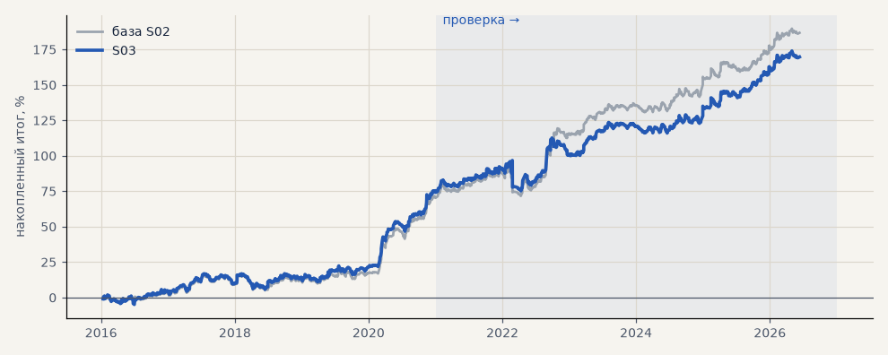

# S03. Цены акций скорректированы на дивиденды

**Семейство:** стратегия без ML (импульс) · **база:** S02 · **гипотеза:** H01 · **вердикт:** учтено (подтвердилась)

**Что поменяли:** обратная корректировка цен акций на 66 отсечек 2015–2026; стоп по гэпу

Подробности: [results/costs.md](../../results/costs.md)

Проверка — сделки, открытые с 1 января 2021 года; выбор — до 2021. В скобках — база на тех же инструментах.

| срез | период | сделок | итог % | выигрышей | ожидание на сделку | PF | без 2 лучших | просадка | t | лет в плюсе |
|---|---|---|---|---|---|---|---|---|---|---|
| все инструменты | проверка | 1924 | +70.1 | 47% | +0.292% | 1.21 | +61.0 | -12.4 | 2.57 | 5/6 |
| все инструменты | выбор | 1196 | +26.5 | 46% | +0.177% | 1.17 | +21.7 | -11.7 | 1.92 | 3/5 |
| портфель 4 | проверка | 896 (890) | +95.3 (+115.9) | 49% (49%) | +0.425% (+0.521%) | 1.37 (1.46) | +79.6 (+98.2) | -21.5 (-21.5) | 2.68 (3.23) | 6/6 (6/6) |
| портфель 4 | выбор | 665 (667) | +74.4 (+70.8) | 48% (47%) | +0.448% (+0.425%) | 1.43 (1.40) | +64.8 (+61.2) | -11.0 (-11.6) | 3.28 (3.08) | 5/5 (5/5) |
| серебро | проверка | 243 (243) | +149.0 (+149.0) | 49% (49%) | +0.613% (+0.613%) | 1.54 (1.54) | +111.6 (+111.6) | -25.4 (-25.4) | 2.38 (2.38) | 5/6 (5/6) |
| серебро | выбор | 218 (218) | +101.5 (+101.5) | 44% (44%) | +0.466% (+0.466%) | 1.56 (1.56) | +63.0 (+63.0) | -32.3 (-32.3) | 2.03 (2.03) | 4/5 (4/5) |
| золото | проверка | 263 | +59.1 | 46% | +0.225% | 1.40 | +32.1 | -26.2 | 1.76 | 4/6 |
| золото | выбор | 243 | -17.0 | 43% | -0.070% | 0.90 | -32.2 | -43.3 | -0.63 | 2/5 |
| LKOH | проверка | 214 (213) | +43.2 (+79.6) | 50% (51%) | +0.202% (+0.374%) | 1.18 (1.34) | +20.2 (+55.2) | -48.2 (-31.4) | 0.88 (1.59) | 5/6 (5/6) |
| LKOH | выбор | 132 (132) | +80.2 (+65.6) | 54% (52%) | +0.607% (+0.497%) | 1.58 (1.44) | +52.4 (+37.8) | -28.7 (-29.5) | 1.98 (1.60) | 3/5 (2/5) |
| GAZP | проверка | 219 (216) | +77.3 (+136.2) | 51% (52%) | +0.353% (+0.631%) | 1.24 (1.46) | +16.3 (+65.4) | -80.3 (-80.3) | 0.73 (1.27) | 4/6 (5/6) |
| GAZP | выбор | 154 (155) | +81.7 (+80.5) | 48% (47%) | +0.531% (+0.519%) | 1.54 (1.50) | +53.7 (+52.5) | -18.2 (-20.6) | 1.93 (1.82) | 4/5 (4/5) |
| SBER | проверка | 220 (218) | +111.6 (+98.7) | 46% (45%) | +0.507% (+0.453%) | 1.56 (1.48) | +83.0 (+70.1) | -23.5 (-40.7) | 2.17 (1.90) | 4/6 (4/6) |
| SBER | выбор | 161 (162) | +34.4 (+35.7) | 48% (48%) | +0.213% (+0.220%) | 1.15 (1.16) | +8.9 (+10.2) | -42.4 (-43.7) | 0.71 (0.74) | 3/5 (4/5) |
| MOEX | проверка | 227 | +11.3 | 45% | +0.050% | 1.04 | -14.2 | -32.7 | 0.23 | 2/6 |
| MOEX | выбор | 153 | +8.0 | 46% | +0.052% | 1.04 | -11.4 | -55.8 | 0.18 | 3/5 |
| MTSS | проверка | 196 | +45.6 | 43% | +0.233% | 1.20 | +6.5 | -25.0 | 0.87 | 3/6 |
| MTSS | выбор | 135 | -76.6 | 39% | -0.567% | 0.63 | -93.4 | -85.4 | -2.15 | 1/5 |
| ETH | проверка | 342 | +63.9 | 44% | +0.187% | 1.07 | +5.2 | -100.7 | 0.44 | 4/6 |

Журнал сделок: `trades.csv.gz` (инструмент, прогон, сторона, вход, выход, цены, результат после издержек, причина выхода).
