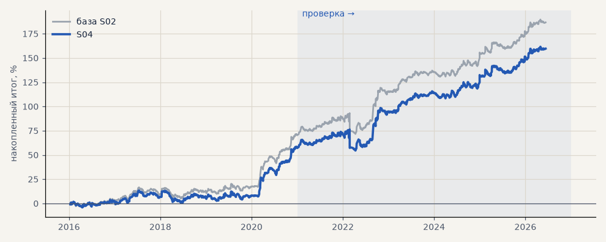

# S04. Проскальзывание 0.05% на входе и выходе

**Семейство:** стратегия без ML (импульс) · **база:** S02 · **гипотеза:** — · **вердикт:** проверка запаса

**Что проверяли.** Цена исполнения хуже на 0.05% при входе и при выходе по стопу или трейлингу (выход по времени — по цене закрытия). Стоп по гэпу, без дивидендной корректировки.

**Зачем.** Узнать, сколько проскальзывания выдерживает стратегия.

**Итог простыми словами.** Небольшая потеря, значимость сохраняется.

Подробности: [results/audit.md](../../results/audit.md)

Проверка — сделки, открытые с 1 января 2021 года; выбор — до 2021. В скобках — база на тех же инструментах.

| срез | период | сделок | итог % | выигрышей | ожидание на сделку | PF | без 2 лучших | просадка | t | лет в плюсе |
|---|---|---|---|---|---|---|---|---|---|---|
| все инструменты | проверка | 888 (890) | +102.0 (+115.9) | 49% (49%) | +0.459% (+0.521%) | 1.39 (1.46) | +84.3 (+98.2) | -21.7 (-21.5) | 2.83 (3.23) | 6/6 (6/6) |
| все инструменты | выбор | 667 (667) | +57.7 (+70.8) | 46% (47%) | +0.346% (+0.425%) | 1.31 (1.40) | +48.1 (+61.2) | -12.7 (-11.6) | 2.50 (3.08) | 4/5 (5/5) |
| серебро | проверка | 240 (243) | +140.8 (+149.0) | 49% (49%) | +0.587% (+0.613%) | 1.50 (1.54) | +103.5 (+111.6) | -28.8 (-25.4) | 2.25 (2.38) | 5/6 (5/6) |
| серебро | выбор | 217 (218) | +86.6 (+101.5) | 42% (44%) | +0.399% (+0.466%) | 1.46 (1.56) | +48.2 (+63.0) | -43.0 (-32.3) | 1.73 (2.03) | 3/5 (4/5) |
| LKOH | проверка | 213 (213) | +61.0 (+79.6) | 49% (51%) | +0.286% (+0.374%) | 1.25 (1.34) | +36.8 (+55.2) | -36.3 (-31.4) | 1.21 (1.59) | 5/6 (5/6) |
| LKOH | выбор | 133 (132) | +52.1 (+65.6) | 49% (52%) | +0.391% (+0.497%) | 1.33 (1.44) | +24.4 (+37.8) | -34.0 (-29.5) | 1.25 (1.60) | 2/5 (2/5) |
| GAZP | проверка | 219 (216) | +118.4 (+136.2) | 52% (52%) | +0.540% (+0.631%) | 1.38 (1.46) | +47.8 (+65.4) | -81.5 (-80.3) | 1.10 (1.27) | 5/6 (5/6) |
| GAZP | выбор | 155 (155) | +65.2 (+80.5) | 47% (47%) | +0.420% (+0.519%) | 1.39 (1.50) | +37.3 (+52.5) | -25.9 (-20.6) | 1.47 (1.82) | 4/5 (4/5) |
| SBER | проверка | 216 (218) | +87.7 (+98.7) | 44% (45%) | +0.406% (+0.453%) | 1.42 (1.48) | +59.3 (+70.1) | -40.3 (-40.7) | 1.69 (1.90) | 4/6 (4/6) |
| SBER | выбор | 162 (162) | +26.9 (+35.7) | 48% (48%) | +0.166% (+0.220%) | 1.12 (1.16) | +1.6 (+10.2) | -41.4 (-43.7) | 0.56 (0.74) | 4/5 (4/5) |

Журнал сделок: `trades.csv.gz` (инструмент, прогон, сторона, вход, выход, цены, результат после издержек, причина выхода).
