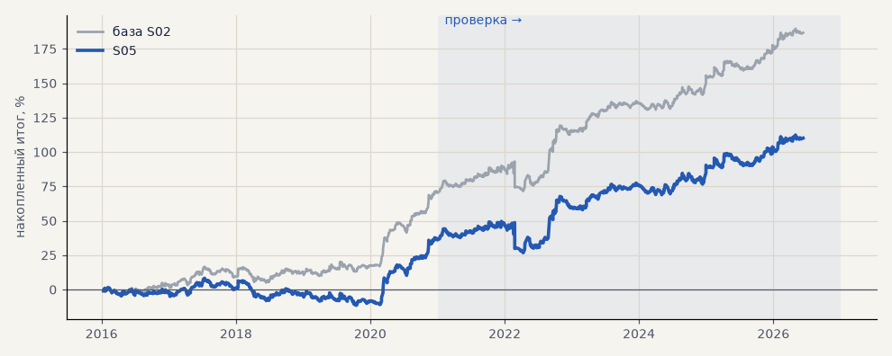

# S05. Проскальзывание 0.1% на входе и выходе

**Семейство:** стратегия без ML (импульс) · **база:** S02 · **гипотеза:** — · **вердикт:** проверка запаса

**Что поменяли:** рабочий порог издержек

Подробности: [results/audit.md](../../results/audit.md)

Проверка — сделки, открытые с 1 января 2021 года; выбор — до 2021. В скобках — база на тех же инструментах.

| срез | период | сделок | итог % | выигрышей | ожидание на сделку | PF | без 2 лучших | просадка | t | лет в плюсе |
|---|---|---|---|---|---|---|---|---|---|---|
| все инструменты | проверка | 893 (890) | +73.6 (+115.9) | 47% (49%) | +0.330% (+0.521%) | 1.27 (1.46) | +56.0 (+98.2) | -22.9 (-21.5) | 2.06 (3.23) | 6/6 (6/6) |
| все инструменты | выбор | 669 (667) | +36.5 (+70.8) | 44% (47%) | +0.218% (+0.425%) | 1.18 (1.40) | +27.0 (+61.2) | -19.7 (-11.6) | 1.59 (3.08) | 2/5 (5/5) |
| серебро | проверка | 240 (243) | +121.8 (+149.0) | 48% (49%) | +0.508% (+0.613%) | 1.42 (1.54) | +84.6 (+111.6) | -32.5 (-25.4) | 1.94 (2.38) | 5/6 (5/6) |
| серебро | выбор | 218 (218) | +60.1 (+101.5) | 39% (44%) | +0.276% (+0.466%) | 1.29 (1.56) | +21.9 (+63.0) | -49.7 (-32.3) | 1.20 (2.03) | 3/5 (4/5) |
| LKOH | проверка | 213 (213) | +31.7 (+79.6) | 48% (51%) | +0.149% (+0.374%) | 1.12 (1.34) | +9.1 (+55.2) | -39.4 (-31.4) | 0.64 (1.59) | 4/6 (5/6) |
| LKOH | выбор | 133 (132) | +42.7 (+65.6) | 48% (52%) | +0.321% (+0.497%) | 1.26 (1.44) | +15.2 (+37.8) | -35.8 (-29.5) | 1.03 (1.60) | 2/5 (2/5) |
| GAZP | проверка | 221 (216) | +80.5 (+136.2) | 50% (52%) | +0.364% (+0.631%) | 1.25 (1.46) | +10.2 (+65.4) | -93.3 (-80.3) | 0.75 (1.27) | 4/6 (5/6) |
| GAZP | выбор | 156 (155) | +34.4 (+80.5) | 45% (47%) | +0.220% (+0.519%) | 1.19 (1.50) | +8.0 (+52.5) | -29.5 (-20.6) | 0.81 (1.82) | 4/5 (4/5) |
| SBER | проверка | 219 (218) | +60.5 (+98.7) | 42% (45%) | +0.276% (+0.453%) | 1.27 (1.48) | +32.2 (+70.1) | -45.6 (-40.7) | 1.17 (1.90) | 3/6 (4/6) |
| SBER | выбор | 162 (162) | +8.8 (+35.7) | 48% (48%) | +0.055% (+0.220%) | 1.04 (1.16) | -16.3 (+10.2) | -51.9 (-43.7) | 0.18 (0.74) | 3/5 (4/5) |

Журнал сделок: `trades.csv.gz` (инструмент, прогон, сторона, вход, выход, цены, результат после издержек, причина выхода).
