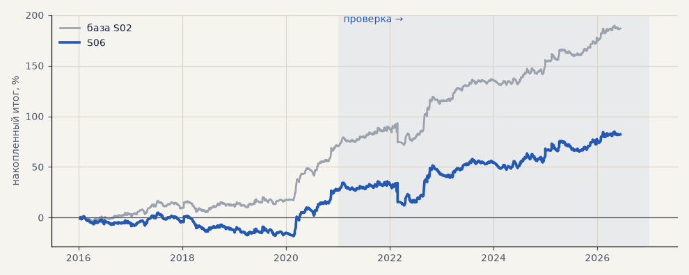

# S06. Проскальзывание 0.15% на входе и выходе

**Семейство:** стратегия без ML (импульс) · **база:** S02 · **гипотеза:** — · **вердикт:** проверка запаса

Подробности: [results/audit.md](../../results/audit.md)

Проверка — сделки, открытые с 1 января 2021 года; выбор — до 2021. В скобках — база на тех же инструментах.

| срез | период | сделок | итог % | выигрышей | ожидание на сделку | PF | без 2 лучших | просадка | t | лет в плюсе |
|---|---|---|---|---|---|---|---|---|---|---|
| все инструменты | проверка | 894 (890) | +55.3 (+115.9) | 46% (49%) | +0.247% (+0.521%) | 1.19 (1.46) | +37.8 (+98.2) | -23.8 (-21.5) | 1.54 (3.23) | 6/6 (6/6) |
| все инструменты | выбор | 670 (667) | +26.9 (+70.8) | 44% (47%) | +0.160% (+0.425%) | 1.13 (1.40) | +17.4 (+61.2) | -23.2 (-11.6) | 1.16 (3.08) | 2/5 (5/5) |
| серебро | проверка | 241 (243) | +97.6 (+149.0) | 47% (49%) | +0.405% (+0.613%) | 1.32 (1.54) | +60.5 (+111.6) | -36.9 (-25.4) | 1.55 (2.38) | 5/6 (5/6) |
| серебро | выбор | 219 (218) | +44.0 (+101.5) | 38% (44%) | +0.201% (+0.466%) | 1.20 (1.56) | +6.0 (+63.0) | -58.4 (-32.3) | 0.87 (2.03) | 3/5 (4/5) |
| LKOH | проверка | 214 (213) | +14.4 (+79.6) | 47% (51%) | +0.067% (+0.374%) | 1.05 (1.34) | -8.0 (+55.2) | -45.8 (-31.4) | 0.29 (1.59) | 2/6 (5/6) |
| LKOH | выбор | 133 (132) | +30.9 (+65.6) | 48% (52%) | +0.232% (+0.497%) | 1.18 (1.44) | +3.6 (+37.8) | -37.9 (-29.5) | 0.74 (1.60) | 2/5 (2/5) |
| GAZP | проверка | 219 (216) | +64.3 (+136.2) | 48% (52%) | +0.294% (+0.631%) | 1.19 (1.46) | -5.8 (+65.4) | -95.2 (-80.3) | 0.60 (1.27) | 4/6 (5/6) |
| GAZP | выбор | 156 (155) | +35.0 (+80.5) | 44% (47%) | +0.224% (+0.519%) | 1.19 (1.50) | +7.4 (+52.5) | -31.5 (-20.6) | 0.78 (1.82) | 3/5 (4/5) |
| SBER | проверка | 220 (218) | +44.9 (+98.7) | 41% (45%) | +0.204% (+0.453%) | 1.19 (1.48) | +16.8 (+70.1) | -47.6 (-40.7) | 0.88 (1.90) | 3/6 (4/6) |
| SBER | выбор | 162 (162) | -2.3 (+35.7) | 46% (48%) | -0.014% (+0.220%) | 0.99 (1.16) | -27.4 (+10.2) | -56.1 (-43.7) | -0.05 (0.74) | 3/5 (4/5) |

Журнал сделок: `trades.csv.gz` (инструмент, прогон, сторона, вход, выход, цены, результат после издержек, причина выхода).
