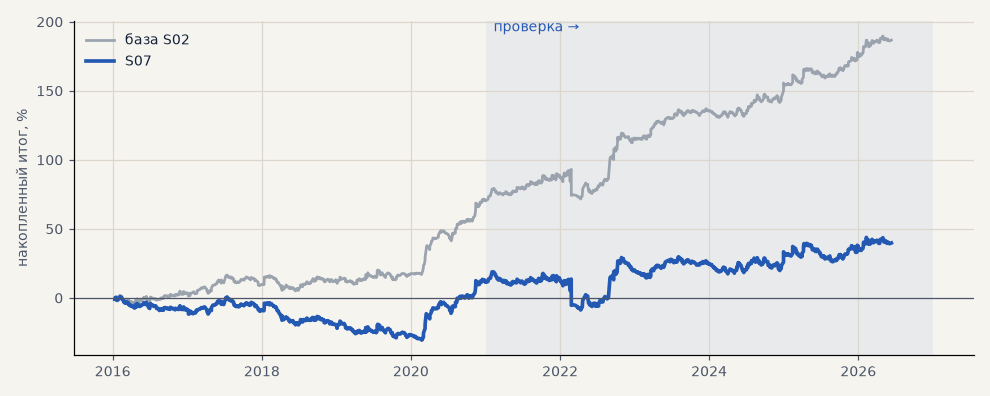

# S07. Проскальзывание 0.2% на входе и выходе

**Семейство:** стратегия без ML (импульс) · **база:** S02 · **гипотеза:** — · **вердикт:** проверка запаса

Подробности: [results/audit.md](../../results/audit.md)

Проверка — сделки, открытые с 1 января 2021 года; выбор — до 2021. В скобках — база на тех же инструментах.

| срез | период | сделок | итог % | выигрышей | ожидание на сделку | PF | без 2 лучших | просадка | t | лет в плюсе |
|---|---|---|---|---|---|---|---|---|---|---|
| все инструменты | проверка | 901 (890) | +28.4 (+115.9) | 43% (49%) | +0.126% (+0.521%) | 1.09 (1.46) | +10.9 (+98.2) | -27.6 (-21.5) | 0.79 (3.23) | 6/6 (6/6) |
| все инструменты | выбор | 671 (667) | +11.5 (+70.8) | 42% (47%) | +0.068% (+0.425%) | 1.05 (1.40) | +2.0 (+61.2) | -31.3 (-11.6) | 0.49 (3.08) | 1/5 (5/5) |
| серебро | проверка | 245 (243) | +53.6 (+149.0) | 45% (49%) | +0.219% (+0.613%) | 1.16 (1.54) | +16.6 (+111.6) | -51.8 (-25.4) | 0.85 (2.38) | 5/6 (5/6) |
| серебро | выбор | 219 (218) | +22.8 (+101.5) | 36% (44%) | +0.104% (+0.466%) | 1.10 (1.56) | -15.0 (+63.0) | -71.6 (-32.3) | 0.45 (2.03) | 3/5 (4/5) |
| LKOH | проверка | 214 (213) | +0.2 (+79.6) | 43% (51%) | +0.001% (+0.374%) | 1.00 (1.34) | -22.0 (+55.2) | -53.2 (-31.4) | 0.00 (1.59) | 3/6 (5/6) |
| LKOH | выбор | 134 (132) | +24.4 (+65.6) | 48% (52%) | +0.182% (+0.497%) | 1.14 (1.44) | -2.7 (+37.8) | -39.9 (-29.5) | 0.58 (1.60) | 2/5 (2/5) |
| GAZP | проверка | 221 (216) | +34.7 (+136.2) | 45% (52%) | +0.157% (+0.631%) | 1.10 (1.46) | -35.2 (+65.4) | -96.5 (-80.3) | 0.32 (1.27) | 4/6 (5/6) |
| GAZP | выбор | 156 (155) | +15.1 (+80.5) | 42% (47%) | +0.097% (+0.519%) | 1.08 (1.50) | -12.2 (+52.5) | -40.7 (-20.6) | 0.34 (1.82) | 3/5 (4/5) |
| SBER | проверка | 221 (218) | +24.9 (+98.7) | 39% (45%) | +0.113% (+0.453%) | 1.10 (1.48) | -3.7 (+70.1) | -56.0 (-40.7) | 0.48 (1.90) | 3/6 (4/6) |
| SBER | выбор | 162 (162) | -16.4 (+35.7) | 46% (48%) | -0.101% (+0.220%) | 0.93 (1.16) | -41.3 (+10.2) | -59.9 (-43.7) | -0.34 (0.74) | 3/5 (4/5) |

Журнал сделок: `trades.csv.gz` (инструмент, прогон, сторона, вход, выход, цены, результат после издержек, причина выхода).
