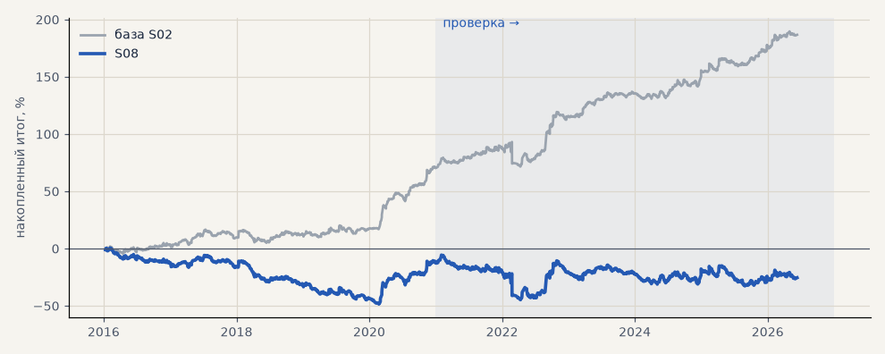

# S08. Проскальзывание 0.3% на входе и выходе

**Семейство:** стратегия без ML (импульс) · **база:** S02 · **гипотеза:** — · **вердикт:** проверка запаса

**Что поменяли:** за точкой безубытка (≈ 0.25%)

Подробности: [results/audit.md](../../results/audit.md)

Проверка — сделки, открытые с 1 января 2021 года; выбор — до 2021. В скобках — база на тех же инструментах.

| срез | период | сделок | итог % | выигрышей | ожидание на сделку | PF | без 2 лучших | просадка | t | лет в плюсе |
|---|---|---|---|---|---|---|---|---|---|---|
| все инструменты | проверка | 905 (890) | -12.7 (+115.9) | 41% (49%) | -0.056% (+0.521%) | 0.96 (1.46) | -30.1 (+98.2) | -39.1 (-21.5) | -0.35 (3.23) | 3/6 (6/6) |
| все инструменты | выбор | 671 (667) | -12.7 (+70.8) | 41% (47%) | -0.076% (+0.425%) | 0.94 (1.40) | -22.0 (+61.2) | -48.8 (-11.6) | -0.55 (3.08) | 1/5 (5/5) |
| серебро | проверка | 247 (243) | +9.5 (+149.0) | 45% (49%) | +0.038% (+0.613%) | 1.03 (1.54) | -27.3 (+111.6) | -68.8 (-25.4) | 0.15 (2.38) | 4/6 (5/6) |
| серебро | выбор | 219 (218) | -18.2 (+101.5) | 33% (44%) | -0.083% (+0.466%) | 0.93 (1.56) | -55.6 (+63.0) | -91.6 (-32.3) | -0.37 (2.03) | 1/5 (4/5) |
| LKOH | проверка | 215 (213) | -35.5 (+79.6) | 40% (51%) | -0.165% (+0.374%) | 0.88 (1.34) | -57.2 (+55.2) | -67.8 (-31.4) | -0.71 (1.59) | 2/6 (5/6) |
| LKOH | выбор | 134 (132) | +9.1 (+65.6) | 47% (52%) | +0.068% (+0.497%) | 1.05 (1.44) | -17.7 (+37.8) | -44.4 (-29.5) | 0.22 (1.60) | 2/5 (2/5) |
| GAZP | проверка | 222 (216) | -17.4 (+136.2) | 42% (52%) | -0.078% (+0.631%) | 0.96 (1.46) | -86.9 (+65.4) | -107.1 (-80.3) | -0.16 (1.27) | 2/6 (5/6) |
| GAZP | выбор | 156 (155) | -0.8 (+80.5) | 41% (47%) | -0.005% (+0.519%) | 1.00 (1.50) | -27.9 (+52.5) | -49.3 (-20.6) | -0.02 (1.82) | 3/5 (4/5) |
| SBER | проверка | 221 (218) | -7.4 (+98.7) | 37% (45%) | -0.033% (+0.453%) | 0.97 (1.48) | -35.7 (+70.1) | -63.7 (-40.7) | -0.14 (1.90) | 3/6 (4/6) |
| SBER | выбор | 162 (162) | -40.8 (+35.7) | 46% (48%) | -0.252% (+0.220%) | 0.85 (1.16) | -65.4 (+10.2) | -75.4 (-43.7) | -0.83 (0.74) | 3/5 (4/5) |

Журнал сделок: `trades.csv.gz` (инструмент, прогон, сторона, вход, выход, цены, результат после издержек, причина выхода).
