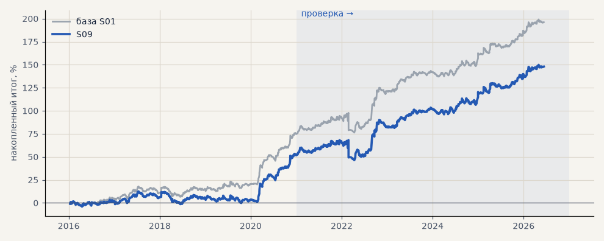

# S09. Проскальзывание 0.1% только на входе

**Семейство:** стратегия без ML (импульс) · **база:** S01 · **гипотеза:** — · **вердикт:** проверка запаса

**Что проверяли.** Проскальзывание 0.1% только на входе, стоп по уровню — первая проверка издержек (28.09), на всех 8 рынках.

**Зачем.** Пережить реальные издержки входа.

**Итог простыми словами.** Серебро и акции устойчивы, золото падает почти до нуля.

Подробности: [results/patterns.md](../../results/patterns.md)

Проверка — сделки, открытые с 1 января 2021 года; выбор — до 2021. В скобках — база на тех же инструментах.

| срез | период | сделок | итог % | выигрышей | ожидание на сделку | PF | без 2 лучших | просадка | t | лет в плюсе |
|---|---|---|---|---|---|---|---|---|---|---|
| все инструменты | проверка | 1916 (1914) | +60.5 (+86.1) | 46% (47%) | +0.253% (+0.360%) | 1.18 (1.27) | +51.1 (+76.7) | -17.7 (-12.2) | 2.21 (3.13) | 5/6 (5/6) |
| все инструменты | выбор | 1200 (1199) | +13.3 (+26.2) | 44% (45%) | +0.089% (+0.175%) | 1.08 (1.16) | +8.5 (+21.3) | -18.8 (-13.8) | 0.97 (1.88) | 1/5 (2/5) |
| портфель 4 | проверка | 893 (890) | +95.8 (+121.1) | 48% (49%) | +0.429% (+0.544%) | 1.37 (1.48) | +77.5 (+102.6) | -21.8 (-21.5) | 2.67 (3.35) | 6/6 (6/6) |
| портфель 4 | выбор | 669 (667) | +52.1 (+75.2) | 45% (47%) | +0.312% (+0.451%) | 1.28 (1.43) | +42.5 (+65.5) | -13.9 (-11.4) | 2.30 (3.29) | 3/5 (5/5) |
| серебро | проверка | 240 (243) | +141.1 (+150.2) | 50% (49%) | +0.588% (+0.618%) | 1.51 (1.55) | +103.8 (+112.8) | -28.5 (-25.4) | 2.26 (2.40) | 5/6 (5/6) |
| серебро | выбор | 218 (218) | +78.8 (+101.9) | 42% (44%) | +0.362% (+0.468%) | 1.40 (1.57) | +40.5 (+63.4) | -39.4 (-32.0) | 1.57 (2.04) | 3/5 (4/5) |
| золото | проверка | 261 (263) | +34.9 (+61.3) | 45% (47%) | +0.134% (+0.233%) | 1.21 (1.41) | +8.1 (+34.3) | -31.2 (-24.5) | 1.04 (1.83) | 3/6 (4/6) |
| золото | выбор | 245 (243) | -34.3 (-16.2) | 40% (43%) | -0.140% (-0.066%) | 0.80 (0.90) | -49.3 (-31.4) | -53.6 (-42.5) | -1.27 (-0.60) | 2/5 (2/5) |
| LKOH | проверка | 213 (213) | +53.7 (+86.3) | 49% (51%) | +0.252% (+0.405%) | 1.22 (1.37) | +31.0 (+61.5) | -34.1 (-30.5) | 1.10 (1.72) | 5/6 (5/6) |
| LKOH | выбор | 133 (132) | +56.3 (+71.2) | 48% (52%) | +0.423% (+0.539%) | 1.37 (1.50) | +28.7 (+43.4) | -33.1 (-29.3) | 1.38 (1.75) | 2/5 (2/5) |
| GAZP | проверка | 221 (216) | +104.4 (+142.3) | 51% (52%) | +0.472% (+0.659%) | 1.33 (1.48) | +30.8 (+68.5) | -90.7 (-79.8) | 0.96 (1.31) | 4/6 (5/6) |
| GAZP | выбор | 156 (155) | +50.6 (+88.2) | 46% (48%) | +0.324% (+0.569%) | 1.30 (1.58) | +24.3 (+60.2) | -24.0 (-18.2) | 1.21 (2.02) | 4/5 (4/5) |
| SBER | проверка | 219 (218) | +84.2 (+105.5) | 43% (45%) | +0.385% (+0.484%) | 1.40 (1.53) | +55.8 (+76.9) | -35.4 (-35.9) | 1.65 (2.04) | 3/6 (4/6) |
| SBER | выбор | 162 (162) | +22.8 (+39.3) | 48% (48%) | +0.141% (+0.243%) | 1.10 (1.18) | -2.5 (+13.8) | -47.5 (-43.3) | 0.47 (0.82) | 4/5 (4/5) |
| MOEX | проверка | 227 (227) | +4.6 (+24.2) | 42% (46%) | +0.020% (+0.107%) | 1.02 (1.09) | -20.7 (-1.3) | -36.1 (-32.0) | 0.09 (0.50) | 4/6 (3/6) |
| MOEX | выбор | 151 (154) | +29.9 (+11.3) | 47% (45%) | +0.198% (+0.073%) | 1.15 (1.05) | +7.9 (-10.9) | -33.2 (-57.4) | 0.68 (0.26) | 2/5 (1/5) |
| MTSS | проверка | 190 (192) | +41.2 (+55.1) | 45% (44%) | +0.217% (+0.287%) | 1.17 (1.25) | +3.7 (+15.1) | -33.1 (-21.8) | 0.76 (1.03) | 4/6 (4/6) |
| MTSS | выбор | 135 (135) | -97.7 (-86.6) | 37% (38%) | -0.724% (-0.641%) | 0.55 (0.59) | -112.2 (-101.3) | -99.3 (-93.2) | -2.85 (-2.51) | 2/5 (2/5) |
| ETH | проверка | 345 (342) | +19.8 (+63.9) | 43% (44%) | +0.057% (+0.187%) | 1.02 (1.07) | -38.7 (+5.2) | -100.9 (-100.7) | 0.14 (0.44) | 4/6 (4/6) |

Журнал сделок: `trades.csv.gz` (инструмент, прогон, сторона, вход, выход, цены, результат после издержек, причина выхода).
