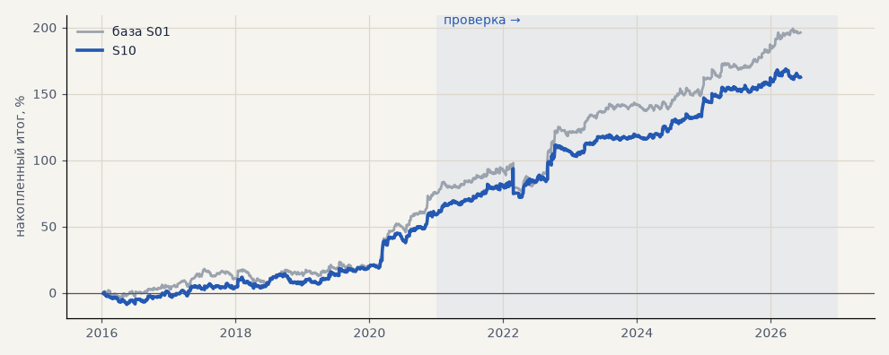

# S10. Выход при развороте тренд-фильтра

**Семейство:** стратегия без ML (импульс) · **база:** S01 · **гипотеза:** — · **вердикт:** не помогло

**Что поменяли:** сделка закрывается, когда гейт C разворачивается против неё

Подробности: [results/trend_filter_ema.md](../../results/trend_filter_ema.md)

Проверка — сделки, открытые с 1 января 2021 года; выбор — до 2021. В скобках — база на тех же инструментах.

| срез | период | сделок | итог % | выигрышей | ожидание на сделку | PF | без 2 лучших | просадка | t | лет в плюсе |
|---|---|---|---|---|---|---|---|---|---|---|
| все инструменты | проверка | 1246 (890) | +102.8 (+121.1) | 42% (49%) | +0.330% (+0.544%) | 1.41 (1.48) | +84.4 (+102.6) | -21.6 (-21.5) | 3.00 (3.35) | 6/6 (6/6) |
| все инструменты | выбор | 896 (667) | +59.7 (+75.2) | 39% (47%) | +0.267% (+0.451%) | 1.34 (1.43) | +50.8 (+65.5) | -9.3 (-11.4) | 2.81 (3.29) | 4/5 (5/5) |
| серебро | проверка | 366 (243) | +70.5 (+150.2) | 39% (49%) | +0.193% (+0.618%) | 1.21 (1.55) | +32.4 (+112.8) | -36.1 (-25.4) | 1.20 (2.40) | 5/6 (5/6) |
| серебро | выбор | 306 (218) | +69.1 (+101.9) | 35% (44%) | +0.226% (+0.468%) | 1.36 (1.57) | +33.4 (+63.4) | -31.9 (-32.0) | 1.53 (2.04) | 3/5 (4/5) |
| LKOH | проверка | 292 (213) | +67.9 (+86.3) | 45% (51%) | +0.233% (+0.405%) | 1.32 (1.37) | +48.9 (+61.5) | -17.8 (-30.5) | 1.59 (1.72) | 5/6 (5/6) |
| LKOH | выбор | 176 (132) | +79.2 (+71.2) | 44% (52%) | +0.450% (+0.539%) | 1.62 (1.50) | +51.4 (+43.4) | -18.1 (-29.3) | 2.11 (1.75) | 3/5 (2/5) |
| GAZP | проверка | 290 (216) | +146.3 (+142.3) | 44% (52%) | +0.504% (+0.659%) | 1.52 (1.48) | +72.5 (+68.5) | -75.6 (-79.8) | 1.38 (1.31) | 5/6 (5/6) |
| GAZP | выбор | 198 (155) | +61.0 (+88.2) | 41% (48%) | +0.308% (+0.569%) | 1.40 (1.58) | +32.9 (+60.2) | -15.4 (-18.2) | 1.55 (2.02) | 4/5 (4/5) |
| SBER | проверка | 298 (218) | +126.7 (+105.5) | 41% (45%) | +0.425% (+0.484%) | 1.72 (1.53) | +90.3 (+76.9) | -31.9 (-35.9) | 2.58 (2.04) | 4/6 (4/6) |
| SBER | выбор | 216 (162) | +29.5 (+39.3) | 38% (48%) | +0.136% (+0.243%) | 1.12 (1.18) | +4.0 (+13.8) | -35.5 (-43.3) | 0.62 (0.82) | 2/5 (4/5) |

Журнал сделок: `trades.csv.gz` (инструмент, прогон, сторона, вход, выход, цены, результат после издержек, причина выхода).
