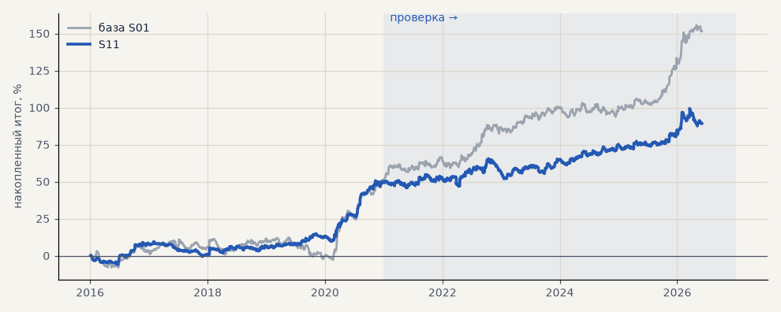

# S11. Узкий трейлинг 3 ATR

**Семейство:** стратегия без ML (импульс) · **база:** S01 · **гипотеза:** — · **вердикт:** не помогло (хрупко к проскальзыванию)

**Что проверяли.** Стоп и трейлинг 3 ATR вместо 6 (трейлинг включается после +1.5 ATR), выход по-прежнему не позже 240 часов. Серебро, золото, Лукойл.

**Зачем.** Ближний стоп — меньше убыток на сделку.

**Итог простыми словами.** Итог заметно ниже, и при 0.1% проскальзывания стратегия почти обнуляется — узкий стоп выбивает рынок обычным шумом.

Подробности: [results/patterns.md](../../results/patterns.md)

Проверка — сделки, открытые с 1 января 2021 года; выбор — до 2021. В скобках — база на тех же инструментах.

| срез | период | сделок | итог % | выигрышей | ожидание на сделку | PF | без 2 лучших | просадка | t | лет в плюсе |
|---|---|---|---|---|---|---|---|---|---|---|
| все инструменты | проверка | 1203 (719) | +40.1 (+99.3) | 42% (49%) | +0.100% (+0.414%) | 1.18 (1.46) | +30.6 (+86.8) | -13.7 (-9.3) | 1.80 (3.43) | 6/6 (6/6) |
| все инструменты | выбор | 927 (593) | +49.2 (+52.3) | 41% (45%) | +0.159% (+0.265%) | 1.39 (1.32) | +39.8 (+39.5) | -10.2 (-15.0) | 2.89 (2.24) | 4/5 (4/5) |
| серебро | проверка | 412 (243) | +61.2 (+150.2) | 43% (49%) | +0.149% (+0.618%) | 1.22 (1.55) | +36.4 (+112.8) | -33.5 (-25.4) | 1.31 (2.40) | 6/6 (5/6) |
| серебро | выбор | 336 (218) | +60.1 (+101.9) | 42% (44%) | +0.179% (+0.468%) | 1.41 (1.57) | +34.0 (+63.4) | -16.1 (-32.0) | 1.84 (2.04) | 3/5 (4/5) |
| золото | проверка | 459 (263) | +14.4 (+61.3) | 40% (47%) | +0.031% (+0.233%) | 1.08 (1.41) | -0.8 (+34.3) | -24.5 (-24.5) | 0.58 (1.83) | 3/6 (4/6) |
| золото | выбор | 395 (243) | +1.2 (-16.2) | 39% (43%) | +0.003% (-0.066%) | 1.01 (0.90) | -5.9 (-31.4) | -12.5 (-42.5) | 0.08 (-0.60) | 2/5 (2/5) |
| LKOH | проверка | 332 (213) | +44.7 (+86.3) | 44% (51%) | +0.135% (+0.405%) | 1.20 (1.37) | +20.7 (+61.5) | -29.8 (-30.5) | 1.09 (1.72) | 6/6 (5/6) |
| LKOH | выбор | 196 (132) | +86.2 (+71.2) | 45% (52%) | +0.440% (+0.539%) | 1.70 (1.50) | +61.0 (+43.4) | -22.1 (-29.3) | 2.45 (1.75) | 3/5 (2/5) |

Журнал сделок: `trades.csv.gz` (инструмент, прогон, сторона, вход, выход, цены, результат после издержек, причина выхода).
