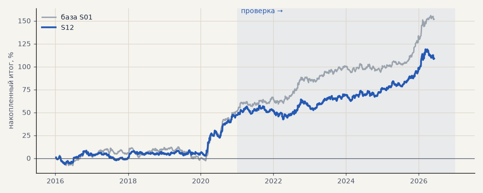

# S12. Выход не позже 120 ч (стоп 6, трейлинг 6, активация 3)

**Семейство:** стратегия без ML (импульс) · **база:** S01 · **гипотеза:** — · **вердикт:** хуже 240 ч

**Что поменяли:** первая версия стратегии в пайплайне

Подробности: [results/patterns.md](../../results/patterns.md)

Проверка — сделки, открытые с 1 января 2021 года; выбор — до 2021. В скобках — база на тех же инструментах.

| срез | период | сделок | итог % | выигрышей | ожидание на сделку | PF | без 2 лучших | просадка | t | лет в плюсе |
|---|---|---|---|---|---|---|---|---|---|---|
| все инструменты | проверка | 904 (719) | +61.8 (+99.3) | 50% (49%) | +0.205% (+0.414%) | 1.24 (1.46) | +53.8 (+86.8) | -15.1 (-9.3) | 2.34 (3.43) | 6/6 (6/6) |
| все инструменты | выбор | 737 (593) | +46.9 (+52.3) | 46% (45%) | +0.191% (+0.265%) | 1.29 (1.32) | +36.8 (+39.5) | -10.7 (-15.0) | 2.27 (2.24) | 4/5 (4/5) |
| серебро | проверка | 306 (243) | +112.4 (+150.2) | 50% (49%) | +0.367% (+0.618%) | 1.34 (1.55) | +88.8 (+112.8) | -33.8 (-25.4) | 1.92 (2.40) | 5/6 (5/6) |
| серебро | выбор | 260 (218) | +89.8 (+101.9) | 45% (44%) | +0.345% (+0.468%) | 1.47 (1.57) | +62.2 (+63.4) | -19.1 (-32.0) | 2.10 (2.04) | 3/5 (4/5) |
| золото | проверка | 335 (263) | +45.8 (+61.3) | 51% (47%) | +0.137% (+0.233%) | 1.28 (1.41) | +33.8 (+34.3) | -32.1 (-24.5) | 1.68 (1.83) | 3/6 (4/6) |
| золото | выбор | 303 (243) | -10.4 (-16.2) | 43% (43%) | -0.034% (-0.066%) | 0.93 (0.90) | -22.3 (-31.4) | -26.5 (-42.5) | -0.45 (-0.60) | 2/5 (2/5) |
| LKOH | проверка | 263 (213) | +27.2 (+86.3) | 50% (51%) | +0.103% (+0.405%) | 1.10 (1.37) | +7.2 (+61.5) | -48.8 (-30.5) | 0.59 (1.72) | 5/6 (5/6) |
| LKOH | выбор | 174 (132) | +61.4 (+71.2) | 52% (52%) | +0.353% (+0.539%) | 1.43 (1.50) | +32.2 (+43.4) | -24.5 (-29.3) | 1.61 (1.75) | 2/5 (2/5) |

Журнал сделок: `trades.csv.gz` (инструмент, прогон, сторона, вход, выход, цены, результат после издержек, причина выхода).
