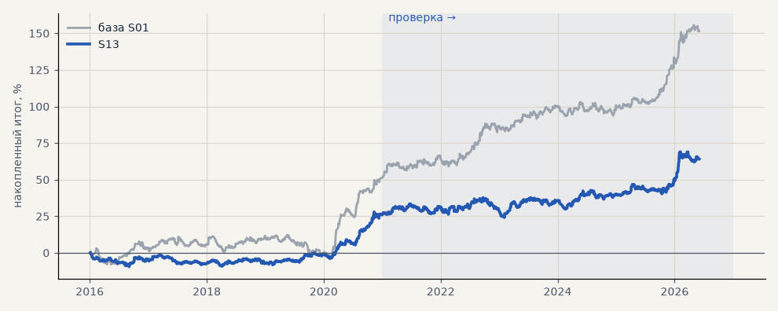

# S13. Выход не позже 48 ч (стоп 4, трейлинг 4, активация 2)

**Семейство:** стратегия без ML (импульс) · **база:** S01 · **гипотеза:** — · **вердикт:** хуже 240 ч

**Что поменяли:** короткое удержание

Подробности: [results/patterns.md](../../results/patterns.md)

Проверка — сделки, открытые с 1 января 2021 года; выбор — до 2021. В скобках — база на тех же инструментах.

| срез | период | сделок | итог % | выигрышей | ожидание на сделку | PF | без 2 лучших | просадка | t | лет в плюсе |
|---|---|---|---|---|---|---|---|---|---|---|
| все инструменты | проверка | 1235 (719) | +38.3 (+99.3) | 46% (49%) | +0.093% (+0.414%) | 1.17 (1.46) | +30.9 (+86.8) | -13.5 (-9.3) | 1.91 (3.43) | 5/6 (6/6) |
| все инструменты | выбор | 958 (593) | +25.8 (+52.3) | 46% (45%) | +0.081% (+0.265%) | 1.19 (1.32) | +20.5 (+39.5) | -9.5 (-15.0) | 1.86 (2.24) | 3/5 (4/5) |
| серебро | проверка | 426 (243) | +69.0 (+150.2) | 44% (49%) | +0.162% (+0.618%) | 1.25 (1.55) | +46.8 (+112.8) | -26.8 (-25.4) | 1.57 (2.40) | 6/6 (5/6) |
| серебро | выбор | 337 (218) | +3.3 (+101.9) | 44% (44%) | +0.010% (+0.468%) | 1.02 (1.57) | -10.5 (+63.4) | -23.6 (-32.0) | 0.12 (2.04) | 2/5 (4/5) |
| золото | проверка | 454 (263) | +18.7 (+61.3) | 46% (47%) | +0.041% (+0.233%) | 1.11 (1.41) | +8.1 (+34.3) | -22.4 (-24.5) | 0.84 (1.83) | 4/6 (4/6) |
| золото | выбор | 400 (243) | +5.0 (-16.2) | 43% (43%) | +0.013% (-0.066%) | 1.04 (0.90) | -3.9 (-31.4) | -9.2 (-42.5) | 0.31 (-0.60) | 2/5 (2/5) |
| LKOH | проверка | 355 (213) | +27.1 (+86.3) | 49% (51%) | +0.076% (+0.405%) | 1.13 (1.37) | +11.4 (+61.5) | -24.1 (-30.5) | 0.79 (1.72) | 5/6 (5/6) |
| LKOH | выбор | 221 (132) | +69.1 (+71.2) | 55% (52%) | +0.313% (+0.539%) | 1.62 (1.50) | +53.6 (+43.4) | -10.5 (-29.3) | 2.54 (1.75) | 3/5 (2/5) |

Журнал сделок: `trades.csv.gz` (инструмент, прогон, сторона, вход, выход, цены, результат после издержек, причина выхода).
