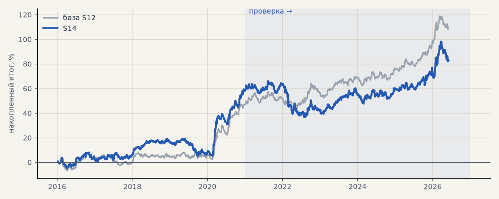

# S14. Без тренд-фильтра (выход 120 ч)

**Семейство:** стратегия без ML (импульс) · **база:** S12 · **гипотеза:** — · **вердикт:** хуже

**Что проверяли.** Выход 120 часов; вход по любому импульсу 6 ч / 3 ATR в его сторону, без проверки тренд-гейта.

**Зачем.** Нужен ли тренд-фильтр вообще.

**Итог простыми словами.** На этих трёх рынках без фильтра хуже. Позже на 8 рынках и 300 случайных фильтрах выяснилось, что в среднем фильтр почти ничего не добавляет, а гейт C — удачный вариант.

Подробности: [results/patterns.md](../../results/patterns.md)

Проверка — сделки, открытые с 1 января 2021 года; выбор — до 2021. В скобках — база на тех же инструментах.

| срез | период | сделок | итог % | выигрышей | ожидание на сделку | PF | без 2 лучших | просадка | t | лет в плюсе |
|---|---|---|---|---|---|---|---|---|---|---|
| все инструменты | проверка | 1089 (904) | +24.7 (+61.8) | 48% (50%) | +0.068% (+0.205%) | 1.07 (1.24) | +12.8 (+53.8) | -29.4 (-15.1) | 0.78 (2.34) | 5/6 (6/6) |
| все инструменты | выбор | 892 (737) | +58.1 (+46.9) | 47% (46%) | +0.196% (+0.191%) | 1.29 (1.29) | +48.0 (+36.8) | -14.5 (-10.7) | 2.57 (2.27) | 4/5 (4/5) |
| серебро | проверка | 369 (306) | +80.7 (+112.4) | 48% (50%) | +0.219% (+0.367%) | 1.19 (1.34) | +45.2 (+88.8) | -35.0 (-33.8) | 1.21 (1.92) | 5/6 (5/6) |
| серебро | выбор | 328 (260) | +101.1 (+89.8) | 46% (45%) | +0.308% (+0.345%) | 1.41 (1.47) | +73.5 (+62.2) | -17.2 (-19.1) | 2.11 (2.10) | 5/5 (3/5) |
| золото | проверка | 389 (335) | +46.5 (+45.8) | 48% (51%) | +0.120% (+0.137%) | 1.21 (1.28) | +31.8 (+33.8) | -33.6 (-32.1) | 1.42 (1.68) | 4/6 (3/6) |
| золото | выбор | 366 (303) | +11.1 (-10.4) | 46% (43%) | +0.030% (-0.034%) | 1.06 (0.93) | -0.8 (-22.3) | -27.8 (-26.5) | 0.43 (-0.45) | 2/5 (2/5) |
| LKOH | проверка | 331 (263) | -53.2 (+27.2) | 47% (50%) | -0.161% (+0.103%) | 0.86 (1.10) | -75.3 (+7.2) | -101.0 (-48.8) | -0.91 (0.59) | 5/6 (5/6) |
| LKOH | выбор | 198 (174) | +62.2 (+61.4) | 51% (52%) | +0.314% (+0.353%) | 1.36 (1.43) | +33.1 (+32.2) | -26.0 (-24.5) | 1.53 (1.61) | 3/5 (2/5) |

Журнал сделок: `trades.csv.gz` (инструмент, прогон, сторона, вход, выход, цены, результат после издержек, причина выхода).
