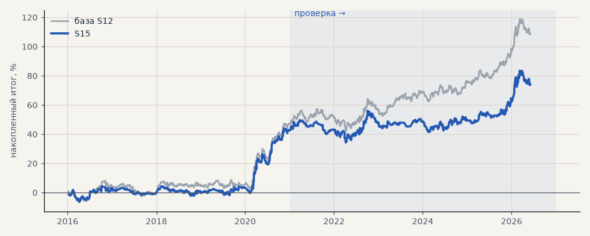

# S15. Только при высокой волатильности (выход 120 ч)

**Семейство:** стратегия без ML (импульс) · **база:** S12 · **гипотеза:** — · **вердикт:** не универсально

**Что поменяли:** входить, только если ATR не ниже медианы прошлого

Подробности: [results/patterns.md](../../results/patterns.md)

Проверка — сделки, открытые с 1 января 2021 года; выбор — до 2021. В скобках — база на тех же инструментах.

| срез | период | сделок | итог % | выигрышей | ожидание на сделку | PF | без 2 лучших | просадка | t | лет в плюсе |
|---|---|---|---|---|---|---|---|---|---|---|
| все инструменты | проверка | 592 (904) | +31.4 (+61.8) | 51% (50%) | +0.159% (+0.205%) | 1.16 (1.24) | +23.5 (+53.8) | -15.2 (-15.1) | 1.30 (2.34) | 6/6 (6/6) |
| все инструменты | выбор | 480 (737) | +42.7 (+46.9) | 47% (46%) | +0.267% (+0.191%) | 1.37 (1.29) | +32.6 (+36.8) | -8.1 (-10.7) | 2.24 (2.27) | 4/5 (4/5) |
| серебро | проверка | 199 (306) | +68.4 (+112.4) | 52% (50%) | +0.344% (+0.367%) | 1.25 (1.34) | +44.8 (+88.8) | -33.8 (-33.8) | 1.23 (1.92) | 5/6 (5/6) |
| серебро | выбор | 166 (260) | +75.1 (+89.8) | 46% (45%) | +0.452% (+0.345%) | 1.53 (1.47) | +48.9 (+62.2) | -12.8 (-19.1) | 1.88 (2.10) | 4/5 (3/5) |
| золото | проверка | 246 (335) | +50.2 (+45.8) | 54% (51%) | +0.204% (+0.137%) | 1.39 (1.28) | +38.3 (+33.8) | -19.0 (-32.1) | 1.99 (1.68) | 4/6 (3/6) |
| золото | выбор | 217 (303) | -13.4 (-10.4) | 44% (43%) | -0.062% (-0.034%) | 0.89 (0.93) | -25.3 (-22.3) | -26.1 (-26.5) | -0.61 (-0.45) | 1/5 (2/5) |
| LKOH | проверка | 147 (263) | -24.3 (+27.2) | 46% (50%) | -0.165% (+0.103%) | 0.88 (1.10) | -44.3 (+7.2) | -58.2 (-48.8) | -0.61 (0.59) | 3/6 (5/6) |
| LKOH | выбор | 97 (174) | +66.3 (+61.4) | 54% (52%) | +0.684% (+0.353%) | 1.83 (1.43) | +37.2 (+32.2) | -11.7 (-24.5) | 1.95 (1.61) | 2/4 (2/5) |

Журнал сделок: `trades.csv.gz` (инструмент, прогон, сторона, вход, выход, цены, результат после издержек, причина выхода).
