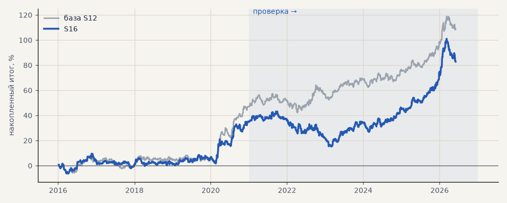

# S16. Импульс 8 ч / 3.5 ATR (выход 120 ч)

**Семейство:** стратегия без ML (импульс) · **база:** S12 · **гипотеза:** — · **вердикт:** без улучшения

**Что проверяли.** Выход 120 часов; импульс — ход за 8 часов не меньше 3.5 ATR (вместо 6 часов и 3 ATR).

**Зачем.** Более длинное и сильное движение может лучше продолжаться.

**Итог простыми словами.** Сделок меньше, итог ниже. Сетка «окно × порог» гладкая, 6 ч / 3 ATR остаётся.

Подробности: [results/patterns.md](../../results/patterns.md)

Проверка — сделки, открытые с 1 января 2021 года; выбор — до 2021. В скобках — база на тех же инструментах.

| срез | период | сделок | итог % | выигрышей | ожидание на сделку | PF | без 2 лучших | просадка | t | лет в плюсе |
|---|---|---|---|---|---|---|---|---|---|---|
| все инструменты | проверка | 837 (904) | +48.1 (+61.8) | 49% (50%) | +0.172% (+0.205%) | 1.19 (1.24) | +38.4 (+53.8) | -28.0 (-15.1) | 1.78 (2.34) | 5/6 (6/6) |
| все инструменты | выбор | 683 (737) | +34.8 (+46.9) | 46% (46%) | +0.153% (+0.191%) | 1.22 (1.29) | +24.6 (+36.8) | -11.5 (-10.7) | 1.74 (2.27) | 4/5 (4/5) |
| серебро | проверка | 282 (306) | +103.0 (+112.4) | 50% (50%) | +0.365% (+0.367%) | 1.33 (1.34) | +74.3 (+88.8) | -37.0 (-33.8) | 1.70 (1.92) | 6/6 (5/6) |
| серебро | выбор | 246 (260) | +70.7 (+89.8) | 46% (45%) | +0.287% (+0.345%) | 1.37 (1.47) | +45.4 (+62.2) | -21.0 (-19.1) | 1.69 (2.10) | 3/5 (3/5) |
| золото | проверка | 310 (335) | +13.4 (+45.8) | 49% (51%) | +0.043% (+0.137%) | 1.08 (1.28) | +0.7 (+33.8) | -37.2 (-32.1) | 0.49 (1.68) | 3/6 (3/6) |
| золото | выбор | 279 (303) | +4.0 (-10.4) | 43% (43%) | +0.014% (-0.034%) | 1.03 (0.93) | -7.6 (-22.3) | -22.2 (-26.5) | 0.17 (-0.45) | 2/5 (2/5) |
| LKOH | проверка | 245 (263) | +27.8 (+27.2) | 49% (50%) | +0.113% (+0.103%) | 1.11 (1.10) | +4.1 (+7.2) | -53.2 (-48.8) | 0.60 (0.59) | 4/6 (5/6) |
| LKOH | выбор | 158 (174) | +29.7 (+61.4) | 51% (52%) | +0.188% (+0.353%) | 1.21 (1.43) | +5.0 (+32.2) | -21.1 (-24.5) | 0.82 (1.61) | 2/5 (2/5) |

Журнал сделок: `trades.csv.gz` (инструмент, прогон, сторона, вход, выход, цены, результат после издержек, причина выхода).
