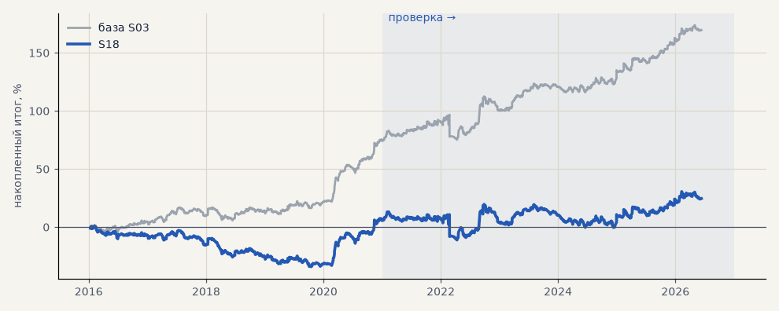

# S18. Издержки Альфа-Форекс, серебро с шагом 0.0001

**Семейство:** стратегия без ML (импульс) · **база:** S03 · **гипотеза:** H19 · **вердикт:** зависит от шага цены серебра

**Что поменяли:** то же, если серебро котируется с 4 знаками

**Издержки:** профиль `alfaforex` (спред и свопы брокера)

Подробности: [results/costs.md](../../results/costs.md)

Проверка — сделки, открытые с 1 января 2021 года; выбор — до 2021. В скобках — база на тех же инструментах.

| срез | период | сделок | итог % | выигрышей | ожидание на сделку | PF | без 2 лучших | просадка | t | лет в плюсе |
|---|---|---|---|---|---|---|---|---|---|---|
| все инструменты | проверка | 1924 (1924) | -2.4 (+70.1) | 42% (47%) | -0.010% (+0.292%) | 0.99 (1.21) | -11.5 (+61.0) | -28.8 (-12.4) | -0.09 (2.57) | 5/6 (5/6) |
| все инструменты | выбор | 1196 (1196) | -28.5 (+26.5) | 41% (46%) | -0.191% (+0.177%) | 0.85 (1.17) | -33.3 (+21.7) | -48.8 (-11.7) | -2.08 (1.92) | 1/5 (3/5) |
| портфель 4 | проверка | 896 (896) | +18.8 (+95.3) | 42% (49%) | +0.084% (+0.425%) | 1.06 (1.37) | +3.2 (+79.6) | -24.3 (-21.5) | 0.53 (2.68) | 5/6 (6/6) |
| портфель 4 | выбор | 665 (665) | +5.8 (+74.4) | 43% (48%) | +0.035% (+0.448%) | 1.03 (1.43) | -3.9 (+64.8) | -35.1 (-11.0) | 0.26 (3.28) | 1/5 (5/5) |
| серебро | проверка | 243 (243) | +149.2 (+149.0) | 49% (49%) | +0.614% (+0.613%) | 1.55 (1.54) | +111.8 (+111.6) | -25.4 (-25.4) | 2.39 (2.38) | 5/6 (5/6) |
| серебро | выбор | 218 (218) | +102.2 (+101.5) | 44% (44%) | +0.469% (+0.466%) | 1.57 (1.56) | +63.6 (+63.0) | -31.6 (-32.3) | 2.05 (2.03) | 4/5 (4/5) |
| золото | проверка | 263 (263) | +58.7 (+59.1) | 46% (46%) | +0.223% (+0.225%) | 1.39 (1.40) | +31.8 (+32.1) | -26.1 (-26.2) | 1.76 (1.76) | 4/6 (4/6) |
| золото | выбор | 243 (243) | -16.8 (-17.0) | 42% (43%) | -0.069% (-0.070%) | 0.90 (0.90) | -32.0 (-32.2) | -42.8 (-43.3) | -0.63 (-0.63) | 2/5 (2/5) |
| LKOH | проверка | 214 (214) | -61.4 (+43.2) | 40% (50%) | -0.287% (+0.202%) | 0.79 (1.18) | -83.0 (+20.2) | -90.8 (-48.2) | -1.27 (0.88) | 1/6 (5/6) |
| LKOH | выбор | 132 (132) | -3.9 (+80.2) | 45% (54%) | -0.030% (+0.607%) | 0.98 (1.58) | -30.1 (+52.4) | -49.4 (-28.7) | -0.10 (1.98) | 2/5 (3/5) |
| GAZP | проверка | 219 (219) | -25.5 (+77.3) | 42% (51%) | -0.116% (+0.353%) | 0.93 (1.24) | -85.5 (+16.3) | -113.1 (-80.3) | -0.24 (0.73) | 3/6 (4/6) |
| GAZP | выбор | 154 (154) | -15.7 (+81.7) | 40% (48%) | -0.102% (+0.531%) | 0.92 (1.54) | -42.5 (+53.7) | -53.8 (-18.2) | -0.38 (1.93) | 3/5 (4/5) |
| SBER | проверка | 220 (220) | +13.0 (+111.6) | 37% (46%) | +0.059% (+0.507%) | 1.05 (1.56) | -14.2 (+83.0) | -45.7 (-23.5) | 0.26 (2.17) | 2/6 (4/6) |
| SBER | выбор | 161 (161) | -59.4 (+34.4) | 45% (48%) | -0.369% (+0.213%) | 0.78 (1.15) | -83.9 (+8.9) | -91.3 (-42.4) | -1.25 (0.71) | 2/5 (3/5) |
| MOEX | проверка | 227 (227) | -96.0 (+11.3) | 37% (45%) | -0.423% (+0.050%) | 0.71 (1.04) | -119.6 (-14.2) | -96.0 (-32.7) | -1.98 (0.23) | 1/6 (2/6) |
| MOEX | выбор | 153 (153) | -77.0 (+8.0) | 39% (46%) | -0.503% (+0.052%) | 0.69 (1.04) | -94.6 (-11.4) | -103.5 (-55.8) | -1.83 (0.18) | 1/5 (3/5) |
| MTSS | проверка | 196 (196) | -50.0 (+45.6) | 39% (43%) | -0.255% (+0.233%) | 0.82 (1.20) | -88.8 (+6.5) | -55.9 (-25.0) | -0.97 (0.87) | 2/6 (3/6) |
| MTSS | выбор | 135 (135) | -157.2 (-76.6) | 32% (39%) | -1.165% (-0.567%) | 0.39 (0.63) | -172.6 (-93.4) | -157.2 (-85.4) | -4.46 (-2.15) | 0/5 (1/5) |
| ETH | проверка | 342 (342) | -7.1 (+63.9) | 44% (44%) | -0.021% (+0.187%) | 0.99 (1.07) | -65.2 (+5.2) | -112.4 (-100.7) | -0.05 (0.44) | 4/6 (4/6) |

Журнал сделок: `trades.csv.gz` (инструмент, прогон, сторона, вход, выход, цены, результат после издержек, причина выхода).
