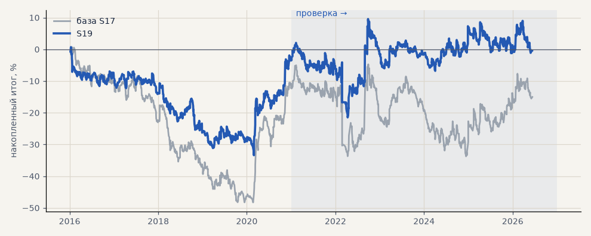

# S19. Альфа-Форекс + выход 168 ч / 4 ATR

**Семейство:** стратегия без ML (импульс) · **база:** S17 · **гипотеза:** H03 · **вердикт:** не помогло

**Что проверяли.** Условия Альфа-Форекс, но выход не позже 168 часов, стоп и трейлинг 4 ATR (трейлинг после +2 ATR). Сделки заново посчитаны штатным симулятором с дивидендами и стопом по гэпу.

**Зачем.** Короче удержание — меньше переносов и свопов. Это лучший по профит-фактору вариант сетки на 2016–2020.

**Итог простыми словами.** Около нуля — экономия на свопах меньше потери сигнала.

**Издержки:** профиль `alfaforex` (спред и свопы брокера)

Подробности: [results/costs.md](../../results/costs.md)

Проверка — сделки, открытые с 1 января 2021 года; выбор — до 2021. В скобках — база на тех же инструментах.

| срез | период | сделок | итог % | выигрышей | ожидание на сделку | PF | без 2 лучших | просадка | t | лет в плюсе |
|---|---|---|---|---|---|---|---|---|---|---|
| все инструменты | проверка | 2701 (1924) | -5.3 (-13.2) | 40% (42%) | -0.016% (-0.055%) | 0.98 (0.96) | -14.0 (-22.2) | -28.8 (-31.1) | -0.25 (-0.49) | 3/6 (5/6) |
| все инструменты | выбор | 1589 (1196) | -19.5 (-37.5) | 39% (40%) | -0.098% (-0.251%) | 0.89 (0.81) | -23.2 (-42.3) | -36.5 (-56.0) | -1.64 (-2.76) | 1/5 (1/5) |
| портфель 4 | проверка | 1236 (896) | +2.1 (-2.7) | 40% (42%) | +0.007% (-0.012%) | 1.01 (0.99) | -11.6 (-18.1) | -23.5 (-29.0) | 0.07 (-0.08) | 3/6 (3/6) |
| портфель 4 | выбор | 879 (665) | -2.5 (-12.3) | 40% (41%) | -0.011% (-0.074%) | 0.99 (0.94) | -9.9 (-21.8) | -34.1 (-49.0) | -0.13 (-0.55) | 1/5 (1/5) |
| серебро | проверка | 357 (243) | -19.6 (+63.1) | 38% (46%) | -0.055% (+0.260%) | 0.95 (1.20) | -44.3 (+26.8) | -49.3 (-49.4) | -0.38 (1.02) | 2/6 (5/6) |
| серебро | выбор | 299 (218) | -13.1 (+29.9) | 36% (37%) | -0.044% (+0.137%) | 0.94 (1.14) | -34.5 (-8.0) | -56.2 (-63.8) | -0.37 (0.61) | 2/5 (2/5) |
| золото | проверка | 390 (263) | +54.5 (+58.7) | 45% (46%) | +0.140% (+0.223%) | 1.31 (1.39) | +36.8 (+31.8) | -19.3 (-26.1) | 1.86 (1.76) | 4/6 (4/6) |
| золото | выбор | 345 (243) | +7.2 (-16.8) | 43% (42%) | +0.021% (-0.069%) | 1.06 (0.90) | -1.9 (-32.0) | -11.2 (-42.8) | 0.36 (-0.63) | 2/5 (2/5) |
| LKOH | проверка | 301 (214) | -65.1 (-61.4) | 38% (40%) | -0.216% (-0.287%) | 0.78 (0.79) | -87.1 (-83.0) | -70.4 (-90.8) | -1.55 (-1.27) | 0/6 (1/6) |
| LKOH | выбор | 173 (132) | +27.7 (-3.9) | 45% (45%) | +0.160% (-0.030%) | 1.17 (0.98) | +7.9 (-30.1) | -42.3 (-49.4) | 0.78 (-0.10) | 1/5 (2/5) |
| GAZP | проверка | 284 (219) | +46.6 (-25.5) | 44% (42%) | +0.164% (-0.116%) | 1.15 (0.93) | -7.7 (-85.5) | -59.7 (-113.1) | 0.56 (-0.24) | 5/6 (3/6) |
| GAZP | выбор | 199 (154) | +3.8 (-15.7) | 43% (40%) | +0.019% (-0.102%) | 1.02 (0.92) | -25.9 (-42.5) | -35.4 (-53.8) | 0.09 (-0.38) | 2/5 (3/5) |
| SBER | проверка | 294 (220) | +46.4 (+13.0) | 40% (37%) | +0.158% (+0.059%) | 1.21 (1.05) | +24.6 (-14.2) | -26.5 (-45.7) | 1.13 (0.26) | 3/6 (2/6) |
| SBER | выбор | 208 (161) | -28.6 (-59.4) | 38% (45%) | -0.137% (-0.369%) | 0.89 (0.78) | -55.2 (-83.9) | -67.0 (-91.3) | -0.60 (-1.25) | 2/5 (2/5) |
| MOEX | проверка | 313 (227) | -103.4 (-96.0) | 37% (37%) | -0.330% (-0.423%) | 0.67 (0.71) | -120.9 (-119.6) | -103.4 (-96.0) | -2.56 (-1.98) | 1/6 (1/6) |
| MOEX | выбор | 191 (153) | -37.0 (-77.0) | 36% (39%) | -0.194% (-0.503%) | 0.82 (0.69) | -53.8 (-94.6) | -71.6 (-103.5) | -1.06 (-1.83) | 1/5 (1/5) |
| MTSS | проверка | 262 (196) | -64.6 (-50.0) | 34% (39%) | -0.246% (-0.255%) | 0.75 (0.82) | -100.1 (-88.8) | -64.7 (-55.9) | -1.43 (-0.97) | 1/6 (2/6) |
| MTSS | выбор | 174 (135) | -116.2 (-157.2) | 34% (32%) | -0.668% (-1.165%) | 0.47 (0.39) | -129.3 (-172.6) | -116.2 (-157.2) | -3.92 (-4.46) | 1/5 (0/5) |
| ETH | проверка | 500 (342) | +62.6 (-7.1) | 43% (44%) | +0.125% (-0.021%) | 1.07 (0.99) | +11.0 (-65.2) | -96.4 (-112.4) | 0.56 (-0.05) | 4/6 (4/6) |

Журнал сделок: `trades.csv.gz` (инструмент, прогон, сторона, вход, выход, цены, результат после издержек, причина выхода).
