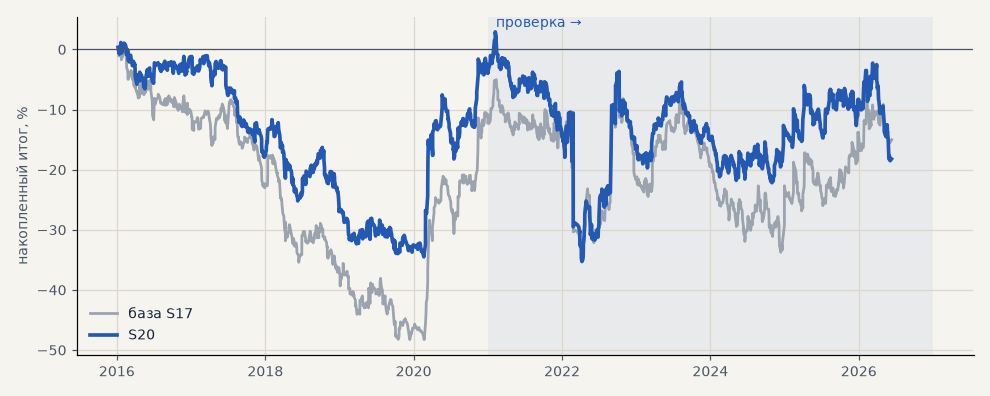

# S20. Альфа-Форекс + выход 120 ч / 6 ATR

**Семейство:** стратегия без ML (импульс) · **база:** S17 · **гипотеза:** H03 · **вердикт:** не помогло

**Что проверяли.** Условия Альфа-Форекс, выход не позже 120 часов, стоп и трейлинг 6 ATR.

**Зачем.** Короче удержание при том же стопе.

**Итог простыми словами.** Убыток.

**Издержки:** профиль `alfaforex` (спред и свопы брокера)

Подробности: [results/costs.md](../../results/costs.md)

Проверка — сделки, открытые с 1 января 2021 года; выбор — до 2021. В скобках — база на тех же инструментах.

| срез | период | сделок | итог % | выигрышей | ожидание на сделку | PF | без 2 лучших | просадка | t | лет в плюсе |
|---|---|---|---|---|---|---|---|---|---|---|
| все инструменты | проверка | 2343 (1924) | -15.3 (-13.2) | 44% (42%) | -0.052% (-0.055%) | 0.96 (0.96) | -24.2 (-22.2) | -34.6 (-31.1) | -0.60 (-0.49) | 2/6 (5/6) |
| все инструменты | выбор | 1496 (1196) | -25.2 (-37.5) | 41% (40%) | -0.135% (-0.251%) | 0.86 (0.81) | -28.9 (-42.3) | -41.1 (-56.0) | -2.06 (-2.76) | 1/5 (1/5) |
| портфель 4 | проверка | 1103 (896) | -14.5 (-2.7) | 44% (42%) | -0.053% (-0.012%) | 0.96 (0.99) | -29.1 (-18.1) | -38.2 (-29.0) | -0.43 (-0.08) | 3/6 (3/6) |
| портфель 4 | выбор | 833 (665) | -3.7 (-12.3) | 41% (41%) | -0.018% (-0.074%) | 0.98 (0.94) | -11.2 (-21.8) | -35.6 (-49.0) | -0.18 (-0.55) | 1/5 (1/5) |
| серебро | проверка | 306 (243) | +33.0 (+63.1) | 47% (46%) | +0.108% (+0.260%) | 1.09 (1.20) | +10.3 (+26.8) | -39.1 (-49.4) | 0.57 (1.02) | 5/6 (5/6) |
| серебро | выбор | 260 (218) | +25.9 (+29.9) | 41% (37%) | +0.100% (+0.137%) | 1.12 (1.14) | -0.8 (-8.0) | -49.3 (-63.8) | 0.61 (0.61) | 3/5 (2/5) |
| золото | проверка | 335 (263) | +47.3 (+58.7) | 51% (46%) | +0.141% (+0.223%) | 1.29 (1.39) | +35.4 (+31.8) | -31.9 (-26.1) | 1.74 (1.76) | 3/6 (4/6) |
| золото | выбор | 303 (243) | -7.5 (-16.8) | 44% (42%) | -0.025% (-0.069%) | 0.95 (0.90) | -19.4 (-32.0) | -23.8 (-42.8) | -0.32 (-0.63) | 2/5 (2/5) |
| LKOH | проверка | 265 (214) | -95.2 (-61.4) | 41% (40%) | -0.359% (-0.287%) | 0.70 (0.79) | -114.1 (-83.0) | -107.0 (-90.8) | -2.13 (-1.27) | 1/6 (1/6) |
| LKOH | выбор | 171 (132) | -5.6 (-3.9) | 43% (45%) | -0.033% (-0.030%) | 0.97 (0.98) | -34.0 (-30.1) | -56.2 (-49.4) | -0.15 (-0.10) | 2/5 (2/5) |
| GAZP | проверка | 267 (219) | -38.4 (-25.5) | 44% (42%) | -0.144% (-0.116%) | 0.90 (0.93) | -96.7 (-85.5) | -104.2 (-113.1) | -0.37 (-0.24) | 2/6 (3/6) |
| GAZP | выбор | 196 (154) | +5.0 (-15.7) | 42% (40%) | +0.026% (-0.102%) | 1.03 (0.92) | -19.3 (-42.5) | -33.2 (-53.8) | 0.13 (-0.38) | 2/5 (3/5) |
| SBER | проверка | 265 (220) | +42.6 (+13.0) | 43% (37%) | +0.161% (+0.059%) | 1.19 (1.05) | +20.3 (-14.2) | -31.2 (-45.7) | 0.98 (0.26) | 3/6 (2/6) |
| SBER | выбор | 206 (161) | -40.2 (-59.4) | 39% (45%) | -0.195% (-0.369%) | 0.85 (0.78) | -62.5 (-83.9) | -71.3 (-91.3) | -0.91 (-1.25) | 2/5 (2/5) |
| MOEX | проверка | 276 (227) | -106.7 (-96.0) | 39% (37%) | -0.387% (-0.423%) | 0.69 (0.71) | -125.3 (-119.6) | -106.7 (-96.0) | -2.36 (-1.98) | 1/6 (1/6) |
| MOEX | выбор | 188 (153) | -64.4 (-77.0) | 40% (39%) | -0.343% (-0.503%) | 0.73 (0.69) | -78.8 (-94.6) | -84.5 (-103.5) | -1.70 (-1.83) | 1/5 (1/5) |
| MTSS | проверка | 239 (196) | -29.8 (-50.0) | 40% (39%) | -0.125% (-0.255%) | 0.89 (0.82) | -68.6 (-88.8) | -48.6 (-55.9) | -0.59 (-0.97) | 2/6 (2/6) |
| MTSS | выбор | 172 (135) | -114.4 (-157.2) | 40% (32%) | -0.665% (-1.165%) | 0.47 (0.39) | -124.6 (-172.6) | -114.4 (-157.2) | -3.88 (-4.46) | 1/5 (0/5) |
| ETH | проверка | 390 (342) | +25.2 (-7.1) | 45% (44%) | +0.065% (-0.021%) | 1.03 (0.99) | -29.5 (-65.2) | -96.8 (-112.4) | 0.19 (-0.05) | 3/6 (4/6) |

Журнал сделок: `trades.csv.gz` (инструмент, прогон, сторона, вход, выход, цены, результат после издержек, причина выхода).
