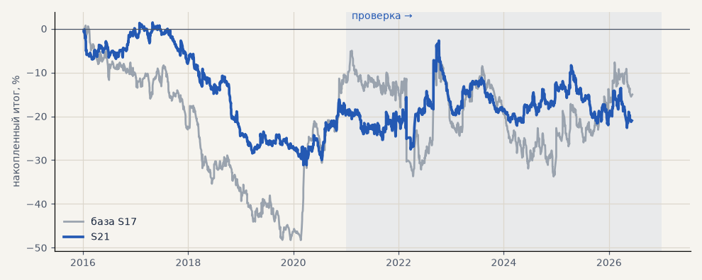

# S21. Альфа-Форекс + выход 72 ч / 3 ATR

**Семейство:** стратегия без ML (импульс) · **база:** S17 · **гипотеза:** H03 · **вердикт:** не помогло

**Что проверяли.** Условия Альфа-Форекс, выход не позже 72 часов, стоп и трейлинг 3 ATR.

**Зачем.** Ещё короче удержание.

**Итог простыми словами.** Около нуля — короткая сделка забирает лишь начало хода.

**Издержки:** профиль `alfaforex` (спред и свопы брокера)

Подробности: [results/costs.md](../../results/costs.md)

Проверка — сделки, открытые с 1 января 2021 года; выбор — до 2021. В скобках — база на тех же инструментах.

| срез | период | сделок | итог % | выигрышей | ожидание на сделку | PF | без 2 лучших | просадка | t | лет в плюсе |
|---|---|---|---|---|---|---|---|---|---|---|
| все инструменты | проверка | 3326 (1924) | -10.8 (-13.2) | 39% (42%) | -0.026% (-0.055%) | 0.97 (0.96) | -19.7 (-22.2) | -20.6 (-31.1) | -0.60 (-0.49) | 2/6 (5/6) |
| все инструменты | выбор | 1934 (1196) | -25.6 (-37.5) | 39% (40%) | -0.106% (-0.251%) | 0.83 (0.81) | -28.6 (-42.3) | -30.9 (-56.0) | -2.80 (-2.76) | 1/5 (1/5) |
| портфель 4 | проверка | 1529 (896) | -1.5 (-2.7) | 40% (42%) | -0.004% (-0.012%) | 0.99 (0.99) | -16.3 (-18.1) | -19.9 (-29.0) | -0.06 (-0.08) | 2/6 (3/6) |
| портфель 4 | выбор | 1070 (665) | -19.5 (-12.3) | 40% (41%) | -0.073% (-0.074%) | 0.89 (0.94) | -25.3 (-21.8) | -32.5 (-49.0) | -1.26 (-0.55) | 1/5 (1/5) |
| серебро | проверка | 442 (243) | -3.4 (+63.1) | 38% (46%) | -0.008% (+0.260%) | 0.99 (1.20) | -26.4 (+26.8) | -42.2 (-49.4) | -0.08 (1.02) | 3/6 (5/6) |
| серебро | выбор | 349 (218) | +0.8 (+29.9) | 37% (37%) | +0.002% (+0.137%) | 1.00 (1.14) | -18.8 (-8.0) | -45.8 (-63.8) | 0.03 (0.61) | 2/5 (2/5) |
| золото | проверка | 475 (263) | +10.8 (+58.7) | 41% (46%) | +0.023% (+0.223%) | 1.06 (1.39) | -0.7 (+31.8) | -19.9 (-26.1) | 0.48 (1.76) | 3/6 (4/6) |
| золото | выбор | 425 (243) | +1.5 (-16.8) | 41% (42%) | +0.004% (-0.069%) | 1.01 (0.90) | -5.6 (-32.0) | -11.6 (-42.8) | 0.10 (-0.63) | 2/5 (2/5) |
| LKOH | проверка | 357 (214) | -23.6 (-61.4) | 40% (40%) | -0.066% (-0.287%) | 0.90 (0.79) | -41.0 (-83.0) | -42.4 (-90.8) | -0.69 (-1.27) | 2/6 (1/6) |
| LKOH | выбор | 215 (132) | +28.5 (-3.9) | 44% (45%) | +0.133% (-0.030%) | 1.22 (0.98) | +8.6 (-30.1) | -31.7 (-49.4) | 1.00 (-0.10) | 1/5 (2/5) |
| GAZP | проверка | 353 (219) | +6.0 (-25.5) | 40% (42%) | +0.017% (-0.116%) | 1.02 (0.93) | -46.3 (-85.5) | -57.9 (-113.1) | 0.08 (-0.24) | 2/6 (3/6) |
| GAZP | выбор | 243 (154) | -35.5 (-15.7) | 42% (40%) | -0.146% (-0.102%) | 0.80 (0.92) | -52.3 (-42.5) | -50.2 (-53.8) | -1.20 (-0.38) | 3/5 (3/5) |
| SBER | проверка | 377 (220) | +14.9 (+13.0) | 41% (37%) | +0.040% (+0.059%) | 1.07 (1.05) | -12.4 (-14.2) | -32.5 (-45.7) | 0.43 (0.26) | 3/6 (2/6) |
| SBER | выбор | 263 (161) | -71.7 (-59.4) | 37% (45%) | -0.273% (-0.369%) | 0.72 (0.78) | -91.2 (-83.9) | -83.0 (-91.3) | -2.02 (-1.25) | 0/5 (2/5) |
| MOEX | проверка | 387 (227) | -94.6 (-96.0) | 36% (37%) | -0.244% (-0.423%) | 0.66 (0.71) | -109.3 (-119.6) | -94.6 (-96.0) | -2.94 (-1.98) | 1/6 (1/6) |
| MOEX | выбор | 232 (153) | -22.2 (-77.0) | 40% (39%) | -0.096% (-0.503%) | 0.86 (0.69) | -32.9 (-94.6) | -46.1 (-103.5) | -0.85 (-1.83) | 2/5 (1/5) |
| MTSS | проверка | 321 (196) | -32.1 (-50.0) | 35% (39%) | -0.100% (-0.255%) | 0.86 (0.82) | -69.0 (-88.8) | -52.4 (-55.9) | -0.76 (-0.97) | 2/6 (2/6) |
| MTSS | выбор | 207 (135) | -106.7 (-157.2) | 34% (32%) | -0.515% (-1.165%) | 0.47 (0.39) | -117.9 (-172.6) | -106.7 (-157.2) | -4.33 (-4.46) | 1/5 (0/5) |
| ETH | проверка | 614 (342) | +35.8 (-7.1) | 41% (44%) | +0.058% (-0.021%) | 1.05 (0.99) | -7.4 (-65.2) | -59.1 (-112.4) | 0.40 (-0.05) | 4/6 (4/6) |

Журнал сделок: `trades.csv.gz` (инструмент, прогон, сторона, вход, выход, цены, результат после издержек, причина выхода).
