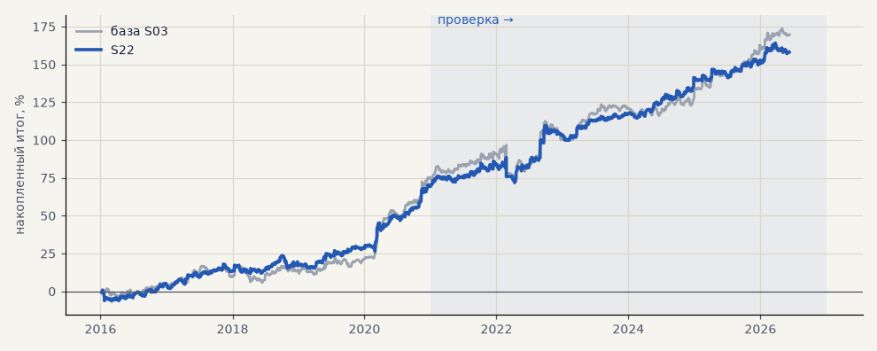

# S22. Выход 168 ч / 4 ATR при прежних издержках

**Семейство:** стратегия без ML (импульс) · **база:** S03 · **гипотеза:** — · **вердикт:** без улучшения

**Что поменяли:** тот же вариант выхода без свопов — для сравнения с S19

Подробности: [results/costs.md](../../results/costs.md)

Проверка — сделки, открытые с 1 января 2021 года; выбор — до 2021. В скобках — база на тех же инструментах.

| срез | период | сделок | итог % | выигрышей | ожидание на сделку | PF | без 2 лучших | просадка | t | лет в плюсе |
|---|---|---|---|---|---|---|---|---|---|---|
| все инструменты | проверка | 2701 (1924) | +65.9 (+70.1) | 44% (47%) | +0.195% (+0.292%) | 1.21 (1.21) | +57.2 (+61.0) | -13.5 (-12.4) | 3.02 (2.57) | 6/6 (5/6) |
| все инструменты | выбор | 1589 (1196) | +33.4 (+26.5) | 44% (46%) | +0.168% (+0.177%) | 1.22 (1.17) | +29.6 (+21.7) | -6.3 (-11.7) | 2.76 (1.92) | 4/5 (3/5) |
| портфель 4 | проверка | 1236 (896) | +87.4 (+95.3) | 45% (49%) | +0.283% (+0.425%) | 1.34 (1.37) | +73.5 (+79.6) | -16.6 (-21.5) | 3.04 (2.68) | 6/6 (6/6) |
| портфель 4 | выбор | 879 (665) | +70.7 (+74.4) | 46% (48%) | +0.322% (+0.448%) | 1.40 (1.43) | +63.1 (+64.8) | -8.3 (-11.0) | 3.45 (3.28) | 5/5 (5/5) |
| серебро | проверка | 357 (243) | +56.2 (+149.0) | 41% (49%) | +0.157% (+0.613%) | 1.18 (1.54) | +30.8 (+111.6) | -35.3 (-25.4) | 1.08 (2.38) | 5/6 (5/6) |
| серебро | выбор | 299 (218) | +46.4 (+101.5) | 42% (44%) | +0.155% (+0.466%) | 1.25 (1.56) | +24.5 (+63.0) | -21.0 (-32.3) | 1.31 (2.03) | 3/5 (4/5) |
| золото | проверка | 390 (263) | +49.1 (+59.1) | 45% (46%) | +0.126% (+0.225%) | 1.27 (1.40) | +31.3 (+32.1) | -19.9 (-26.2) | 1.67 (1.76) | 4/6 (4/6) |
| золото | выбор | 345 (243) | +1.9 (-17.0) | 42% (43%) | +0.005% (-0.070%) | 1.01 (0.90) | -7.2 (-32.2) | -13.9 (-43.3) | 0.09 (-0.63) | 2/5 (2/5) |
| LKOH | проверка | 301 (214) | +27.8 (+43.2) | 44% (50%) | +0.092% (+0.202%) | 1.11 (1.18) | +4.8 (+20.2) | -33.0 (-48.2) | 0.65 (0.88) | 5/6 (5/6) |
| LKOH | выбор | 173 (132) | +99.5 (+80.2) | 50% (54%) | +0.575% (+0.607%) | 1.74 (1.58) | +78.9 (+52.4) | -15.6 (-28.7) | 2.75 (1.98) | 4/5 (3/5) |
| GAZP | проверка | 284 (219) | +132.6 (+77.3) | 51% (51%) | +0.467% (+0.353%) | 1.48 (1.24) | +77.5 (+16.3) | -52.3 (-80.3) | 1.59 (0.73) | 5/6 (4/6) |
| GAZP | выбор | 199 (154) | +86.7 (+81.7) | 50% (48%) | +0.436% (+0.531%) | 1.51 (1.54) | +56.0 (+53.7) | -15.4 (-18.2) | 2.01 (1.93) | 5/5 (4/5) |
| SBER | проверка | 294 (220) | +133.0 (+111.6) | 46% (46%) | +0.453% (+0.507%) | 1.76 (1.56) | +110.8 (+83.0) | -12.6 (-23.5) | 3.16 (2.17) | 5/6 (4/6) |
| SBER | выбор | 208 (161) | +50.4 (+34.4) | 44% (48%) | +0.242% (+0.213%) | 1.22 (1.15) | +22.9 (+8.9) | -42.2 (-42.4) | 1.05 (0.71) | 5/5 (3/5) |
| MOEX | проверка | 313 (227) | -14.4 (+11.3) | 44% (45%) | -0.046% (+0.050%) | 0.95 (1.04) | -32.7 (-14.2) | -34.6 (-32.7) | -0.35 (0.23) | 3/6 (2/6) |
| MOEX | выбор | 191 (153) | +32.5 (+8.0) | 41% (46%) | +0.170% (+0.052%) | 1.19 (1.04) | +14.6 (-11.4) | -26.5 (-55.8) | 0.91 (0.18) | 3/5 (3/5) |
| MTSS | проверка | 262 (196) | +17.6 (+45.6) | 40% (43%) | +0.067% (+0.233%) | 1.08 (1.20) | -18.6 (+6.5) | -25.5 (-25.0) | 0.39 (0.87) | 2/6 (3/6) |
| MTSS | выбор | 174 (135) | -49.8 (-76.6) | 41% (39%) | -0.286% (-0.567%) | 0.73 (0.63) | -64.0 (-93.4) | -63.7 (-85.4) | -1.65 (-2.15) | 1/5 (1/5) |
| ETH | проверка | 500 (342) | +125.3 (+63.9) | 44% (44%) | +0.251% (+0.187%) | 1.15 (1.07) | +73.4 (+5.2) | -84.7 (-100.7) | 1.12 (0.44) | 4/6 (4/6) |

Журнал сделок: `trades.csv.gz` (инструмент, прогон, сторона, вход, выход, цены, результат после издержек, причина выхода).
