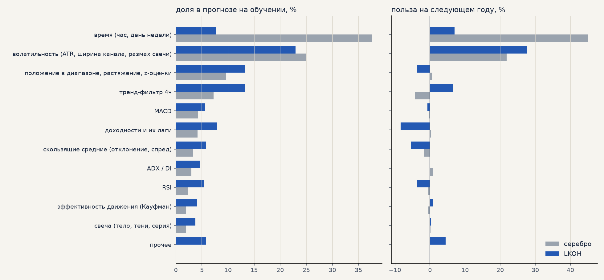
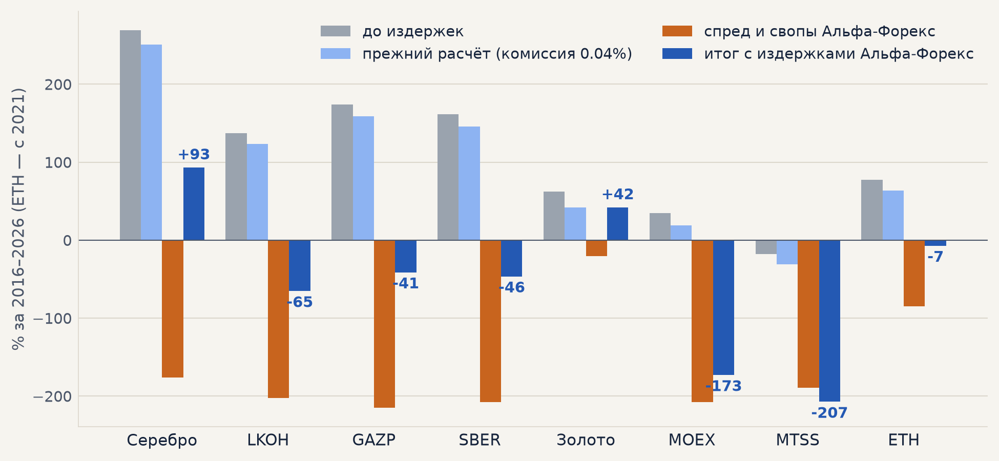

# Знакомство с проектом forexmodel

Для Тагира: что мы делаем, как устроены модель и стратегия, что уже проверено и как предложить свою
гипотезу. Состояние на 9 октября 2026 года. Код читать не нужно — всё важное в документах и на
страницах по ссылкам. Незнакомые слова объяснены в словарике в конце.

**Доступ к ссылкам.** Репозиторий на GitHub закрытый: Денис добавит тебя или пришлёт файлы.
Страницы на claude.ai открываются после входа в аккаунт claude.ai (подойдёт бесплатный) и только
если Денис ими поделился; вносить гипотезы в банк можно по приглашению с правом редактирования.
README.md и RESULTS.md в корне репозитория устарели — актуальное в журналах ниже.

## 1. Общая идея

Мы строим торговые стратегии для биржи на основе анализа данных: машинного обучения (ML) и детальных
данных об инструментах — минутных цен, ленты обезличенных сделок, дивидендов, условий брокеров.
Итоговая цель — система, которая в реальном времени анализирует рынок, сама открывает и закрывает
позиции и зарабатывает после всех издержек.

Рынки: серебро и золото (к доллару), акции Мосбиржи (Лукойл, Газпром, Сбербанк, Мосбиржа, МТС) и
эфир. Данные с 2015 года, решения принимаются раз в час. Проект начался 17 сентября 2026 года.

Работа идёт двумя линиями:

* **ML-модель** прогнозирует движение цены на ближайшие часы (раздел 2). Пока её преимущество
  сопоставимо с комиссией.
* **Стратегия без ML** — простое правило «импульса», найденное анализом данных (раздел 3). Это
  первый результат, который зарабатывает на истории после комиссии, и сейчас проверяется на реальных
  условиях брокеров.

Главные страницы:

| что | ссылка |
|---|---|
| Итоги недели 28.09–05.10 (презентация, 16 слайдов) — лучший вход | https://claude.ai/artifact/7FU7fQXKkUodVew2jJhEny |
| **Журнал экспериментов**: все проверки на одних метриках и одном периоде, журнал сделок на графике | https://claude.ai/artifact/E4teCbCVvojCf96CJy9UQU |
| **Банк гипотез**: сюда добавлять свои идеи и оценки | https://claude.ai/artifact/QkKUwLx2zAQ8X5CZypbU6f |
| Карта сделок стратегии и песочница издержек | https://claude.ai/artifact/G9ooDKv2SZETcQxhouKswt |
| Журнал изменений: одна строка — один эксперимент, с датой и выводом | [model_changelog.md](https://github.com/deniss97/forexmodel/blob/main/docs/results/model_changelog.md) |

## 2. ML-модель

### 2.1. Базовый подход

**Часовые бары.** Минутные цены собираются в часовые свечи, решение принимается после закрытия
каждого часа, вход — через минуту. Часы выбраны как компромисс: достаточно сделок для статистики и
достаточно движения, чтобы окупить комиссию. Другие масштабы (15 минут, 4 часа) пробовали точечно.

**Три класса.** Модель (CatBoost — «деревья решений», популярный и устойчивый метод) не предсказывает
цену, а относит каждый час к одному из трёх классов по тому, что случилось за следующие 10 часов:

* **рост** — цена прошла +1.5 ATR раньше, чем −0.75 ATR;
* **падение** — наоборот, −1.5 ATR раньше, чем +0.75 ATR;
* **ничего** — ни то, ни другое.

Зачем так. Классы описывают выгодную сделку: цель 1.5 ATR при стопе 0.75 ATR (в самой торговле
стоп шире — 2 ATR, и он подтягивается за ценой). Цель вдвое дальше стопа, поэтому «рост» получают только часы в начале движения:
на излёте цена чаще сначала откатывается к стопу — так модель вынуждена отличать начало движения от
его конца. Класс «ничего» нужен, потому что большую часть времени рынок не даёт сделки, и модель
должна уметь это сказать. Барьеры в ATR, а не в процентах, — чтобы задача была одинаковой в спокойный
и в бурный год. Пробовали и другие постановки (знак хода, величина хода) — хуже, см. 2.3.

**Как торгует.** Сделка открывается, если вероятность «роста» или «падения» достаточно высока, ожидаемая
выгода с учётом комиссии положительна и направление совпадает с 4-часовым тренд-фильтром. Выход — по
стопу, подтягивающемуся стопу или через 10 часов.

**Бэктест и его особенности.**

1. **Walk-forward по годам.** Модель года Y учится только на данных до 1 января Y и торгует весь год Y.
   Ни один день проверки не участвует в обучении. Одной пары «обучение — тест» мало: прибыльный год
   может быть просто удачным режимом рынка (так было с +64% на серебре в 2026 году).
2. **Минутная симуляция.** Стопы и выходы проверяются по минутам, а не по часовым свечам; если цена
   «перепрыгнула» стоп ночью, исполнение по цене открытия.
3. **Все издержки.** Комиссия 0.04% за сделку; для стратегии — ещё проскальзывание, перенос позиции
   через ночь, дивиденды.
4. **Проверка без подглядывания.** Признаки считаются только по прошлому; тренд старшего таймфрейма
   становится известен только после закрытия его свечи. Несколько таких «утечек» из исходного
   ноутбука мы нашли и исправили.
5. **Единый протокол сравнения.** Все эксперименты в [журнале](https://claude.ai/artifact/E4teCbCVvojCf96CJy9UQU)
   оцениваются на одном периоде — сделки, открытые с 1 января 2021 года, — и на одних метриках:
   число сделок, итог %, доля выигрышей, ожидание на сделку, профит-фактор, итог без 2 лучших сделок,
   просадка, t. Вывод «помогло» требует улучшения сразу по нескольким из них и на нескольких seed.

### 2.2. Признаки и их ценность

Модель серебра использует 81 признак, модель Лукойла — 85 (плюс 4 по объёму). Все безразмерные:
в долях ATR, процентах, z-оценках — чтобы модель не запоминала уровень цены конкретного года.

| группа | что это | признаки |
|---|---|---|
| время | час суток (синус и косинус — чтобы 23 и 0 часов были рядом), день недели | hour_sin, hour_cos, dow |
| волатильность | насколько активен рынок: ATR в % цены, ATR к своему среднему, ширина полос Боллинджера, размах свечи | atr_pct, atr_ratio, atr_ema_ratio, bb_width, bb_width_atr, bb_width_pct, candle_range_atr |
| положение в диапазоне, растяжение | где цена относительно недавних максимумов и минимумов, как далеко ушла от них, сколько часов назад был новый максимум | close_pos_in_range, bb_pos, ext_from_high/low_6/12/24, runup_6/12/24, z_close_6/12/24, bars_since_new_high/low |
| доходности | изменение цены за 1, 2, 5, 8, 13 часов назад (в % и в ATR) | log_return, ret_lag_1…13, ret_lag_1…13_atr |
| скользящие средние | отклонение цены от средних за 3 и 7 часов, расстояние между средними | close_sma/ema_3/7_atr и _ratio, sma_spread_atr, ema_spread_atr |
| MACD | индикатор разницы средних и его значения 1–13 часов назад | macd_atr, macd_diff_atr, macd_hist_atr, macd_hist_atr_lag_1…13 |
| RSI | индекс относительной силы, его z-оценка и прошлые значения | rsi_4, rsi_z, rsi_lag_1…13, rsi_adx_product |
| ADX / DI | сила тренда и перевес покупателей или продавцов | adx_4, adx_slope, di_spread, dmp_4, dmn_4 |
| эффективность движения | насколько прямолинейно шла цена за 6, 12, 24 часа (по Кауфману) | er_6, er_12, er_24 |
| свеча | тело и тени последней свечи, серия свечей одного цвета | body_dir, body_to_range, upper_wick_ratio, lower_wick_ratio, candle_streak |
| тренд 4 часа | направление и возраст 4-часового тренда, сила и наклон | trend_4h, trend_age_4h, adx_4h, adx_slope_4h, slope_atr_4h |
| объём (только акции) | объём к своему среднему, тренд объёма, объём × тело свечи | rel_vol_20, rel_vol_50, vol_trend, vol_x_body |

**Ценность признаков.** Для каждого года мы смотрели две вещи: насколько модель опирается на признак
(«доля в прогнозе») и насколько она становится хуже на следующем, ещё не виденном году, если признак
испортить («польза на новых данных»; минус — признак мешает):

* У серебра почти вся польза — **время суток** (45%) и **волатильность** (22%): модель в основном
  узнаёт, «когда рынок активен», а не «куда он пойдёт». Признаки 4-часового тренда на новых данных
  мешают.
* У Лукойла главное — **волатильность** (28%), время суток почти не важно, тренд 4 часа помогает.
* У 43 из 81 признака польза на новых данных отрицательная, но убрать их нельзя: любой отбор
  признаков делал модель хуже (слабые признаки полезны вместе).

Все признаки по отдельности: [серебро](https://github.com/deniss97/forexmodel/blob/main/docs/results/feature_importance/all_silver.png),
[Лукойл](https://github.com/deniss97/forexmodel/blob/main/docs/results/feature_importance/all_lkoh.png);
подробно — [lkoh_features_orderflow.md](https://github.com/deniss97/forexmodel/blob/main/docs/results/lkoh_features_orderflow.md)
и [trend_filter_ema.md §8](https://github.com/deniss97/forexmodel/blob/main/docs/results/trend_filter_ema.md).

### 2.3. Результаты и текущие проблемы

Все варианты — в [журнале экспериментов](https://claude.ai/artifact/E4teCbCVvojCf96CJy9UQU)
(эксперименты M — серебро, L — Лукойл). Коротко, на проверке 2021–2026:

| эксперимент | итог | PF | t | вывод |
|---|---|---|---|---|
| M01 базовая модель серебра (3 seed) | +55% | 1.10 | 1.2 | ожидание +0.04% на сделку — ровно размер комиссии |
| M02 обучение только там, где тренд разрешает вход | +84% | 1.17 | 1.8 | лучше базы, но разброс между прогонами такой же — перепроверяем (гипотеза H31) |
| M03, M04 другая постановка: знак хода, величина хода | −12%, −4% | < 1 | < 0 | хуже трёх классов |
| M05, M06 регуляризация, ансамбль из 3 моделей | +58%, +60% | 1.11 | 1.3 | без улучшения |
| M08 вторая модель-фильтр («брать ли сделку») | +73% против +75% | 1.21 | 1.8 | не различает удачные и неудачные сделки |
| M10, M11 размер позиции по волатильности | t 2.2 против 1.8 | 1.30 | 2.2 | **единственное устойчивое улучшение** (слабое) |
| M14–M17 другие тренд-фильтры, признаки по EMA5 | хуже базы | | | не помогло |
| L01–L03 модель Лукойла с лентой сделок и без | −30…−52% | 0.8–0.9 | < 0 | в минусе после комиссии, лента не помогает |
| L04 правило по ленте без модели | −17% | 0.90 | −1.1 | было +8.6% на одном полугодии — удача |

Кроме того, без журнала сделок проверены диффузионная модель траекторий TokDiT и синтетические
данные — они видят только краткосрочный откат цены (AUC 0.51, как простое правило).

**Текущие проблемы модели:**

1. **Преимущество равно комиссии.** До комиссии средняя сделка +0.03…+0.06%, комиссия 0.04%.
2. **Модель не видит направления.** Она опирается на время суток и волатильность — то есть знает,
   когда будет движение, но почти не знает, куда.
3. **Большой разброс между прогонами.** Одна и та же базовая модель в разных прогонах даёт +55% и
   +86% (M01 и M09): различия между вариантами меньше этого шума, поэтому проверяем на нескольких seed.
4. **Модель Лукойла почти не учится** — после ранней остановки остаётся 5–125 деревьев.
5. **Часовой горизонт неудобен.** На нескольких часах цена чаще откатывается, чем продолжает
   движение; продолжение появляется только на 2–5 днях — это и привело к стратегии из раздела 3.

## 3. Текущая стратегия: импульс без ML

Модели полезны, но результат можно получать и без них — простым правилом, найденным анализом
данных. 28 сентября мы перестали спрашивать «куда пойдёт цена» и стали искать повторяющиеся рисунки.
Из 23 проверенных рисунков устойчивым оказался один — **импульс**.

### 3.1. Описание

1. **Сильный ход:** цена за 6 часов прошла больше трёх своих обычных часовых размахов (3 ATR).
2. **Вход в ту же сторону**, если 4-часовой тренд-фильтр смотрит туда же; через минуту после
   закрытия часа.
3. **Стоп 6 ATR.** Когда сделка дала +3 ATR, стоп подтягивается за ценой на расстоянии 6 ATR.
4. **Выход** по стопу или не позже чем через 10 дней (240 часов). Одна сделка на инструмент за раз.

Почему это работает: после сильного движения цена в среднем проходит ещё +0.5…0.7 ATR в ту же
сторону за 5 дней — в 3–50 раз больше, чем в обычный момент (на серебре, золоте, Лукойле; z до 3.2).
Это не общий рост рынка: он объясняет лишь 13% результата. Простыми словами и с картинками —
[patterns_explained.md](https://github.com/deniss97/forexmodel/blob/main/docs/results/patterns_explained.md).

### 3.2. Результаты на разных инструментах и при разных вводных

По инструментам, 2016–2026, комиссия 0.04%, цены акций скорректированы на дивиденды:

| рынок | итог | без 2 лучших | PF | лет в плюсе |
|---|---|---|---|---|
| серебро | +251% | +207% | 1.55 | 9 из 11 |
| Газпром | +159% | +98% | 1.33 | 8 из 11 |
| Сбербанк | +146% | +117% | 1.34 | 7 из 11 |
| Лукойл | +123% | +96% | 1.32 | 8 из 11 |
| эфир (2021–2026) | +64% | +5% | 1.07 | 4 из 6 |
| золото | +42% | +15% | 1.13 | 6 из 11 |
| Мосбиржа | +19% | −6% | 1.04 | 5 из 11 |
| МТС | −31% | −70% | 0.93 | 4 из 11 |

Портфель «серебро + Лукойл + Газпром + Сбербанк» поровну при разных вводных (эксперименты S в
журнале):

| вводные | весь период 2016–2026 | проверка 2021–2026 |
|---|---|---|
| комиссия 0.04%, стоп по уровню (S01) | +196% | +121% |
| + стоп по цене открытия при ночном гэпе (S02) | +187% | +116% |
| + дивиденды (S03) | +170% | +95% |
| + проскальзывание 0.1% на входе и выходе (S05) | +110% | +74% |
| + проскальзывание 0.3% — за точкой безубытка (S08) | −25% | −13% |
| спред и свопы брокера Альфа-Форекс, CFD (S17 / S18) | −15% или +25% | −3% или +19% |

### 3.3. Материалы и проблемы стратегии

Материалы: [журнал экспериментов](https://claude.ai/artifact/E4teCbCVvojCf96CJy9UQU) (S01–S22, у
каждого — журнал сделок на графике), [карта всех сделок](https://claude.ai/artifact/G9ooDKv2SZETcQxhouKswt),
[8 рынков](https://github.com/deniss97/forexmodel/blob/main/docs/results/impulse_instruments.md),
[проверка расчёта](https://github.com/deniss97/forexmodel/blob/main/docs/results/audit.md),
[издержки и дивиденды](https://github.com/deniss97/forexmodel/blob/main/docs/results/costs.md),
[поиск паттернов](https://github.com/deniss97/forexmodel/blob/main/docs/results/patterns.md).

Что пробовали улучшить и не получилось (подробно — в журнале): более короткое удержание, узкий стоп,
перенос стопа в безубыток, выход при развороте тренда, досрочное закрытие по вероятности дойти до
цели, фильтр дневного тренда, фильтр «бокового рынка», подбор тренд-фильтра, контекст (соседний
рынок, час, день, сила хода), модель машинного обучения поверх импульса, ранний вход на 15 минутах,
порог в процентах. Всё, что срезает крупные выигрышные сделки, ухудшает итог.

**Проблемы стратегии:**

1. **Издержки решают всё.** Средняя сделка до издержек +0.4…0.6%, позиция переносится через ночь
   5–6 раз. Через CFD Альфа-Форекс акции убыточны (перенос 0.068% в день при допустимых 0.04–0.05%).
   Нужна дешёвая площадка: акции на бирже своими деньгами, фьючерсы, другой брокер.
2. **Серебро зависит от одного неизвестного** — сколько знаков после запятой у котировки у брокера
   (от этого свопы различаются в 10 раз). Выясняем.
3. **Удачный фильтр.** Наш тренд-фильтр лучше 99% случайных, а в среднем фильтр почти ничего не
   добавляет. Честный ориентир на 8 рынках — около +110% за 10 лет при комиссии и около +65% с
   проскальзыванием.
4. **Неравномерность по годам.** 2020 год дал почти треть прибыли, 2016–2019 были слабыми; распознать
   слабые годы заранее пока не удалось.
5. **Не проверено в реальной торговле.** Следующий шаг — демо-счёт и сверка исполнения с расчётом.

## 4. Какие данные есть

| данные | период | что в них |
|---|---|---|
| серебро XAG/USD, золото XAU/USD | 2015-01 – 2026-05 | минутные цены; время нью-йоркское |
| акции LKOH, GAZP, SBER, MOEX, MTSS | с 2015 (Лукойл — с апреля 2016) до весны 2026 | минутные цены и объём; московское время, вечерняя сессия, с 2025 — сессии выходного дня |
| эфир ETH/USDT | 2020-01 – 2026-05 | минутные цены, круглосуточно |
| лента обезличенных сделок | 2024-01 – 2026-04 | посекундно: объём покупок и продаж по инициатору — Лукойл и фьючерсы на серебро |
| дивиденды | 2015 – 2026 | даты отсечек и суммы по 5 акциям |
| условия брокера | на 06.10.2026 | спреды и свопы Альфа-Форекс |

**Чего нет:** фундаментальных данных компаний, новостей и календаря событий, макростатистики,
опционов, стакана заявок, позиций участников, других рынков. Добавить можно — напиши в банке, какие
данные нужны для гипотезы.

## 5. Где особенно нужны идеи и как их предложить

1. **Почему импульс продолжается** и где он должен быть сильнее: какие рынки, периоды, события.
2. **Какие рынки добавить** — с сильными трендами и дешёвым переносом позиции.
3. **Где исполнять дёшево** — биржа, фьючерсы, налоги, стоимость шорта на Мосбирже.
4. **События и календарь** — ставки ЦБ и ФРС, статистика США, отчётность и дивидендный сезон.
5. **Режимы рынка** — почему 2016–2019 были слабыми и можно ли распознать такие годы вовремя.
6. **Как помочь модели увидеть направление**, а не только «активность» рынка.

Предлагать — в [банке гипотез](https://claude.ai/artifact/QkKUwLx2zAQ8X5CZypbU6f), кнопка «Добавить
гипотезу». Хорошая гипотеза проверяема на наших данных (или называет, каких данных не хватает),
говорит, что именно должно быть иначе — на каком рынке, когда, в какую сторону, — и почему. Пример:
«Импульсы по золоту и серебру, начавшиеся в час публикации статистики по рынку труда США, продолжаются
сильнее обычных: фонды перестраивают позиции несколько дней. Проверка: такие импульсы против
остальных, отдельно 2016–2020 и 2021–2026; нужен календарь публикаций». Плохая: «рынок растёт, когда
инвесторы оптимистичны» — непонятно, что считать.

Оценки в банке от 1 до 5: **В** — насколько изменится итог, если гипотеза верна; **У** — сколько уже
оснований в неё верить; **С** — насколько дёшево проверить (5 — дёшево). Если не уверен — оставь
гипотезу без оценок. Каждая проверка попадает в журнал экспериментов на тех же метриках, и ссылка на
неё появляется у гипотезы.

## Словарик

| слово | что значит |
|---|---|
| ATR | средний размах часовой свечи за последние 14 часов — «обычное» движение рынка; «3 ATR» — втрое больше обычного |
| импульс | сильное движение: за 6 часов больше 3 ATR |
| тренд-фильтр, гейт C | правило, определяющее направление 4-часового тренда; входим только в его сторону |
| стоп, трейлинг-стоп | уровень закрытия сделки с убытком; трейлинг подтягивается за ценой, когда сделка в плюсе |
| walk-forward | проверка, при которой на каждый год всё выбирается только по прошлым годам |
| seed | начальное число случайности при обучении; разные seed — разные, но равноправные версии модели |
| профит-фактор (PF) | сумма прибыльных сделок, делённая на сумму убыточных; больше 1 — в плюсе |
| ожидание | средний результат одной сделки после издержек |
| итог без 2 лучших | итог без двух самых прибыльных сделок — не держится ли результат на удаче |
| t-статистика | значимость средней сделки с учётом разброса; больше 2 — значимо |
| проскальзывание | на сколько исполнение хуже цены в момент сигнала |
| своп, перенос | плата брокеру за удержание позиции через ночь; через выходные — за 2 дня дополнительно |
| спред | разница между ценой покупки и продажи — плата за сделку у брокера CFD |
| CFD | контракт с брокером на разницу цен вместо покупки самой акции |
| гэп | разрыв между ценой закрытия и открытия (ночью, после выходных, в день дивидендной отсечки) |
| лента обезличенных сделок, дельта | все сделки биржи; дельта — покупки по инициативе покупателя минус продажи по инициативе продавца |
| AUC | мера точности прогноза: 0.5 — монетка, 1 — идеально |
