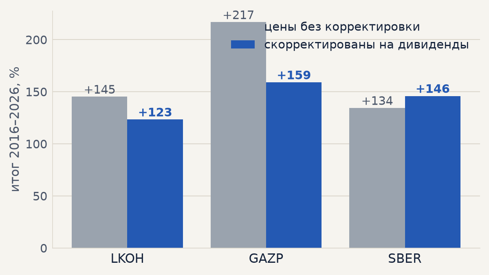
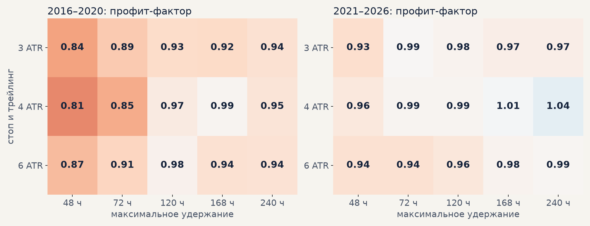
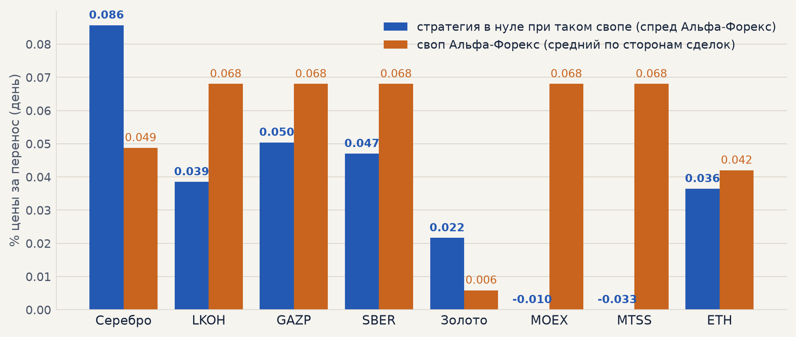

# Импульс с новыми вводными: дивиденды и издержки брокера (06.10.2026)

План недели 05.10–12.10, «перспективная стратегия»: данные о комиссиях за перенос позиции (Тимур,
условия Альфа-Форекс), дивидендные гэпы и добавление их в расчёт (Денис), «смотрим, что получится».
Гипотезы H01–H03 из [банка гипотез](../hypotheses.md).

**Коротко.**

* **Дивиденды** снимают часть результата у акций: портфель серебро + LKOH + GAZP + SBER при прежних
  издержках **+187% → +170%** (GAZP +217 → +159%, LKOH +145 → +123%, SBER +134 → +146%).
* **С условиями Альфа-Форекс акции становятся убыточными** (LKOH −65%, GAZP −41%, SBER −46%):
  своп 0.068% в день с обеих сторон × ~6 переносов на сделку плюс спред 0.15% съедают весь доход.
  Сигнал при этом не меняется: до издержек сделка акции в среднем +0.40…+0.47%.
* **Серебро решает размер пункта**: при шаге 0.001 (3 знака) +93% (PF 1.18, t 1.2 — уже не значимо),
  при шаге 0.0001 (4 знака) — +251%, как раньше. **Нужно посмотреть в терминале, сколько знаков у
  XAG/USD** (вопрос Тимуру).
* **Короткое удержание не спасает**: при свопах Альфа-Форекс ни один выход 48–240 ч не делает
  портфель прибыльным в 2016–2020; у сделки отнимается больше сигнала, чем экономится свопов.
* **Где стратегия жива**: акции окупаются при переносе до 0.04–0.05% в день; если лонг держать на
  бирже своими деньгами (без переноса) и платить только за шорт, шорт может стоить до 0.12–0.14% в
  день. Следующий шаг — **биржа вместо CFD для акций** (H04) и реальные свопы серебра.

## 1. Что добавлено в расчёт

**Дивиденды** — [data/dividends/moex_dividends.csv](../../data/dividends/moex_dividends.csv),
`scripts/fetch_dividends.py`: 66 отсечек LKOH, GAZP, SBER, MOEX, MTSS за 2015–2026 (dohod.ru, сверка дат
со smart-lab). Момент отсечки — первая сессия после последнего дня с дивидендом (с 2025 года это бывает
праздничная или субботняя сессия: LKOH отдала дивиденд 01.05.2026). Проверка: гэп в этот момент в
долях дивиденда — медиана 0.84, у 95% отсечек от 0.5 до 1.5 (остальное — мелкие дивиденды и GAZP
10.10.2022, когда рынок рос на фоне отсечки 26%). Минутные цены обратно корректируются на дивиденды
(`data.dividends_path`, `forexmodel/data/dividends.py`): гэп отсечки исчезает и не даёт ложного
импульса, доходность позиции через отсечку — полная (лонг получает дивиденд, шорт платит, как у CFD).

**Издержки брокера** — [configs/costs/alfaforex.yaml](../../configs/costs/alfaforex.yaml), условия
Альфа-Форекс на 06.10.2026:

| инструмент | спред за круг | своп лонг, за перенос | своп шорт, за перенос | тройной перенос |
|---|---|---|---|---|
| серебро XAG/USD | 90 п. = 0.120% (шаг 0.001) / 0.012% (шаг 0.0001) | −55 п. = −0.073% / −0.0073% | −15 п. = −0.020% / −0.0020% | ср → чт |
| золото XAU/USD | 45 п. = 0.010% | −50 п. = −0.011% | 0 | ср → чт |
| акции РФ (LKOH, GAZP, SBER, MOEX, MTSS) | 0.15% | −0.068% | −0.068% | чт → пт |
| ETHUSD | 0.09% | −0.042% | −0.042% | пт → сб |

Пункты металлов переведены в % по последней цене в наших данных (серебро 75.24, золото 4540 на
29.05.2026) — то есть сегодняшние условия применены ко всей истории. Это стресс-тест «если бы так было
всегда»: в 2016–2021 ставки, а с ними и свопы, были ниже. Перенос — после каждого торгового дня,
выходные — тройным переносом в день, который назначил брокер (итого 7 переносов в неделю: «перенос
через выходные — это 2 дня»). Спред заменяет прежнюю комиссию 0.04%. В симуляторе — параметры
`simulation.swap_long_pct / swap_short_pct / swap_rollover_hour / swap_triple_weekday`, в walk-forward —
`--costs configs/costs/alfaforex.yaml:<инструмент>`; путь сделки от издержек не зависит, поэтому
профили издержек пересчитываются по готовым сделкам (`scripts/broker_costs.py`).

Прогоны: walk-forward 2016–2026 (ETH — 2021–2026), импульс 6 ч / 3 ATR по гейту C, стоп по гэпу,
у акций цены скорректированы на дивиденды; сетка выхода «удержание 48–240 ч × стоп и трейлинг
3 / 4 / 6 ATR» (`scripts/queues/costs.sh`).

## 2. Дивиденды

Выход 240 ч / 6 ATR, прежняя комиссия 0.04%, стоп по гэпу:

| | без корректировки | с дивидендами | PF без → с |
|---|---|---|---|
| LKOH | +145% | **+123%** | 1.38 → 1.32 |
| GAZP | +217% | **+159%** | 1.47 → 1.33 |
| SBER | +134% | **+146%** | 1.31 → 1.34 |
| портфель 4 (с серебром) | +187% | **+170%** | |

Почти вся разница — сделки, открытые до отсечки и закрытые после: шорт без корректировки «получал»
дивидендный гэп даром, лонг его терял. GAZP: 6 таких сделок (4 шорта) — было +40%, стало −16%; LKOH:
13 сделок — +15% → −10%; SBER: 5 сделок, чаще лонги — +7% → +29% (дивиденд теперь засчитан). Ложные
шорты сразу после отсечки (сигнал ≤ 8 ч после гэпа: у LKOH было 9, у GAZP 3) исчезли, но в итог они
почти не входили. Оценка 29.09 («оптимизм акций 25–40%») подтвердилась для GAZP и LKOH.

## 3. Издержки Альфа-Форекс

Выход 240 ч / 6 ATR, 2016–2026, % после издержек:

| инструмент | прежний расчёт | Альфа-Форекс | PF | без 2 лучших | спред | свопы лонгов | свопы шортов | переносов на сделку |
|---|---|---|---|---|---|---|---|---|
| серебро (шаг 0.001) | +251 | **+93** | 1.18 | +51 | −55 | −98 | −23 | 5.4 |
| серебро (шаг 0.0001) | +251 | **+251** | 1.55 | +208 | −6 | −10 | −2 | 5.4 |
| LKOH | +123 | **−65** | 0.86 | −92 | −52 | −81 | −69 | 6.4 |
| GAZP | +159 | **−41** | 0.93 | −101 | −56 | −88 | −71 | 6.3 |
| SBER | +146 | **−46** | 0.91 | −74 | −57 | −85 | −65 | 5.8 |
| золото | +42 | +42 | 1.13 | +15 | −5 | −16 | 0 | 5.2 |
| MOEX | +19 | −173 | 0.70 | | | | | 5.8 |
| MTSS | −31 | −207 | 0.61 | | | | | 6.2 |
| ETH (2021–26) | +64 | −7 | 0.99 | | | | | 3.8 |
| **портфель 4** | **+170** | **−15** (шаг 0.001) / **+25** (шаг 0.0001) | | | | | | |

По годам (портфель 4, шаг серебра 0.001): [costs/years_old_vs_alfa.png](costs/years_old_vs_alfa.png).

## 4. Помогает ли более короткое удержание

Профит-фактор портфеля 4 с издержками Альфа-Форекс по сетке выхода, выбор на 2016–2020, проверка на
2021–2026:

* Шаг серебра 0.001: в 2016–2020 **все 15 вариантов ниже PF 1**; лучший (168 ч / 4 ATR, PF 0.99) в
  2021–2026 даёт +2% (PF 1.01). Базовый 240 ч / 6 ATR: −2.7%.
* Шаг серебра 0.0001 ([график](costs/exit_grid_pf_4dp.png)): лучший по 2016–2020 тот же 168 ч / 4 ATR
  (PF 1.07) → 2021–2026 +22% (PF 1.08); базовый — +19% (PF 1.06). Разница в пределах шума.
* Без свопов (прежний расчёт) лучший по 2016–2020 — по-прежнему 240 ч / 6 ATR (PF 1.43 → 1.37).

Укорачивание удержания режет свопы, но и сигнал: импульс отрабатывает за 2–5 дней, выход через 2–3
дня забирает меньшую часть хода. **H03 не подтвердилась.**

## 5. Сколько может стоить перенос

Своп (одинаковый для лонга и шорта, % цены за перенос), при котором средняя сделка в нуле — при спреде
Альфа-Форекс; рядом — средний своп Альфа-Форекс по сторонам сделок:

| инструмент | до издержек на сделку | безубыточный своп, спред Альфа | своп Альфа (средний) | шорт может стоить, если лонг без переноса и комиссия 0.04% |
|---|---|---|---|---|
| серебро | +0.58% | 0.086% | 0.049% (шаг 0.001) | 0.22% |
| LKOH | +0.40% | 0.039% | 0.068% | 0.12% |
| GAZP | +0.47% | 0.050% | 0.068% | 0.14% |
| SBER | +0.42% | 0.047% | 0.068% | 0.14% |
| золото | +0.12% | 0.022% | 0.006% | 0.03% |
| ETH | +0.23% | 0.036% | 0.042% | 0.10% |

Последняя колонка — сценарий биржи: лонг куплен своими деньгами (переноса нет), платит только шорт
(маржинальная позиция). Реальных тарифов биржевого брокера здесь нет — это граница, с которой их
сравнивать.

## 6. Выводы и что дальше

1. Сигнал не изменился, изменилась цена его исполнения: **CFD Альфа-Форекс для акций не подходят**
   (своп 0.068% в день против допустимых 0.04–0.05%).
2. **Серебро** — главный кандидат, но всё решает шаг цены: при 4 знаках стратегия на нём сохраняется
   целиком, при 3 знаках остаётся слабый плюс (PF 1.18). Узнать точно — в терминале.
3. **Золото** почти не чувствует издержек Альфа-Форекс, но и само по себе слабое (PF 1.13).
4. Новые гипотезы в банк: **H04** акции на бирже (лонг без переноса), **H05** фьючерсы MOEX, **H17**
   свопы других брокеров; сравнивать тарифы с таблицей §5.
5. Оговорки: сегодняшние свопы применены ко всей истории (в годы низких ставок свопы были ниже);
   дивиденд по CFD у лонга может зачисляться за вычетом налога — не учтено; проскальзывание сверх спреда
   здесь не добавлено (запас по нему — [audit.md](audit.md) §6).
