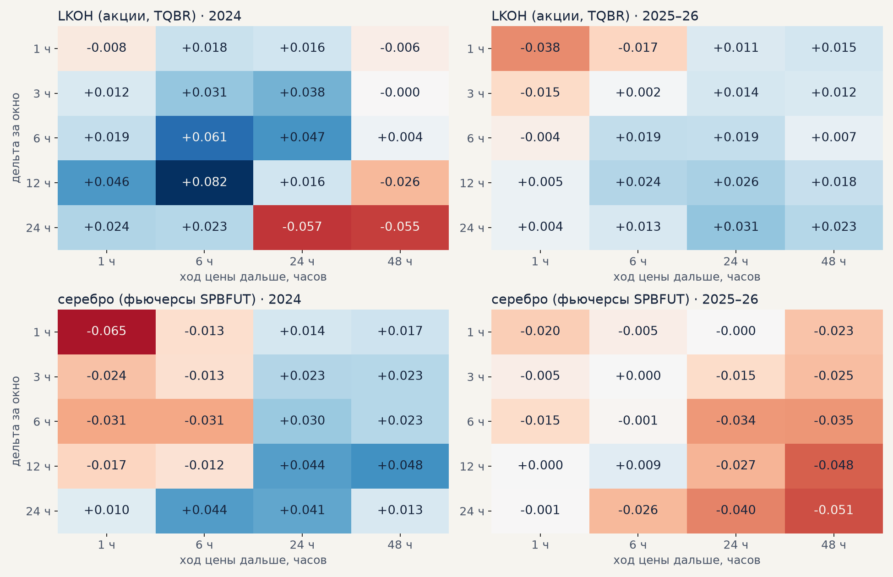
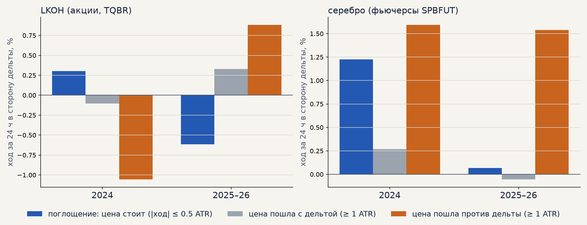
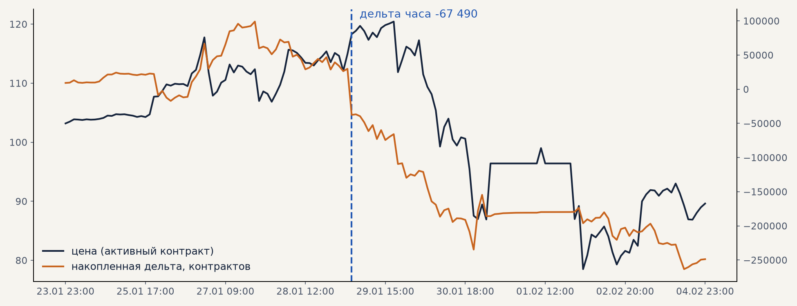

# Основная модель: важность признаков LKOH и обезличенные сделки по-новому (06.10.2026)

План недели 05.10–12.10, «гипотезы для основной модели»: важность признаков для LKOH и всех признаков
(Денис), попытка с данными обезличенных сделок (Тимур) и тест с изменением подхода к ним. Гипотезы
H11–H14 из [банка гипотез](../hypotheses.md).

**Коротко.**

* **Модель LKOH живёт волатильностью, а не временем суток** (у серебра — наоборот): волатильность —
  23% прогноза и 28% пользы на следующем году, время — 8% и 7% (у серебра 38% и 45%). Признаки
  тренд-фильтра 4ч у LKOH помогают вне выборки (+7%), у серебра мешают (−4%). Модель LKOH почти не
  учится: после ранней остановки 5–125 деревьев. **H11 ✅** (важность другая).
* **Скрытых полезных признаков за пределами топ-20 нет**: у серебра ни одного признака вне топ-20
  с пользой вне выборки больше 1%, у LKOH — два (z_close_24 +1.7%, ext_from_low_12 +1.1%). Полные
  списки всех признаков — на графиках ниже. **H12 ❌** (перепроверять нечего).
* **Дельта за несколько часов** у LKOH связана с дальнейшим ходом чуть сильнее часовой (IC до 0.06–0.08
  в 2024, до 0.02–0.03 в 2025–26), но ход после крупной дельты меняет знак между периодами: в 2024 —
  разворот, в 2025–26 — продолжение. У серебра связи нет. **H13 ❌** как правило.
* **Поглощение** (крупная дельта, цена стоит) — 24–33 случая за период, знак меняется, t < 2.
  **H14 ❌** на этих данных. Пример Тимура из января реальный (−67 тыс. контрактов за час 28.01, через
  сутки −14%), но это один случай, а не закономерность.

## 1. Важность признаков: LKOH против серебра

Как в [trend_filter_ema.md](trend_filter_ema.md) §8 для серебра: на каждом годе Y модель учится на
данных до Y (LKOH: `configs/default.yaml`, гейт C, обучение внутри гейта — как прогон, давший 6
прибыльных лет из 9; окна 2018–2026), «на обучении» — доля признака в прогнозе
(PredictionValuesChange), «вне выборки» — насколько хуже становится модель на следующем году без
признака (LossFunctionChange). `scripts/feature_importance.py ... --name lkoh`.

| группа | серебро: прогноз / польза | LKOH: прогноз / польза |
|---|---|---|
| время (час, день недели) | 37.6% / **+45.1%** | 7.7% / +7.0% |
| волатильность (ATR, ширина канала, размах свечи) | 24.9% / +21.8% | 23.0% / **+27.8%** |
| положение в диапазоне, растяжение, z-оценки | 9.6% / +0.4% | 13.3% / −3.7% |
| тренд-фильтр 4ч | 7.2% / −4.3% | 13.3% / **+6.7%** |
| доходности и их лаги | 4.1% / +0.3% | 7.9% / −8.4% |
| объём (vol_trend, rel_vol_20, vol_x_body; в таблице — «прочее») | — (у серебра нет объёма) | 5.7% / +4.5% |

Лучшие признаки LKOH вне выборки: atr_ratio (+15.1%, помог в 8 окнах из 9), atr_pct (+14.2%, 8/9),
hour_sin (+5.1%), vol_trend (+4.6%), slope_atr_4h и adx_4h (+2.5%, +2.4%). Вредят: доходности и их
лаги (ret_lag_5_atr −2.3%), bars_since_new_high (−2.0%).

Все признаки (в скобках — в скольких окнах признак помог вне выборки):
[серебро, 81 признак](feature_importance/all_silver.png) ·
[LKOH, 85 признаков](feature_importance/all_lkoh.png); таблицы —
[silver.csv](feature_importance/silver.csv), [lkoh.csv](feature_importance/lkoh.csv), по окнам —
[lkoh_by_window.csv](feature_importance/lkoh_by_window.csv).

Что это значит для гипотез по модели: у LKOH прогноз — это «активен ли рынок», как и у серебра, но
по уровню волатильности, а не по часу. Тренд 4ч у LKOH полезен — фильтр по тренду для акций стоит
оставить. Отбор признаков на серебре уже показал, что убирать слабые признаки вредно
([trend_filter_ema.md](trend_filter_ema.md) §8).

## 2. Обезличенные сделки: дельта за окно и поглощение

Данные — секундные агрегаты ALGOPACK 2024–2026: LKOH (TQBR) и фьючерсы на серебро (SPBFUT, все
контракты; цена — по самому активному контракту часа). Дельта = объём покупок агрессором − объём
продаж. `scripts/orderflow_windows.py`.

**H13 — дельта за 1 / 3 / 6 / 12 / 24 часа** в z-оценке к своему разбросу за прошлые 20 дней против
хода цены дальше. Ранговая корреляция (IC):

* LKOH: суммирование за 6–12 ч поднимает IC по сравнению с часом (2024: 0.02 → 0.06–0.08 на 6 ч
  вперёд; 2025–26: −0.02 → 0.02), знак положительный в обоих периодах — слабое продолжение. Но ход
  после крупной дельты (|z| ≥ 2) в её сторону: 2024 — **−0.2…−0.6%** за 24–48 ч (разворот), 2025–26 —
  **+0.3…+0.5%** (продолжение). Правило, работающее в обоих периодах, не получается.
* Серебро: IC от −0.05 до +0.05, знак меняется между периодами — связи нет.

**H14 — поглощение**: крупная дельта за 6 ч, а цена за те же 6 ч почти не сдвинулась (≤ 0.5 ATR).
Для сравнения — цена пошла с дельтой и против неё (≥ 1 ATR). Ход цены за 24 ч в сторону дельты:

| | LKOH 2024 | LKOH 2025–26 | серебро 2024 | серебро 2025–26 |
|---|---|---|---|---|
| поглощение: цена стоит | +0.30% (25 случаев) | −0.62% (30) | +1.2% (24) | +0.07% (33) |
| цена пошла с дельтой | −0.11% (179) | +0.33% (439) | +0.27% (217) | −0.05% (227) |
| цена пошла против дельты | −1.06% (15) | +0.88% (18) | +1.6% (19) | +1.5% (29) |

Поглощение встречается 25–30 раз за период, знак результата меняется, t по неперекрывающимся
случаям меньше 2. Хвосты 1% ходов обрезаны: обвал серебра 30.01.2026 (−26% за день) иначе решал
бы все средние.

**Пример Тимура.** Крупнейшая часовая дельта января 2026 по фьючерсам на серебро — 28.01 в 23:00,
−67 490 контрактов (z = −3.0); дальше цена: через 6 ч −0.4%, через сутки −13.6%, через двое −16.3%:

Наблюдение верное, и такие эпизоды бывают перед большими движениями, но по всем крупным дельтам 2024–2026
закономерности нет — значит, на графике видны в первую очередь запомнившиеся случаи.

## 3. Что дальше

* Модель LKOH: если продолжать, то как фильтр «активности» (волатильность + тренд 4ч), а не как прогноз
  направления; признаки ленты в модель не добавлять (09-28: не улучшают).
* Ленту осталось проверить в одной роли — **подтверждение импульса** (дельта за 6 ч в сторону сигнала
  импульсной стратегии). Новая гипотеза H18; данных мало — лента есть только с 2024 года (около 70
  сделок импульса LKOH).
