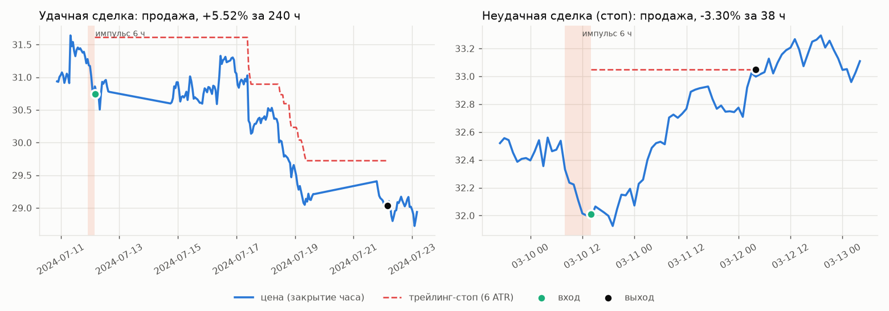
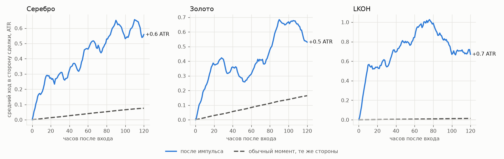
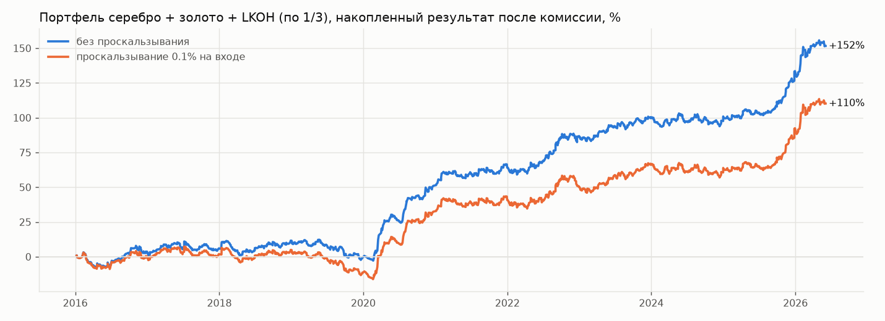
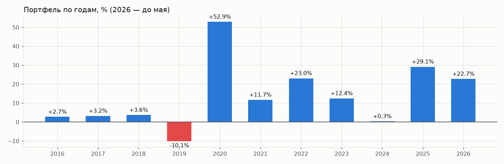

# Импульсная стратегия простыми словами

Что исследовалось 28 сентября 2026, что сработало и почему — без формул. Проверка на новых
инструментах и интерактивная карта всех сделок — [impulse_instruments.md](impulse_instruments.md). Подробные
таблицы — в [patterns.md](patterns.md), история всех экспериментов — в
[model_changelog.md](model_changelog.md).

## Коротко

* Раньше модели (CatBoost, нейросеть, диффузионная TokDiT) пытались угадать, куда пойдёт цена
  в ближайшие 10 часов. Угадать не получилось: преимущества хватало разве что на комиссию.
* Мы сменили подход: не угадывать направление каждый час, а ждать понятную ситуацию —
  **паттерн**. Сработал один: **сильное движение цены обычно продолжается несколько дней**.
* Правило простое, **модели машинного обучения в нём не нужны**: цена за 6 часов прошла
  много в сторону тренда → входим туда же и держим до 10 дней, пока трейлинг-стоп не
  закроет.
* На истории 2016–2026 на серебре, золоте и акциях Лукойла (по трети денег на каждый)
  это дало **+152% после комиссии, 10 прибыльных лет из 11, худшая просадка −15%**. С
  проскальзыванием 0.1% на входе — +110%.

## Что такое паттерн

Паттерн — это **узнаваемая ситуация на графике, после которой цена чаще идёт в
определённую сторону**. Он сам говорит, покупать или продавать. Модели не нужно
угадывать направление каждый час: ждём паттерн и действуем по нему.

Мы проверили 23 варианта таких ситуаций:

| паттерн | как выглядит | что делаем | сработал? |
|---|---|---|---|
| **Импульс** | цена за несколько часов прошла намного больше обычного | входим **в ту же сторону** | **да** |
| Импульс наоборот | то же | входим **против** движения (ждём отката) | нет, теряет |
| Серия свечей | три часовые свечи подряд в одну сторону | в ту же сторону | нет |
| Пробой диапазона | цена вышла за максимум или минимум последних 1–3 суток | в сторону пробоя | слабо |
| Откат в тренде | тренд вверх, но цена за 3 часа упала | покупаем «на откате» | нет |
| Растяжение | цена далеко ушла от средней линии | против (ждём возврата к средней) | нет, теряет |
| Просто по тренду | тренд-фильтр показывает направление | входим по тренду на каждом часе | слабо |

«Сработал» здесь значит: зарабатывает после комиссии на всех трёх инструментах и в обоих
периодах проверки (2015–2020 и 2021–2026).

**Главный вывод:** на горизонте нескольких дней рынок **продолжает** сильные движения, а не
откатывает их. Все ставки на откат проиграли.

## Правило стратегии, по шагам

Мерилом движения служит **ATR** — средний размах часовой свечи за последние 14 часов. Это
«обычный шаг» цены прямо сейчас. Так правило одинаково работает на серебре за 30 $ и на
акции за 7000 ₽.

1. **Каждый час, после закрытия свечи**, смотрим, сколько цена прошла за последние 6 часов.
2. **Если прошла 3 ATR или больше** (в три раза больше обычного часового шага) — это
   импульс. Вверх — сигнал на покупку, вниз — на продажу.
3. **Проверяем тренд-фильтр.** Это отдельный индикатор направления рынка на 4-часовых
   свечах (наклон цены и сила тренда по ADX). Если он показывает то же направление, что
   импульс, входим. Если нейтраль или обратное — пропускаем.
4. **Входим** в начале следующей минуты.
5. **Стоп** — 6 ATR от цены входа против нас.
6. **Трейлинг-стоп.** Когда цена ушла в нашу сторону на 3 ATR, стоп начинает двигаться за
   ценой на расстоянии 6 ATR. Он только подтягивается и никогда не отодвигается. Так мы
   забираем большую часть движения, если оно длинное.
7. **Выход** — по стопу или трейлинг-стопу, но не позже чем через 240 часов (10 суток).
   В среднем сделка длится около 5 суток.
8. **Пока позиция открыта, новые сигналы по этому инструменту пропускаем.**

Комиссия — 0.04% за сделку (вход плюс выход), как во всех расчётах проекта.

## Как это выглядит на графике

* **Слева — удачная сделка.** Серебро резко упало за 6 часов (оранжевая полоса), тренд
  вниз. Продаём (зелёная точка). Цена падает несколько дней, трейлинг-стоп (красный
  пунктир) спускается за ней. Через 240 часов сделка закрывается по времени: **+5.5%**.
* **Справа — неудачная.** То же: резкое падение, продаём. Но цена развернулась вверх и
  дошла до стопа: **−3.3%** за 38 часов.

Больше половины сделок — неудачные (выигрывают около 47%). Стратегия зарабатывает за счёт
того, что **удачные сделки в среднем крупнее неудачных**: трейлинг даёт хорошим движениям
развиться, а стоп ограничивает плохие.

(Линии на графике — по закрытиям часов, для наглядности. Сам расчёт идёт по минутным
ценам.)

## Почему это работает

Синяя линия — насколько в среднем цена продолжает двигаться в сторону импульса после входа,
в ATR. Серый пунктир — то же для обычного момента, с той же пропорцией покупок и продаж.
Пунктир учитывает, что серебро и золото за эти годы в целом росли.

**После импульса цена за следующие 2–5 суток проходит в его сторону ещё около 0.5–0.7
ATR, а в обычный момент — почти ничего.** Это и есть преимущество. Статистически оно
надёжно: вероятность получить такое случайно — меньше 0.1%. Оно держится на всех трёх
инструментах, при любых разумных порогах (4–12 часов, 1.5–5 ATR) и в обоих периодах.

**Почему прежние модели этого не нашли.** Они смотрели на 10 часов вперёд. За 10 часов
продолжение импульса совсем маленькое, меньше комиссии, а на таком горизонте сильнее
заметны мелкие откаты. Прибыль появляется, только если держать позицию несколько дней.

## Используются ли модели машинного обучения?

**В самой стратегии — нет.** Это правило из нескольких чисел: 6 часов, 3 ATR, тренд-фильтр,
стоп и трейлинг 6 ATR, максимум 240 часов.

Мы проверяли, помогут ли модели поверх паттерна: паттерн даёт момент и сторону, а модель
решает, брать ли конкретную сделку.

| модель поверх паттерна | что делала | результат |
|---|---|---|
| **CatBoost** (своя на каждый паттерн и общая на три инструмента) | по 13 признакам (движение цены, волатильность, час, день недели и т. д.) предсказывала, будет ли сделка прибыльной | лучше, чем без модели, в половине случаев, хуже в другой половине — **не помогает** |
| **TokDiT** (диффузионная модель, рисует возможные продолжения графика) | по последним 96 часам рисовала 64 варианта следующих 48 часов; брали сделку, если большинство вариантов шло в нашу сторону | отличить удачный импульс от неудачного не смогла (точность как у монетки); на серебре итог упал с +68% до +17% — **не помогает** |

**Вывод:** деньги приносит сам паттерн. Модели поверх него добавляют шум. Диффузионная модель
продолжение после импульса «видит» только по направлению, и в разы слабее, чем оно есть на
самом деле.

Что ещё проверяли и что не помогло:

* **Фильтр «не торговать в боковом рынке».** Проверили 6 признаков, включая
  собственные результаты стратегии за последнее время. Ни один не предсказывает убыточные
  годы заранее. Вместо этого спасает **разнесение по трём инструментам**: у каждого
  по отдельности просадка −30…−44%, у портфеля −15%.
* **Вход раньше, на 15- или 30-минутных свечах.** Сделок больше, но результат не лучше.
  Ждать закрытия часа можно.
* **Тренд-фильтр, который при пробое средней встаёт в нейтраль.** Разница в пределах шума.

## Результаты

Портфель — по трети денег на серебро, золото и Лукойл. Проценты — от всего капитала,
складываются без реинвестирования, после комиссии.

| | сделок | прибыльных сделок | итог за 2016 — май 2026 | в среднем в год | худшая просадка | прибыльных лет |
|---|---|---|---|---|---|---|
| **портфель** | 1312 | 47% | **+152%** | ≈ +15% | **−15%** | **10 из 11** |
| портфель, проскальзывание 0.1% на входе | 1310 | 45% | +110% | ≈ +11% | −23% | 8 из 11 |
| только серебро | 461 | 46% | +252% | ≈ +24% | −32% | 9 из 11 |
| только Лукойл | 345 | 51% | +157% | ≈ +15% | −31% | 7 из 11 |
| только золото | 506 | 45% | +45% | ≈ +4% | −44% | 6 из 11 |

**Для чего нужен портфель.** По отдельности у каждого инструмента бывают долгие плохие
периоды: у серебра 2015–2018, у Лукойла 2022, у золота слабо почти всё время. Вместе они
сглаживают друг друга.

## Как проверяли, что это не случайность

1. **Параметры не подбирали под результат.** Импульс «6 часов / 3 ATR» был в исходном
   списке паттернов до всякой проверки.
2. **Два периода.** Выбирали на 2015–2020, проверяли на 2021–2026: в плюсе в обоих.
3. **Три разных рынка:** серебро и золото (Forex) и акция Лукойла (Мосбиржа).
4. **Поправка на общий рост цены.** Сравнивали не с нулём, а с «всегда покупать» и «всегда
   продавать» на тех же условиях. Импульс лучше в 11 случаях из 12.
5. **Соседние параметры** (4–12 часов, 1.5–5 ATR) тоже работают, лучшие — 6–8 часов при
   3–5 ATR. Нет «волшебного» числа.
6. **Все 32 варианта выхода** (удержание 2–30 суток, трейлинг 3–8 ATR) в плюсе в обоих
   периодах.
7. **Штатный симулятор проекта и walk-forward:** каждый год торгуется так, будто будущее
   неизвестно.
8. **Проскальзывание и задержка входа.** С широким трейлингом (6 ATR) стратегия
   выдерживает проскальзывание 0.1% или четверть ATR на входе. Задержка входа на 5–60
   минут не мешает.

## Риски и чего мы пока не знаем

* **Результат на истории, вероятно, завышен на четверть-треть.** Тренд-фильтр (гейт C) выбирался
  по данным 2025–2026, и он на 99-м процентиле среди 300 случайных вариантов. Со «средним»
  тренд-фильтром или вовсе без него стратегия на 8 инструментах даёт около +110% за 11 лет вместо
  +144% (с проскальзыванием 0.1% — около +65% вместо +101%). Подробно —
  [trend_filter_ema.md](trend_filter_ema.md) §7.
* **2020 год дал треть всей прибыли** (+53%, ковидные движения). Без него портфель +99%
  за 10 лет.
* **Бывают плохие годы:** 2019 −10%, 2024 около нуля.
* **Золото на грани:** на сделке оно зарабатывает мало, и проскальзывание 0.1% съедает
  всё. Исключать его по этим же данным было бы подгонкой. Решать надо по реальным
  издержкам брокера.
* **Стоп при гэпе.** Расчёт исполнял стоп по его уровню, даже если цена открылась уже за ним
  (ночь, дивиденды). Для акций это завышает итог на 10–14% за 11 лет на инструмент; портфель
  четырёх основных инструментов +196% → +187%. Подробно — [audit.md](audit.md).
* **Проскальзывание на выходе по стопу не учитывали.** При тех же уровнях оно примерно
  удвоит потери от проскальзывания.
* **Реальные спреды и проскальзывание брокера** по каждому инструменту пока не известны.
  Это следующий шаг.
* **Размер позиции** всегда одинаковый: треть капитала на инструмент, без плеча и без
  выравнивания риска между инструментами.
* Прошлое не гарантирует будущего. 10 лет истории и три рынка — хорошая проверка, но не
  доказательство.

## Где это в проекте

| что | где |
|---|---|
| сигнал «импульс» в пайплайне | `simulation.signal_source: impulse`, `impulse_bars: 6`, `impulse_atr: 3.0` |
| выход | `simulation.horizon_minutes: 14400`, `sl_atr: 6`, `trail_atr: 6`, `activate_atr: 3` |
| проскальзывание | `simulation.entry_slippage_pct`, `simulation.entry_slippage_atr` |
| проверка walk-forward | `python scripts/walk_forward.py -c configs/silver.yaml --years 2016 2026 --set simulation.horizon_minutes=14400 --set simulation.sl_atr=6 --set simulation.trail_atr=6 --set simulation.activate_atr=3 --variants impulse:6:3 impulse:6:3:slip0.1` |
| лаборатория паттернов | `scripts/pattern_lab.py` |
| подбор выхода и проскальзывание | `scripts/exit_grid.py` |
| модели поверх паттерна | `scripts/pattern_models.py` (CatBoost), `scripts/tokdit_patterns.py` (TokDiT) |
| картинки этой страницы | `scripts/plot_patterns_explained.py` |

## Словарик

* **ATR** — средний размах часовой свечи за последние 14 часов, «обычный шаг» цены сейчас.
* **Тренд-фильтр (гейт C)** — индикатор направления рынка на 4-часовых свечах: вверх, вниз
  или нейтраль.
* **Стоп** — цена, при которой сделка закрывается с убытком.
* **Трейлинг-стоп** — стоп, который подтягивается за ценой, когда она идёт в нашу сторону.
* **Комиссия** — 0.04% за сделку (вход плюс выход).
* **Проскальзывание** — насколько цена исполнения хуже цены в момент сигнала.
* **Просадка** — насколько капитал опускался от предыдущего максимума.
* **Walk-forward** — проверка по годам: для каждого года используется только то, что было
  известно до его начала.
* **Дрейф** — общий рост или падение цены за период: серебро и золото за 10 лет выросли,
  поэтому «всегда покупать» уже давало бы плюс.
