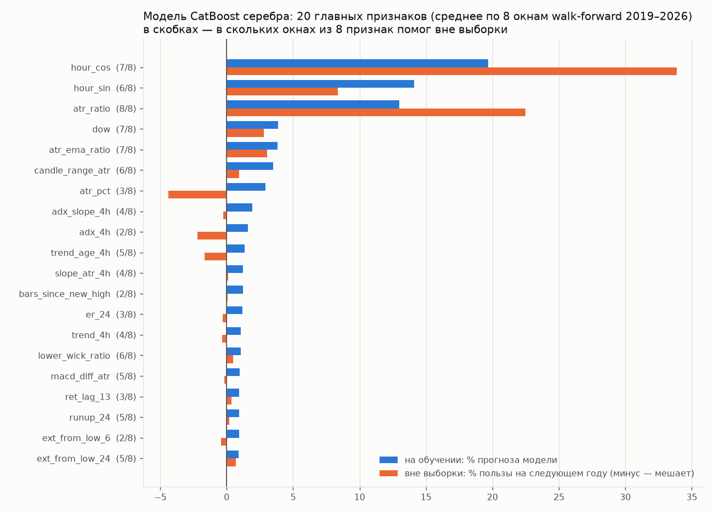

# Тренд-фильтр: сброс по EMA5 и подбор параметров

Дата: 2026-10-03. Основа — ноутбук `notebooks/S_TrendFiter_dev (1).ipynb`:

* **раздел «Сброс тренда по EMA»:** тренд не может быть +1, пока свеча закрывается ниже EMA5, и
  −1, пока выше;
* **раздел «Перебор данных для поиска лучшего фильтра»:** подбор параметров.

Проверка — на 8 инструментах (серебро, золото, LKOH, GAZP, SBER, MOEX, MTSS, ETH), выбор
2015–2020, проверка 2021–2026.

## Итог

| вопрос | ответ |
|---|---|
| почему фильтр ноутбука по-прежнему «косячит» | гистерезис v3 сравнивает с EMA только закрытия **4-часовых** баров, часовые свечи внутри бара не проверяются (ячейка 65: 19.12 00:00–03:00 close 65.84 > EMA 65.47, а тренд −1) |
| сделано | сброс по EMA встроен в тренд-фильтр проекта и выполняется **на каждой свече**: EMA часа или EMA 4ч, с подтверждением возврата; перенесены гистерезис v3 и шок-слой; тесты |
| как часто правило нарушается сейчас | гейт C: 41% часов с трендом (EMA5 часа) / 23% (EMA5 4ч); v3: 38% / 17% |
| это ошибки? | **по EMA5 часа — нет**: после таких часов цена в среднем продолжает идти по тренду (это откаты). **По EMA5 4ч — да, это слабая зона**: следующие 5–24 ч в 2015–2020 в среднем против метки, в 2021–2026 втрое слабее |
| что даёт жёсткий сброс | метка «против движения» в крупных трендах реже вдвое (20% → 9–12%), но и верных меток меньше, метка мигает (11 → 18–24 смен на 100 ч), следование тренду после комиссии хуже на всех вариантах |
| в торговле | **импульс** — без изменений (после хода 3 ATR цена всегда по нужную сторону EMA5); **модель CatBoost** серебра — сделок на 22–43% меньше при том же результате сделки, итог ниже (t 1.77 → 1.0–1.35) |
| подбор параметров | новый подбор устойчив: ранговая корреляция «выбор → проверка» **0.89** по 359 наборам. Но лучший по следованию тренду фильтр **хуже** гейта C как вход для импульса и модели |
| рекомендация | гейт C в работе не менять; сброс по EMA оставить выключенным (опция в конфиге есть). Для визуальной проверки — переключатель зон на карте сделок |
| выход по развороту фильтра и слабая зона как признак (§6) | не помогают: портфель импульса +196% → +163% (штатный симулятор), модель CatBoost t 1.77 → 0.91 |
| подбор гейта под импульс (§7) | walk-forward подбора хуже фиксированного выбора (+104% против +150%); медиана 300 случайных гейтов = результат без гейта; честная оценка стратегии на 8 инструментах ≈ +110% (≈ +65% с проскальзыванием 0.1%) вместо +144% |

## 1. Почему версия ноутбука остаётся «косячной»

1. **Правило проверяется на 4-часовых барах.** `_compute_trend_with_hysteresis` сравнивает с
   EMA закрытие 4-часового бара. Часовые свечи внутри бара могут сколько угодно закрываться по
   другую сторону линии `ema_4h`, а зона на графике остаётся прежней. Пример из вывода ячейки
   65: 19 декабря с 00:00 по 03:00 close 65.84 при EMA 65.47, тренд −1. Правило должно
   работать на каждой свече рабочего ТФ и применяться последним, после всех остальных слоёв.
2. **Шок-слой** (`apply_shock_override`) берёт направление шока по последним барам, а не по
   самому ходу. Рост на 2.5 ATR за 3 часа с последней красной свечой считается шоком вниз. В
   переносе ход и бары обязаны совпадать по направлению.
3. **В подборе перепутаны подписи:** `train_error_rate=best['val_total_error_rate']`,
   `val_error_rate=best['train_contra_rate']`.
4. Проблемы самого подбора — в §5.

## 2. Что сделано в коде

**Тренд-фильтр** (`forexmodel/features/trend.py`, секции `trend` и `trend_gate` конфига). Все
слои по умолчанию выключены, поведение моделей не меняется:

```yaml
trend_gate:
  # сброс по EMA: тренд не +1 при закрытии свечи ниже EMA и не −1 при закрытии выше
  ema_reset_period: 5          # 0 — выключен
  ema_reset_tf: htf            # base — EMA закрытий часа; htf — EMA закрытий 4ч (линия ema_4h)
  ema_reset_confirm_bars: 1    # после сброса направление возвращается через N свечей на «своей» стороне
  # гистерезис v3 из ноутбука (режим confirm)
  hysteresis: false
  # шок-слой из ноутбука (ход за shock_window часов >= shock_atr ATR)
  shock_atr: 0                 # 0 — выключен
  shock_window: 3
  shock_mode: neutral          # neutral | flip
```

Тесты в `tests/test_trend_gate.py`:

* правило выполняется на каждой свече, в том числе после `hold_bars`;
* сброс только гасит тренд, нового направления не создаёт;
* слои не смотрят в будущее (префиксный тест);
* подтверждение возврата, гистерезис, направление шока.

**Варианты гейта на одной модели.** Поле `trend_gate.variants: {имя: поправки}` создаёт
колонки `trend_gate__<имя>`. Это не признаки модели. В walk-forward вариант `gate:<имя>`
подставляет такую колонку в правило входа, поэтому несколько гейтов сравниваются на одной
обученной модели без переобучения:

```
python scripts/walk_forward.py -c configs/silver.yaml --years 2019 2026 \
  --set 'trend_gate.variants={ema4h: {ema_reset_period: 5, ema_reset_tf: htf}}' --variants cb gate:ema4h
```

**Метрики и подбор** (`forexmodel/evaluation/trend_quality.py`, годится и для ноутбука, см. §5):

* `trend_quality` — метрики разметки;
* `score_trend_filter` — оценка фильтра на нескольких инструментах;
* `search_trend_filter` — подбор.

Лаборатория — `scripts/trend_filter_lab.py` (`compare`, `tune`).

**Карта сделок** (https://claude.ai/artifact/G9ooDKv2SZETcQxhouKswt):

* выбор, чей тренд показывать зонами: гейт C (по нему сделки), C со сбросом по EMA5 4ч или
  часа, v3, v3 со сбросом, лучший из подбора;
* выбор линии EMA: EMA5 4ч раз в 4 часа (как была), EMA5 4ч каждый час (по ней сброс 4ч),
  EMA5 часа.

## 3. Как часто правило нарушается и плохо ли это

Ход цены в сторону метки тренда после часа, в ATR, среднее по 8 инструментам
([trend_lab/violations.txt](trend_lab/violations.txt)):

| | через | 2015–20: без нарушения / нарушение | 2021–26: без нарушения / нарушение |
|---|---|---|---|
| гейт C, EMA5 часа | 1 ч | +0.010 / +0.016 | +0.008 / +0.024 |
| | 5 ч | +0.075 / +0.010 | +0.073 / +0.061 |
| | 24 ч | +0.115 / +0.035 | +0.255 / +0.157 |
| гейт C, EMA5 4ч | 1 ч | +0.012 / +0.015 | +0.013 / +0.019 |
| | 5 ч | +0.073 / **−0.031** | +0.081 / +0.022 |
| | 24 ч | +0.120 / **−0.042** | +0.252 / +0.094 |

Доля часов с нарушением среди часов с трендом: гейт C — 41% (EMA5 часа) и 23% (EMA5 4ч), v3 —
38% и 17%.

* **Закрытие ниже часовой EMA5 в восходящем тренде — обычный откат.** После него цена в
  среднем продолжает идти по тренду, а в первый час даже сильнее, чем без нарушения (отскок).
  Гасить тренд на таких часах — значит выходить на откате и заходить обратно после отскока.
* **Закрытие ниже 4-часовой EMA5 — настоящая слабая зона.** В 2015–2020 следующие 5–24 часа в
  среднем идут против метки, в 2021–2026 — втрое слабее, чем без нарушения. Это то, что видно
  глазом на графике ноутбука.

## 4. Разметка и торговля по вариантам

**Разметка**, среднее по 8 инструментам, 2021–2026 (2015–2020 — в
[trend_lab/compare_quality.csv](trend_lab/compare_quality.csv), картина та же).
«Следование» — результат позиции «как метка» после комиссии 0.04% за каждую смену метки, ATR на
1000 часов. «По ходу» и «против» — доли часов внутри крупных движений (зигзаг задним числом,
колено ≥ 12 ATR) с меткой по ходу и против хода.

| вариант | доля тренда | следование | по ходу | против | задержка, ч | смен на 100 ч | нарушений EMA5 часа |
|---|---|---|---|---|---|---|---|
| **гейт C (сейчас)** | 0.70 | **+4.2** | 0.49 | 0.19 | 15 | 10.1 | 0.29 |
| C + EMA5 часа | 0.42 | −8.2 | 0.32 | 0.09 | 16 | 23.2 | 0 |
| C + EMA5 часа, 2 свечи | 0.34 | −5.3 | 0.27 | 0.07 | 16 | 17.4 | 0 |
| C + EMA10 часа | 0.48 | −4.1 | 0.37 | 0.11 | 16 | 18.5 | 0.07 |
| C + EMA5 4ч | 0.54 | −2.2 | 0.41 | 0.12 | 16 | 18.0 | 0.13 |
| C + шок 2 ATR | 0.71 | +1.3 | 0.50 | 0.19 | 12 | 13.8 | 0.27 |
| ноутбук v2 (лучшие из перебора) | 0.94 | +4.4 | 0.62 | **0.32** | 8 | 5.4 | 0.38 |
| ноутбук v3 (гистерезис) | 0.58 | +3.7 | 0.49 | 0.12 | 24 | 8.8 | 0.22 |
| ноутбук v3 + EMA5 4ч | 0.49 | +0.6 | 0.43 | 0.09 | 24 | 10.9 | 0.12 |
| ноутбук v3 + EMA5 часа | 0.37 | −5.7 | 0.33 | 0.06 | 25 | 18.1 | 0 |
| подбор: плато (§5) | 0.61 | +5.9 | 0.54 | 0.11 | 36 | 4.3 | 0.25 |
| подбор: №1 по выбору | 0.94 | +9.0 | 0.72 | 0.23 | 24 | 2.5 | 0.44 |

* **Сброс по EMA делает разметку чище на глаз** (против хода реже вдвое), но гасит и верные
  метки, и метка начинает мигать. Следование тренду после комиссии хуже у всех вариантов
  сброса, в обоих периодах.
* **v3 визуально заметно лучше гейта C:** по ходу столько же, против хода реже (12% против
  19%). Следование почти такое же, но задержка больше (24 ч против 15).
* **v2 из перебора ноутбука почти всегда в рынке** (94% часов) и в трети часов крупных
  движений показывает против хода. Это следствие цели перебора (§5).

**Торговля**, быстрый движок, портфель 8 инструментов по 1/8, итог % после комиссии
([trend_lab/compare_trading.csv](trend_lab/compare_trading.csv)):

| вариант | вход по тренду, 240 ч: 2015–20 / 2021–26 | вход по тренду, 10 ч | импульс + гейт, 240 ч |
|---|---|---|---|
| **гейт C (сейчас)** | +45.8 / +17.2 | −27.4 / −106.4 | **+37.7 / +106.4** |
| C + EMA5 часа | +41.0 / +42.7 | −38.4 / −76.4 | +37.7 / +106.4 |
| C + EMA5 4ч | +30.4 / +46.7 | −32.7 / −70.5 | +37.7 / +106.4 |
| ноутбук v3 | +31.5 / +62.8 | −40.0 / −114.2 | +34.9 / +76.9 |
| ноутбук v3 + EMA5 4ч | +18.2 / +97.0 | −35.9 / −70.0 | +34.9 / +76.9 |
| подбор: плато | +38.3 / +70.6 | −16.8 / −58.0 | +36.4 / +39.7 |
| всегда лонг (для сравнения) | +103.0 / +60.6 | −66.6 / −190.4 | |

**Модель CatBoost серебра** (основной потребитель гейта), walk-forward 2019–2026, 3 seed. Все
варианты гейта — на одной обученной модели окна:

| гейт входа | сделок | итог, % | просадка | на сделку | t (42 / 7 / 1) | t среднее |
|---|---|---|---|---|---|---|
| **гейт C (сейчас)** | 1858 | **+92.3** | −27.6 | +0.050 | +1.48 / +1.82 / +2.02 | **1.77** |
| C + EMA5 4ч | 1437 | +60.2 | −30.9 | +0.042 | +1.31 / +1.36 / +1.05 | 1.24 |
| C + EMA5 часа | 1062 | +43.8 | −27.7 | +0.041 | +1.17 / +0.70 / +1.12 | 1.00 |
| ноутбук v3 | 1672 | +39.3 | −31.2 | +0.024 | +0.63 / +0.91 / +0.65 | 0.73 |
| ноутбук v3 + EMA5 4ч | 1308 | +68.3 | **−23.5** | +0.053 | +1.52 / +1.54 / +0.98 | 1.35 |
| подбор: плато | 1473 | +15.4 | −45.0 | +0.011 | +0.41 / +0.60 / −0.10 | 0.30 |
| подбор: №1 по выбору | 2205 | −2.0 | −68.3 | 0.000 | −0.09 / +0.32 / −0.34 | −0.04 |

* **Сброс по EMA не улучшает сделки модели.** Результат сделки тот же (+0.041…+0.053% при
  ошибке около ±0.035), сделок на 22–43% меньше, итог ниже. «Слабая зона» по 4-часовой EMA
  входы модели не отбирает: модель и так входит на откатах, а именно они попадают под сброс.
* **Импульс сброс не меняет вовсе.** После хода на 3 ATR за 6 часов закрытие всегда по нужную
  сторону EMA5.
* **Лучший по следованию тренду фильтр — худший гейт для модели и импульса.** Он медленный (6ч,
  гистерезис) и запаздывает к моменту входа.

## 5. Подбор параметров

**Что не так с перебором в ноутбуке:**

1. **Пороги в процентах (1.5–3%) зависят от волатильности года.** Для одного и того же фильтра
   (гейт C на серебре) доля ошибок «против ≥ 1.5% за 5 ч» — от 0.3% (2018, часовой ATR 0.30%
   цены) до 15.9% (2026, ATR 1.16%)
   ([trend_lab/notebook_metric_by_year.txt](trend_lab/notebook_metric_by_year.txt)). Обучение в
   ноутбуке (2024–2025) было спокойным, проверка (осень 2025 — весна 2026) бурной. Разрыв
   train / val (0.2% против 3.7%) — это волатильность, а не переобучение.
2. **5 часов вперёд — слишком короткий горизонт** для 4-часового фильтра: метку судят по шуму
   внутри одного бара.
3. **Цель поощряет «всегда в рынке».** При пороге 3% ошибок «против» почти нет, а «ложных
   нейтралей» нет, когда нейтралей нет. Лучший набор из перебора размечает трендом 99% часов и
   в трети часов крупных движений показывает против хода (v2 в таблице §4).
4. **Выбор по val** (сортировка по `val_total_error_rate`): отдельной проверки нет, val сам
   стал периодом подбора.
5. **Один инструмент и 2.5 года:** параметры подстраиваются под режим серебра 2025–2026.
6. Нет проверки устойчивости: соседние значения параметров могут давать совсем другой
   результат.

**Как устроен новый подбор** (`scripts/trend_filter_lab.py tune`, `search_trend_filter` для
ноутбука):

* **Цель** — следование метке после комиссии в ATR: метка как позиция, комиссия за каждую смену
  метки. В одной величине штрафуются ход против метки, пропущенный ход в нейтрали и мигание.
  Порогов в процентах нет, всё в ATR, поэтому разные годы и инструменты сопоставимы.
* **8 инструментов, по годам:** берётся медиана по парам «инструмент × год» периода выбора, чтобы
  не выиграл фильтр, удачный в одном году.
* **Выбор 2015–2020, проверка 2021–2026:** по проверке ничего не выбирается.
* **Поиск:** 300 случайных наборов по пространству параметров, затем доводка вокруг 10 лучших.
  В пространстве оба режима фильтра, ТФ 2/4/6 ч, обновление каждый час, удержание, гистерезис,
  шок-слой и сброс по EMA.
* **Выбор по плато:** среди лучших по периоду выбора берётся набор, у которого и соседние
  наборы (1–2 параметра сдвинуты на шаг сетки) хороши.

**Результат** ([trend_lab/tune_results.csv](trend_lab/tune_results.csv)):

* **Цель устойчива:** ранговая корреляция «выбор → проверка» по 359 наборам — **0.89**.
  Фильтры, хорошие в 2015–2020, хороши и в 2021–2026.
* **Выбранный по плато набор** — `confirm`, ТФ 6 ч, EMA21, ADX(9) > 25, наклон 4 бара в
  согласии, гистерезис, шок 3 ATR за 2 ч, сброс по EMA13 6-часовых закрытий с подтверждением 3
  свечами. Следование (медиана по инструмент-годам) +5.3 / +5.0 ATR на 1000 ч против −1.2 / +5.0
  у гейта C; против хода 11% против 19%; смен на 100 ч 4.3 против 10.1. Как метка тренда для
  удержания позиции он лучше гейта C.
* **Но как вход для импульса и для модели он хуже** (§4). **Подбирать фильтр нужно под его
  применение:** следование метке отвечает на вопрос «держать ли позицию по тренду», а не
  «пускать ли вход быстрой стратегии». Подбор гейта под сделки модели возможен
  (`trend_gate.variants` + `gate:<имя>` — без переобучения), но разница между вариантами
  (±0.01–0.02% на сделку) меньше ошибки (±0.035%). На одном серебре такой подбор подгонит шум;
  нужно больше сделок — больше инструментов.

**Как подобрать свой фильтр из ноутбука:**

```python
import sys; sys.path.insert(0, '/home/dev/forexmodel')
import pandas as pd
from forexmodel.evaluation.trend_quality import score_trend_filter, search_trend_filter

# часовые бары time/open/high/low/close по инструментам (кэш проекта: reports/_cache/hourly_<inst>.pkl)
frames = {i: pd.read_pickle(f'/home/dev/forexmodel/reports/_cache/hourly_{i}.pkl')
          for i in ['silver', 'gold', 'lkoh', 'gazp', 'sber']}

# любая функция df -> метка на каждый бар; add_trend_filter_v3 из ноутбука возвращает df с trend_4h
print(score_trend_filter(frames, add_trend_filter_v3, dict(ema_period=5)))

res = search_trend_filter(frames, add_trend_filter_v3, {
    'ema_period': [3, 5, 7, 10, 14, 21], 'adx_period': [7, 9, 14], 'adx_threshold': [15, 20, 25],
    'slope_period': [4, 6, 8], 'require_slope_agreement': [False, True]}, n_random=60, top=5)
res.head(10)   # sel_* — 2015–2020 (по ним выбирать, лучше по колонке plateau), val_* — 2021–2026 (только смотреть)
```

## 6. Проверка двух следующих шагов

### Медленный фильтр как правило выхода импульсной стратегии

`scripts/trend_exit_lab.py`. Вход тот же: импульс 6 ч ≥ 3 ATR по гейту C. Выход — трейлинг
6 ATR и предел по времени, плюс разворот фильтра выхода: «против» — фильтр показал
противоположное направление, «нейтраль/против» — ушёл в нейтраль или против. Тренд часа T
известен на его закрытии, на минуты он переносится с этого момента.

**При подготовке найдено и исправлено заглядывание в штатном симуляторе.** Выход по развороту
(`simulation.close_on_trend_flip`) переносил тренд часового бара на минуты с начала бара, то
есть видел разворот до 59 минут раньше времени. Раньше эта опция нигде не включалась, прежние
результаты не затронуты. Теперь значение доступно с закрытия бара (тест
`test_trend_flip_exit_waits_for_bar_close_and_uses_exit_column`). Добавлен
`simulation.exit_trend_col`: можно входить по одному фильтру, а держать позицию по другому.

**Быстрый движок**, серебро + LKOH + GAZP + SBER по 1/4, итог %, 2015–20 / 2021–26 / всё
([trend_lab/trend_exit.csv](trend_lab/trend_exit.csv)):

| выход | без проскальзывания | t | проскальзывание 0.1% |
|---|---|---|---|
| **240 ч, без разворота (сейчас)** | +76 / +146 / **+222** | 5.32 | +162 |
| 240 ч + разворот гейта C (против) | +73 / +137 / +210 | 5.30 | +151 |
| 240 ч + разворот v3 (против) | +56 / +152 / +208 | 5.07 | +152 |
| 240 ч + разворот «плато» (против) | +87 / +109 / +196 | 4.46 | +152 |
| 720 ч + разворот «плато» (против) | +105 / +107 / +211 | 4.66 | +172 |
| 720 ч, без разворота | +92 / +107 / +199 | 4.55 | +153 |
| любой фильтр, «нейтраль/против» | +30…+57 / +40…+105 | 2.0–5.6 | −56…+94 |

На всех 8 инструментах лучший вариант — разворот гейта C (против): +157% против +144%, t 5.40
против 4.52.

**Штатный симулятор**, walk-forward 2016–2026, 240 ч / 6 ATR + разворот гейта C (против):

| | без разворота | с разворотом |
|---|---|---|
| серебро | +252%, t 3.15 | +140%, t 1.89 |
| LKOH | +157%, t 2.44 | +147%, t 2.59, просадка −18 против −31 |
| GAZP | +231%, t 1.97 | +207%, t 1.83 |
| SBER | +145%, t 2.05 | +156%, t 2.29 |
| **портфель из 4** | **+196%** | **+163%** |

**Вывод:** выход по развороту тренда не улучшает стратегию.

* **Медленный фильтр** помогает в 2015–2020, когда тренды слабые, но в 2021–2026 режет длинные
  движения, а они дают основную прибыль.
* **Выход в нейтраль** срабатывает через 15–40 часов и ломает стратегию: её прибыль — от
  удержания на 5 суток.
* **Широкий трейлинг уже делает эту работу лучше:** он закрывает сделку по цене, а не по
  запаздывающему индикатору.

### Слабая зона по EMA5 как признаки модели

`features.use_ema_zone_features: true` добавляет модели четыре признака:

* расстояние close до EMA5 часа и до EMA5 4ч, в ATR;
* сторона закрытия относительно этих EMA в направлении гейта: +1 — по тренду, −1 — слабая
  зона, 0 — тренда нет.

Признаки причинные (тест `test_ema_zone_features_are_causal_and_signed`). Модель CatBoost
серебра, walk-forward 2019–2026, те же seed:

| | сделок | итог, % | на сделку | t (42 / 7 / 1) |
|---|---|---|---|---|
| без признаков (гейт C) | 1858 | +92.3 | +0.050 | +1.48 / +1.82 / +2.02 |
| с признаками слабой зоны | 1785 | +47.0 | +0.026 | +1.10 / +1.06 / +0.57 |

**Хуже на всех трёх seed.** При этом сама модель новыми признаками почти не пользуется: они на
40, 62, 81 и 82 местах из 85, вместе 1.1% её прогноза (§8). Поэтому ухудшение — скорее разброс
обучения (добавленные колонки меняют построение деревьев, а разброс модели серебра между seed и
так велик), чем вред самих признаков. Пользы от них во всяком случае нет. Признаки остаются
опцией конфига, по умолчанию выключены.

## 7. Подбор гейта под саму импульсную стратегию

`scripts/impulse_gate_tuner.py`. Раз фильтр надо подбирать под применение, следующий шаг —
подбирать гейт и параметры импульса по итогу самой импульсной стратегии.

**Как сделано быстро и точно.** Для каждого часа, где ход за 4 / 6 / 8 / 12 ч ≥ 2.5 ATR, заранее
посчитана сделка в сторону хода с выходом 240 ч / 6 ATR (около 118 тыс. кандидатов на 8
инструментах). Исход сделки от гейта не зависит: гейт только решает, брать ли её. Отбор «без
перекрытия» делается жадной цепочкой по заранее посчитанным временам выхода. Проверка: гейт C +
6 ч / 3 ATR даёт ровно прежние +144.1% и 3438 сделок. Один вариант гейта со всеми 16
сочетаниями окна и порога считается за 5 секунд.

**Перебор:** 300 случайных гейтов (то же пространство, что в §5) × 16 сочетаний окна и порога =
4880 вариантов, плюс эталоны.

**Проверка самой процедуры подбора — walk-forward.** На каждый год Y параметры выбираются только
по годам < Y и торгуют год Y. Портфель 8 инструментов, сумма 2017–2026
([trend_lab/impulse_gate_search.txt](trend_lab/impulse_gate_search.txt)):

| способ | без проскальзывания | проскальзывание 0.1% |
|---|---|---|
| **фиксированные гейт C + 6 ч / 3 ATR** (выбраны до подбора) | **+150%** | **+113%** |
| подбор гейта, окна и порога по сумме прошлых лет | +104% | +56% |
| то же, по медиане прошлых лет | +96% | +56% |
| гейт C, подбор только окна и порога | +147% | +112% |
| плотная цель: средний результат всех подходящих импульсов, включая перекрывающиеся | +16% | +11% |
| среднее 5 / 20 / 100 лучших по прошлому | +97 / +90 / +89% | +55 / +59 / +59% |
| среднее всех 305 вариантов гейта | +88% | +54% |

* **Подбор под результат стратегии не работает.** Ранговая корреляция «2015–20 → 2021–26» по
  4880 вариантам — 0.34 против 0.89 у подбора по метке тренда. Лучшие по прошлому варианты в
  следующем году не лучше случайного гейта.
* **Плотная цель** (в 20–40 раз больше наблюдений) сама по себе стабильнее (корреляция 0.56), но с
  итогом торговли почти не связана. Она выбирает варианты с хорошим средним импульсом, но редкими
  сделками.
* **Усреднение лучших тоже не спасает**: оно даёт ровно среднее по случайным гейтам.

**Чего честно ждать от стратегии.** Итог импульса 6 ч / 3 ATR на 8 инструментах за 2015–2026 по 300
случайным гейтам ([trend_lab/impulse_gate_structure.txt](trend_lab/impulse_gate_structure.txt)):

| | без проскальзывания | проскальзывание 0.1% |
|---|---|---|
| случайные гейты: 5% / медиана / 95% | +56 / **+111** / +133% | +26 / **+66** / +90% |
| без гейта вовсе | +115% (61-й процентиль) | +65% (49-й) |
| гейты того же семейства, что C (early, 4 ч, обновление каждый час; 31 шт.): медиана, 25–75% | +105%, +88…+113% | +62%, +50…+69% |
| **гейт C** | **+144% (99-й процентиль)** | **+101% (99-й)** |

* **Тренд-гейт в среднем ничего не добавляет к импульсу**: медиана случайных гейтов равна
  результату без гейта. Прибыль даёт сам импульс.
* **Гейт C — 4-е место из 305.** Параметры C выбирались 09-24 по окнам серебра и LKOH 2025–2026,
  поэтому его +144% частично удача отбора. **Честная оценка стратегии на 8 инструментах — около
  +110% за 11 лет без проскальзывания и около +65% с проскальзыванием 0.1%**, а не +144% и +101%.
  Это всё ещё в плюсе.
* Свойства гейта по группам случайных вариантов (гистерезис, шок, сброс по EMA, ТФ, удержание)
  дают различия в пределах ±10% и не ясны по знаку между периодами.

## 8. Важность признаков модели CatBoost

`scripts/feature_importance.py`. Модель серебра (configs/silver.yaml, гейт C, seed 42) обучалась
на каждом окне walk-forward 2019–2026, как в §4. Для каждого окна сняты две важности:

* **на обучении** — PredictionValuesChange: насколько признак меняет прогноз модели (сумма по
  признакам — 100%). Показывает, на что модель опирается;
* **вне выборки** — LossFunctionChange на барах следующего года, где модель торгует (гейт
  включён): насколько вырастет ошибка модели на новых данных, если убрать признак. Нормировано
  на сумму помогающих признаков окна. Минус — признак мешает.



**По группам** (81 признак, сумма по группе, среднее по 8 окнам):

| группа | признаков | на обучении, % | вне выборки, % |
|---|---|---|---|
| время (час, день недели) | 3 | 37.6 | **+45.1** |
| волатильность (ATR, ширина канала, размах свечи) | 7 | 24.9 | **+21.8** |
| положение в диапазоне, растяжение, z-оценки | 16 | 9.6 | +0.4 |
| тренд-фильтр 4ч (trend_4h, ADX, наклон, возраст тренда) | 5 | 7.2 | **−4.3** |
| MACD | 8 | 4.2 | −0.2 |
| доходности и их лаги | 11 | 4.1 | +0.3 |
| скользящие средние (отклонение, спред) | 10 | 3.2 | −1.6 |
| ADX / DI часа | 5 | 3.0 | +0.9 |
| RSI | 8 | 2.3 | −0.5 |
| эффективность движения (Кауфман) | 3 | 1.9 | −0.5 |
| свеча (тело, тени, серия) | 5 | 1.9 | +0.1 |

**Главные признаки** (в скобках — в скольких окнах из 8 признак помог вне выборки):

| признак | что это | на обучении, % | вне выборки, % |
|---|---|---|---|
| hour_cos, hour_sin | час суток | 19.7, 14.1 | +33.9 (7/8), +8.4 (6/8) |
| atr_ratio | ATR к своей средней — растёт ли волатильность | 13.0 | +22.5 (8/8) |
| dow | день недели | 3.9 | +2.8 (7/8) |
| atr_ema_ratio | ATR к сглаженному ATR | 3.9 | +3.0 (7/8) |
| candle_range_atr | размах свечи в ATR | 3.5 | +1.0 (6/8) |
| atr_pct | ATR в % цены | 2.9 | **−4.4** (3/8) |
| adx_slope_4h, adx_4h, trend_age_4h | тренд-фильтр 4ч | 1.9, 1.6, 1.4 | −0.3, **−2.2**, **−1.7** |

Полные таблицы — [feature_importance/silver.csv](feature_importance/silver.csv) (по признакам),
[feature_importance/silver_groups.csv](feature_importance/silver_groups.csv) (по группам),
`feature_importance/*_by_window.csv` (по окнам). С признаками слабой зоны —
`feature_importance/silver_emazone*.csv`.

**Что это значит:**

* **Модель — это модель времени суток и волатильности.** Две группы дают 62% её прогноза и почти
  всю пользу вне выборки (+67%). Она предсказывает, будет ли в ближайшие часы движение, которое
  дойдёт до барьера, а не его направление. Направление сделки задаёт тренд-гейт. Это совпадает с
  разбором 09-24 и с тем, что у модели нет преимущества в направлении.
* **Признаки тренд-фильтра 4ч мешают модели вне выборки** (−4.3% в сумме). Модель выучивает на них
  то, что на следующем году не повторяется. Из 81 признака у 43 вклад вне выборки отрицательный
  (−15% в сумме).
* **Признаки слабой зоны EMA5** (§6): 1.1% прогноза, +0.2% вне выборки — модель ими почти не
  пользуется.
* **Возможная проверка:** обучать модель только на признаках, которые помогали вне выборки в
  прошлых окнах (отбор по прошлому, без заглядывания). С 10–15 признаками вместо 81 у модели
  меньше способов подстроиться под шум.

## 9. Что дальше

* **Сброс по EMA в торговлю не включать.** Для глаза он полезен, поэтому он есть
  переключателем на карте сделок.
* Выход по развороту тренда и признаки слабой зоны проверены (§6) — не помогают. Гейт C,
  выход 240 ч / трейлинг 6 ATR и признаки модели остаются как есть.
* Подбор гейта под импульсную стратегию (§7) проигрывает фиксированному выбору, а сам гейт в
  среднем не добавляет к импульсу ничего. Тренд-фильтр в текущем виде исчерпан как источник
  улучшений. Гейт C оставить (он не хуже), но ждать от стратегии честную оценку из §7.
* Дальше разумнее добирать инструменты для импульсной стратегии (каждый новый инструмент —
  независимая проверка) и реальные издержки брокера.
